# SuperClaude 架构深度分析

> **面向**：需要深入了解 SuperClaude 路由/子代理编排的开发者与 PM
> **用途**：掌握 `/sc:*` 命令体系如何拆解任务、分配子代理、协调 MCP
>
> 理解 SuperClaude 的设计哲学和实现机制

---

## 一、PM Agent 的角色和职责

### 1.1 核心定位：默认协调层

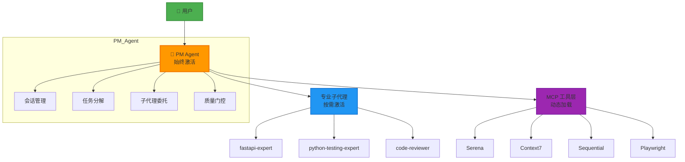

**关键洞察**：PM Agent 不是"模式"，而是**默认操作系统**

### 1.2 会话生命周期管理

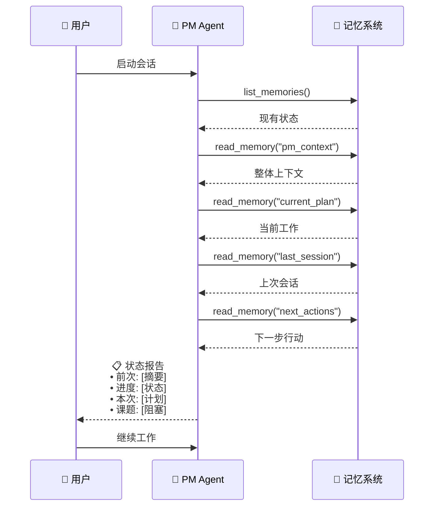

**核心价值**：用户可以从上次检查点继续，无需重新解释上下文

### 1.3 PDCA 持续循环

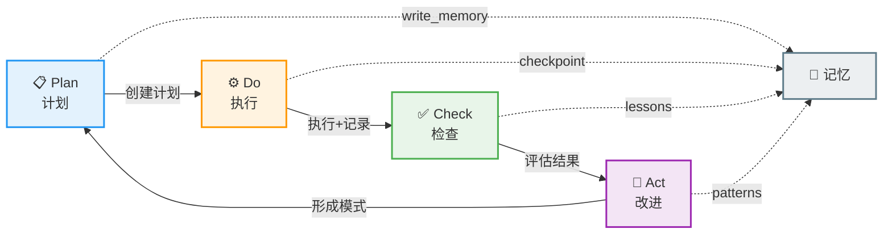

#### PDCA 各阶段输出

```yaml
Plan (计划):
  📝 write_memory("plan", goal_statement)
  📄 创建 docs/temp/hypothesis-YYYY-MM-DD.md
  🎯 定义要实现什么以及为什么

Do (执行):
  ✅ TodoWrite 任务跟踪
  💾 每30分钟 write_memory("checkpoint", progress)
  📓 更新 docs/temp/experiment-YYYY-MM-DD.md
  🐛 记录试错、错误、解决方案

Check (评估):
  🤔 think_about_task_adherence() → 自我评估
  📊 "什么进展顺利？什么失败？"
  📈 更新 docs/temp/lessons-YYYY-MM-DD.md
  🎯 对照目标进行评估

Act (改进):
  ✅ 成功 → docs/patterns/[pattern-name].md (正式化)
  ❌ 失败 → docs/mistakes/mistake-YYYY-MM-DD.md (防止复发)
  📝 更新 CLAUDE.md（如果是全局模式）
  💾 write_memory("summary", outcomes)
```

### 1.4 记忆键模式

```mermaid
graph TD
    Root[记忆系统]

    Root --> Session[session/]
    Session --> S1[session/context<br/>完整PM状态快照]
    Session --> S2[session/last<br/>上次会话摘要]
    Session --> S3[session/checkpoint<br/>进度快照 30min间隔]

    Root --> Plan[plan/]
    Plan --> P1[plan/[feature]/hypothesis<br/>假设设计]
    Plan --> P2[plan/[feature]/architecture<br/>架构决策]
    Plan --> P3[plan/[feature]/rationale<br/>选择理由]

    Root --> Exec[execution/]
    Exec --> E1[execution/[feature]/do<br/>实验试错]
    Exec --> E2[execution/[feature]/errors<br/>错误日志]
    Exec --> E3[execution/[feature]/solutions<br/>解决方案]

    Root --> Eval[evaluation/]
    Eval --> V1[evaluation/[feature]/check<br/>评估分析]
    Eval --> V2[evaluation/[feature]/metrics<br/>质量指标]
    Eval --> V3[evaluation/[feature]/lessons<br/>经验教训]

    Root --> Learn[learning/]
    Learn --> L1[learning/patterns/[name]<br/>成功模式]
    Learn --> L2[learning/solutions/[error]<br/>错误方案库]
    Learn --> L3[learning/mistakes/[timestamp]<br/>失败分析]

    style Root fill:#37474f,stroke:#263238,stroke-width:3px,color:#fff
    style Session fill:#42a5f5,stroke:#1e88e5,stroke-width:2px
    style Plan fill:#66bb6a,stroke:#43a047,stroke-width:2px
    style Exec fill:#ffa726,stroke:#fb8c00,stroke-width:2px
    style Eval fill:#ab47bc,stroke:#8e24aa,stroke-width:2px
    style Learn fill:#ef5350,stroke:#e53935,stroke-width:2px
```

**记忆键模式**：`[category]/[subcategory]/[identifier]`

---

## 二、命令系统的组织方式

### 2.1 命令分类架构

```mermaid
graph TD
    Root[SuperClaude Commands]

    Root --> Orchestration[编排层]
    Orchestration --> O1[pm.md<br/>项目管理代理<br/>默认激活]
    Orchestration --> O2[agent.md<br/>SC Agent<br/>会话控制器]
    Orchestration --> O3[spawn.md<br/>元系统<br/>任务编排]

    Root --> Workflow[工作流层]
    Workflow --> W1[implement.md<br/>功能实现]
    Workflow --> W2[design.md<br/>系统设计]
    Workflow --> W3[build.md<br/>构建编译]
    Workflow --> W4[test.md<br/>测试执行]

    Root --> Analysis[分析层]
    Analysis --> A1[analyze.md<br/>代码分析]
    Analysis --> A2[troubleshoot.md<br/>问题诊断]
    Analysis --> A3[index.md<br/>生成文档]
    Analysis --> A4[index-repo.md<br/>仓库索引]

    Root --> Improvement[改进层]
    Improvement --> I1[improve.md<br/>系统改进]
    Improvement --> I2[cleanup.md<br/>代码清理]
    Improvement --> I3[refactor.md<br/>重构]

    Root --> Learning[学习层]
    Learning --> L1[explain.md<br/>解释说明]
    Learning --> L2[brainstorm.md<br/>头脑风暴]
    Learning --> L3[research.md<br/>深度研究]
    Learning --> L4[document.md<br/>文档生成]

    Root --> Utilities[工具层]
    Utilities --> U1[git.md<br/>Git操作]
    Utilities --> U2[recommend.md<br/>命令推荐]
    Utilities --> U3[sc.md<br/>命令列表]
    Utilities --> U4[select-tool.md<br/>工具选择]

    Root --> Meta[元层]
    Meta --> M1[spec-panel.md<br/>规范审查]
    Meta --> M2[business-panel.md<br/>商业分析]
    Meta --> M3[workflow.md<br/>工作流生成]
    Meta --> M4[load/save<br/>会话管理]

    style Root fill:#1565c0,stroke:#0d47a1,stroke-width:3px,color:#fff
    style Orchestration fill:#ff6f00,stroke:#e65100,stroke-width:2px
    style Workflow fill:#2e7d32,stroke:#1b5e20,stroke-width:2px
    style Analysis fill:#0277bd,stroke:#01579b,stroke-width:2px
    style Improvement fill:#7b1fa2,stroke:#4a148c,stroke-width:2px
    style Learning fill:#c62828,stroke:#b71c1c,stroke-width:2px
    style Utilities fill:#f9a825,stroke:#f57f17,stroke-width:2px
    style Meta fill:#455a64,stroke:#263238,stroke-width:2px
```

### 2.2 命令元数据结构

每个命令都包含 YAML front matter 定义其行为：

```yaml
---
name: implement              # 命令名称
description: "功能实现..."    # 人类可读描述
category: workflow           # 分类
complexity: standard         # 复杂度级别
mcp-servers:                 # 需要的 MCP 服务器
  - context7
  - sequential
  - magic
  - playwright
personas:                    # 需要激活的 personas
  - architect
  - frontend
  - backend
  - security
  - qa-specialist
---
```

### 2.3 命令触发模式

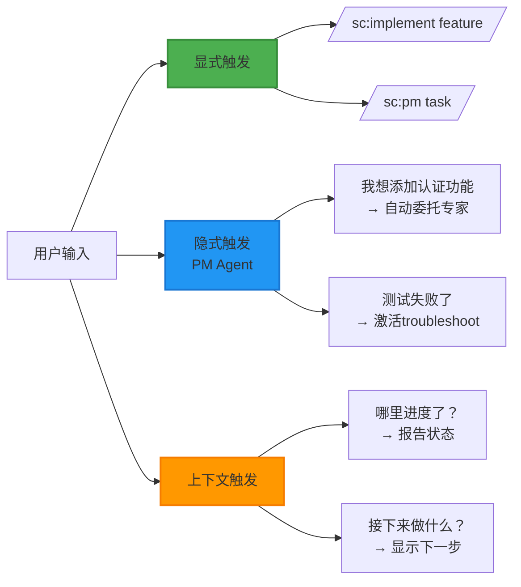

### 2.4 命令组合模式

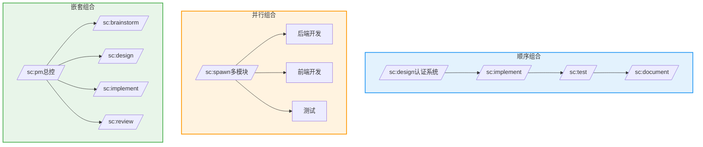

---

## 三、MCP 服务器的动态加载机制

### 3.1 Zero-Token 基线策略

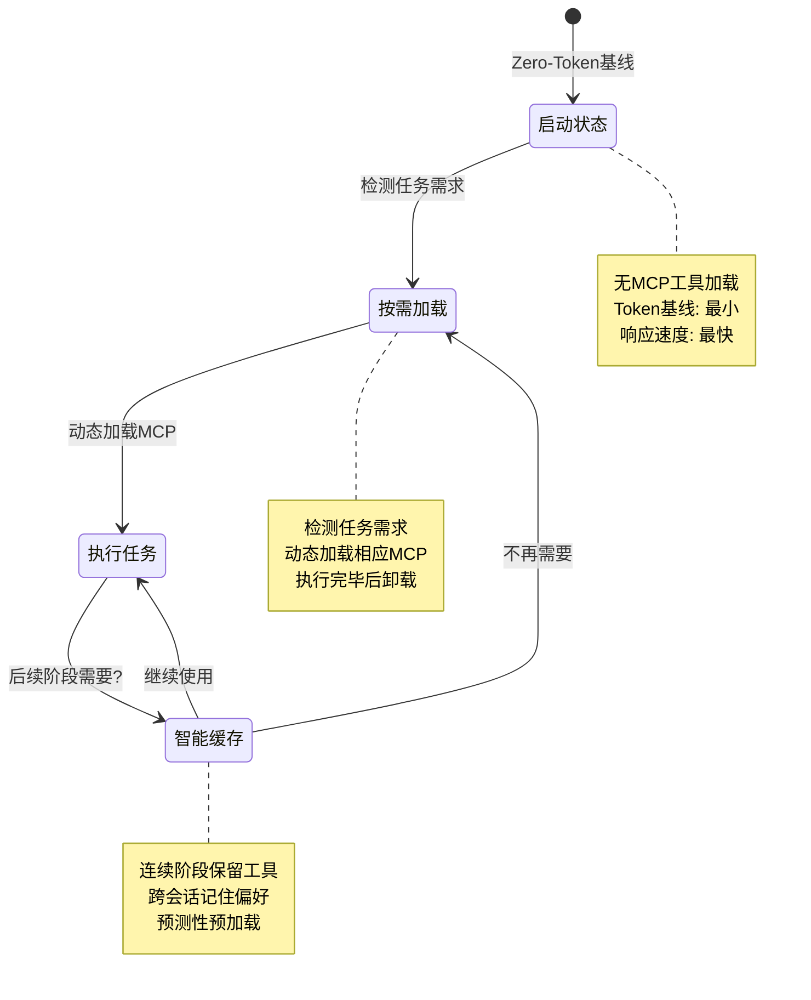

### 3.2 基于阶段的工具加载

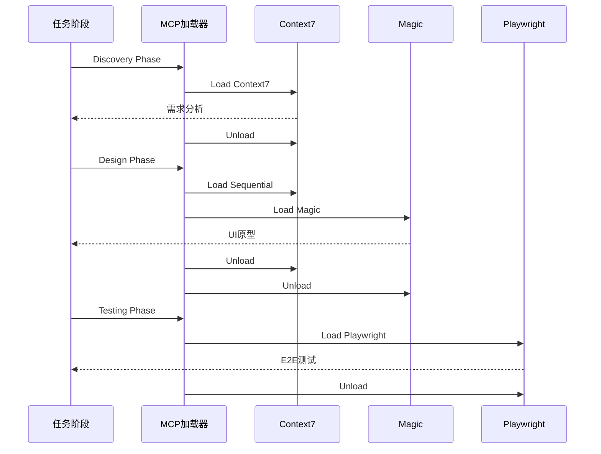

### 3.3 MCP 服务器能力矩阵

| MCP 服务器 | 主要功能 | 使用场景 | Token 成本 | 优先级 |
|:-----------|:---------|:---------|:-----------|:------:|
| **Serena** | 符号搜索、代码编辑 | 深入代码理解 | 中 | ⭐⭐⭐ |
| **Context7** | 官方文档查询 | API 文档、最佳实践 | 低 | ⭐⭐⭐⭐⭐ |
| **Sequential** | 结构化推理 | 复杂决策、规划 | 高 | ⭐⭐⭐⭐ |
| **Magic** | UI 组件生成 | 前端开发 | 中 | ⭐⭐⭐ |
| **Playwright** | 浏览器自动化 | E2E 测试 | 中 | ⭐⭐⭐ |
| **Chrome DevTools** | 调试、性能分析 | 问题诊断 | 中 | ⭐⭐ |
| **Web Reader** | 网页内容提取 | 研究分析 | 低 | ⭐⭐ |

### 3.4 动态加载决策树

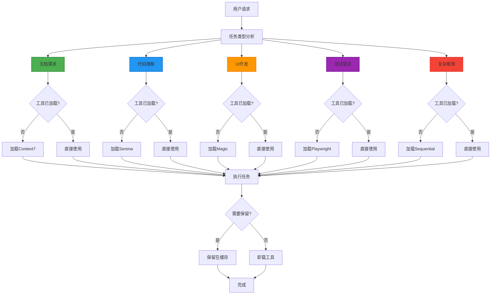

### 3.5 资源优化策略

| 优化维度 | 策略 | 效果 |
|:--------:|:-----|:-----|
| **Token** | 只加载必需工具<br/>批量操作减少往返<br/>缓存常用结果 | 减少 30-50% Token 使用 |
| **性能** | 并行工具调用<br/>增量结果返回<br/>智能预加载 | 提升 2-3x 响应速度 |
| **成本** | 轻量级工具优先<br/>重用已有结果<br/>及时卸载不用的工具 | 降低 40-60% API 成本 |

---

## 四、PDCA 循环在 AI 工作流中的应用

### 4.1 Plan 阶段：假设驱动设计

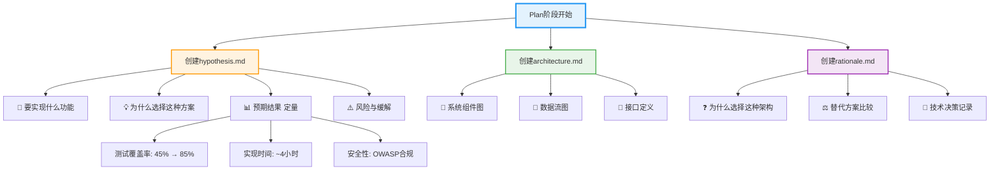

### 4.2 Do 阶段：实验性实现

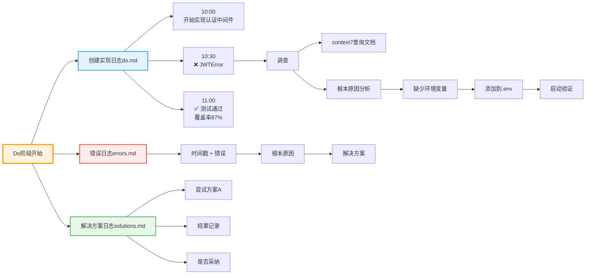

### 4.3 Check 阶段：定量评估

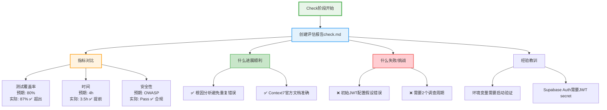

### 4.4 Act 阶段：知识形式化

```mermaid
graph TB
    Act[Act阶段开始]

    Act --> Outcome{结果如何?}

    Outcome --> Success1[成功]
    Outcome --> Failure[失败]

    Success1 --> P1[📄 docs/patterns/[name].md<br/>正式化模式]
    Success1 --> P2[💾 write_memory<br/>保存成功模式]
    Success1 --> P3[📝 CLAUDE.md更新<br/>全局规则]

    Failure --> F1[📄 docs/mistakes/[timestamp].md<br/>失败分析]
    Failure --> F2[💾 write_memory<br/>保存错误原因]
    Failure --> F3[🔄 回到Plan<br/>改进方案]

    Act --> Checklist[更新检查清单]
    Checklist --> C1[环境变量已记录]
    Checklist --> C2[启动验证已实现]
    Checklist --> C3[安全扫描通过]

    Act --> Next[规划下一步]
    Next --> N1[什么可以复用?]
    Next --> N2[什么需要改进?]
    Next --> N3[什么要避免?]

    style Act fill:#f3e5f5,stroke:#9c27b0,stroke-width:3px
    style Success1 fill:#c8e6c9,stroke:#66bb6a,stroke-width:2px
    style Failure fill:#ffcdd2,stroke:#ef5350,stroke-width:2px
    style Checklist fill:#e3f2fd,stroke:#2196f3,stroke-width:2px
    style Next fill:#fff3e0,stroke:#ff9800,stroke-width:2px
```

### 4.5 PDCA 文档结构

```
docs/pdca/[feature-name]/
├── plan.md           # Plan: 假设、设计
├── do.md             # Do: 实验、试错
├── check.md          # Check: 评估、分析
└── act.md            # Act: 改进、下一步
```

### 4.6 自我纠错机制

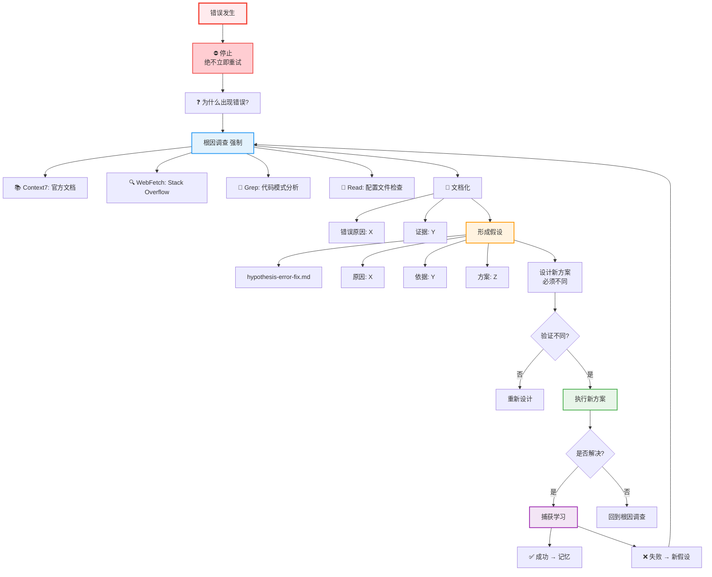

---

## 五、架构设计哲学总结

### 5.1 核心原则

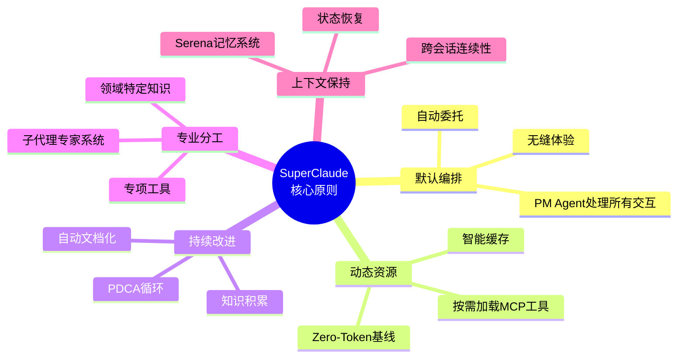

### 5.2 与传统 AI 编程助手的区别

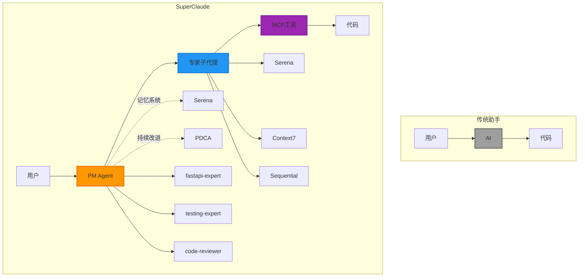

### 5.3 设计权衡

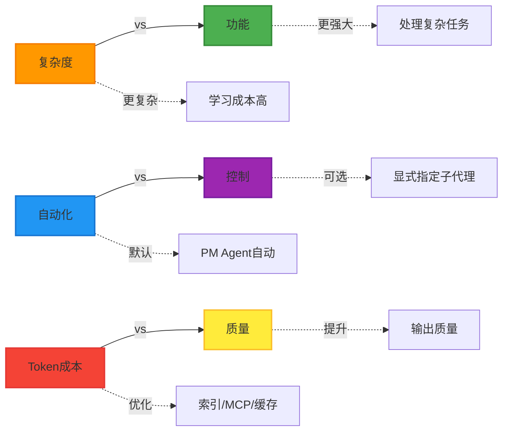

---

## 六、实战应用示例

### 示例：实现用户认证功能

```mermaid
sequenceDiagram
    participant User as 👤 用户
    participant PM as 🎯 PM Agent
    participant Brainstorm as 🧠 Brainstorm
    participant Memory as 💾 记忆
    participant Doc as 📚 Context7
    participant FastAPI as ⚡ FastAPI专家
    participant Security as 🔒 安全专家
    participant Test as 🧪 测试专家

    User->>PM: 添加用户认证功能

    PM->>PM: Plan阶段
    PM->>Brainstorm: /sc:brainstorm
    Brainstorm-->>PM: 发现需求

    PM->>Memory: read_memory<br/>(learning/patterns/auth)
    Memory-->>PM: 历史模式

    PM->>PM: 创建docs/pdca/auth/plan.md

    PM->>PM: Do阶段
    PM->>Doc: Load Context7<br/>查询Supabase Auth
    Doc-->>PM: 官方文档

    PM->>FastAPI: 委托后端实现
    FastAPI-->>PM: 实现完成

    PM->>Security: 委托安全审查
    Security-->>PM: 审查通过

    PM->>PM: 更新docs/pdca/auth/do.md

    PM->>PM: Check阶段
    PM->>Test: 委托测试
    Test-->>PM: 覆盖率87%

    PM->>PM: think_about_task_adherence
    PM->>PM: 创建docs/pdca/auth/check.md

    PM->>PM: Act阶段
    PM->>PM: docs/patterns/<br/>supabase-auth.md
    PM->>Memory: write_memory<br/>(learning/patterns/auth)
    PM->>PM: 更新CLAUDE.md

    PM-->>User: ✅ 完成<br/>• 完整认证系统<br/>• 测试覆盖率87%<br/>• 安全审查通过<br/>• 可重用模式已保存

    style PM fill:#ff9800,stroke:#f57c00,stroke-width:3px
    style FastAPI fill:#2196f3,stroke:#1976d2,stroke-width:2px
    style Security fill:#f44336,stroke:#e53935,stroke-width:2px
    style Test fill:#4caf50,stroke:#388e3c,stroke-width:2px
```

---

## 相关资源

- 📄 [PM Agent 完整文档](~/.claude/commands/sc/pm.md)
- 📄 [命令系统概览](~/.claude/commands/sc/README.md)
- 📄 [Serena MCP 文档](https://github.com/testvitamin/serena-mcp)
- 📄 [子代理系统详解](./subagent-system.md)
- 📄 [TDD 核心原则](./tdd-first-principles.md)

## 下一步阅读

- 想快速回顾四层体系：参考 `../01-setup/claude-code-architecture.md`
- 想细化子代理设计：参考 `./subagent-system.md`

---

**最后更新**: 2026-01-08
**维护者**: CS146S Course Team
**反馈**: GitHub Issues
