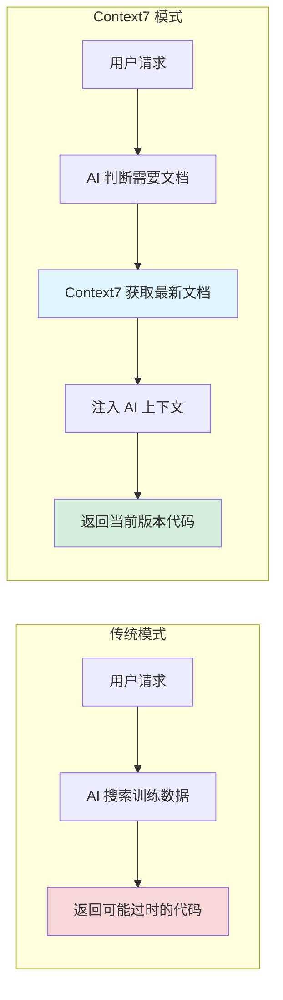
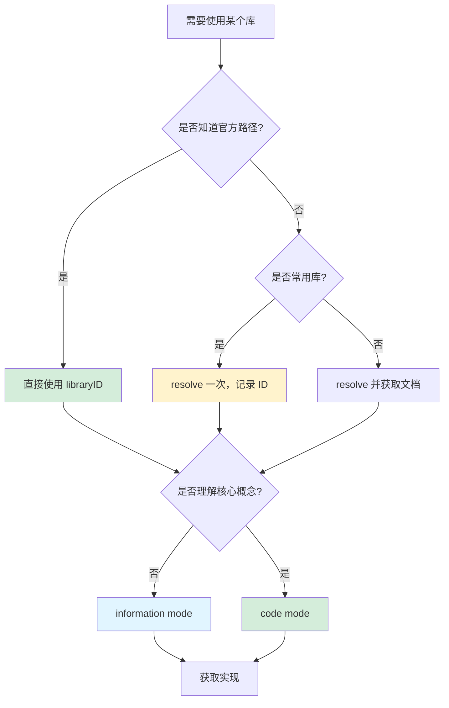

# Context7 MCP 完全指南

> AI 工程师的精准文档武器：从原理到实战的完整体系

## Table of Contents
1. [核心原理](#1-核心原理)
2. [功能与边界](#2-功能与边界)
3. [AI 工程师思维](#3-ai-工程师思维)
4. [实战 Prompts](#4-实战-prompts)
5. [配置速查](#5-配置速查)

---

## 1. 核心原理

### 1.1 问题本质

**AI 编程的根本困境**：

```
训练数据截止 ──────► 当前时刻
     │                    │
     ▼                    ▼
  AI 知识             现实世界
  (静态)              (动态变化)
```

**矛盾**：
- AI 训练数据有截止日期（通常落后 6-18 个月）
- 软件库持续更新（每周都有新版本）
- 开发者需要当前版本的准确信息

**结果**：
- AI 使用过时的 API 签名
- 生成的代码无法运行
- 开发者花费大量时间调试和修正

### 1.2 Context7 的解决思路

**核心思想**：让 AI 在需要时动态查询最新文档，而不是依赖静态训练数据。



**关键机制**：

| 阶段 | 传统模式 | Context7 模式 |
|------|----------|---------------|
| **知识获取** | 训练时静态学习 | 运行时动态查询 |
| **信息时效** | 截止到训练日 | 实时最新 |
| **准确性** | 取决于训练数据质量 | 取决于文档质量 |
| **Token 成本** | 无额外成本 | 每次查询 ~5k-10k tokens |

### 1.3 为什么这个方案有效？

**1. 文档比代码更稳定**

```
代码变更频率 >>> 文档变更频率
```

- API 内部实现经常变化
- 但公共接口（API 签名）相对稳定
- 官方文档记录的是公共契约

**2. LLM 擅长理解文档**

- LLM 训练数据包含大量技术文档
- 理解 Markdown 格式文档是强项
- 文档 → 代码的转换是自然语言处理的强项

**3. 上下文注入机制**

```
用户请求
  │
  ▼
AI 识别需要文档
  │
  ▼
Context7 获取文档 ───► 注入 AI 上下文窗口
  │                        │
  └────────────────────────┘
           │
           ▼
    基于最新文档生成代码
```

---

## 2. 功能与边界

### 2.1 两个核心工具

#### resolve-library-id

**功能**：将模糊的库名称映射到精确的 GitHub 路径

```
"fastapi" ──resolve──► "/tiangolo/fastapi"
"react"   ──resolve──► "/facebook/react"
```

**为什么需要这个工具？**

1. **同名库问题**：GitHub 上可能有多个同名库
2. **路径记忆成本**：开发者不需要记住完整路径
3. **准确性保证**：选择最流行/官方的实现

**使用场景判断**：
- ✅ 你知道库名但不确定 GitHub 路径
- ❌ 你已经知道完整路径（直接用更快）

#### get-library-docs

**功能**：获取指定库的文档内容

**参数设计逻辑**：

| 参数 | 存在原因 | AI 工程师使用思路 |
|------|----------|-------------------|
| `libraryID` | 精确定位库 | 尽量直接使用，跳过 resolve |
| `topic` | 缩小文档范围 | 越具体越好，减少 token |
| `mode` | 匹配任务类型 | 实现=code，设计=information |
| `page` | 处理长文档 | 大多数情况 1-2 页足够 |

**mode 参数的深层含义**：

```
code mode = "给我代码"
- 优先返回可复制粘贴的示例
- 语法正确优先于解释完整
- 适合："如何实现 X"

information mode = "让我理解"
- 优先解释概念和架构
- 完整性优先于简洁
- 适合："X 是如何工作的"
```

### 2.2 能力边界

**Context7 能做的**：
- ✅ 获取最新的 API 文档
- ✅ 提供官方代码示例
- ✅ 解释当前版本的特性

**Context7 不能做的**：
- ❌ 替代你的思考（仍需判断方案优劣）
- ❌ 解决非文档问题（如架构设计决策）
- ❌ 实时调试（无法运行你的代码）

**边界意识**：Context7 是"增强工具"，不是"替代思考"

---

## 3. AI 工程师思维

### 3.1 成本效益分析

**Token 成本模型**：

```
总成本 = resolve成本 + get成本 × 页数 + 生成成本

最优策略：
- 直接使用 libraryID（节省 resolve）
- 精确的 topic（减少页数）
- 适当的 mode（避免重复获取）
```

**ROI 决策树**：



### 3.2 上下文管理策略

**优先级排序**：

1. **直接 ID** > 库名称 resolve > 模糊搜索
2. **特定 topic** > 通用文档 > 多次组合
3. **一次获取** > 分页追加 > 重复查询

**模式复用**：

```
Context7 发现模式 ──► 验证有效 ──► Serena 存储 ──► 未来直接读取
     ↑                                              │
     └──────────────────────────────────────────────┘
                100% 节省后续 Token 成本
```

### 3.3 提示词工程原则

**原则 1：明确意图**

```
❌ "告诉我关于 FastAPI 的信息"
   - AI 不知道你要什么
   - 可能返回无关内容

✅ "Use Context7 for FastAPI routing documentation.
     Focus on path parameters and request body.
     Use code mode."
   - 明确库、主题、模式
   - AI 精准执行
```

**原则 2：渐进式细化**

```
第一轮：获取概览（information mode）
第二轮：获取实现（code mode）
第三轮：特定问题（带 topic）
```

**原则 3：预期管理**

```
告诉 AI 你期望的输出形式：
- "返回可复制粘贴的代码"
- "解释架构和设计原理"
- "对比不同方案的优劣"
```

---

## 4. 实战 Prompts

### 4.1 日常编程场景

#### 场景：快速查询 API 用法

**AI 工程师思维**：我需要快速获取准确的代码示例，不要多余解释。

```
Use Context7 to get FastAPI routing documentation.
Focus on: path parameters, query parameters, request body validation.
Use code mode.
Skip explanations, just give me working examples.
```

**Token 成本**: ~6000 tokens
**时间节省**: ~10 分钟（vs 手动搜索 + 验证）

---

#### 场景：理解新概念

**AI 工程师思维**：先理解原理，再看实现，避免盲目复制。

```
Use Context7 for SQLAlchemy relationship documentation.
Topic: one-to-many and many-to-many relationships.
Use information mode first to explain the concepts.
Then use code mode to show implementation patterns.
```

**Token 成本**: ~12000 tokens (两次调用)
**价值**: 避免因误解概念导致的设计缺陷

---

#### 场景：版本迁移

**AI 工程师思维**：我知道旧版本，需要了解新版本变化。

```
Use Context7 for FastAPI version 0.115+ documentation.
Focus on breaking changes and new features compared to 0.100.
Use information mode to highlight differences.
```

**Token 成本**: ~8000 tokens
**价值**: 避免因 API 变更导致的运行时错误

---

### 4.2 项目特定场景

#### 场景：CS146S Week 2 - LLM 集成

**AI 工程师思维**：我需要 OpenAI SDK 的结构化输出功能。

```
Use Context7 for OpenAI Python SDK documentation.
Topic: structured outputs, response_format, JSON schema.
Use code mode.
Focus on Pydantic model integration.
```

---

#### 场景：Week 3 - MCP 服务器开发

**AI 工程师思维**：我需要理解 MCP 的工具定义规范。

```
Use Context7 for Model Context Protocol documentation.
Topic: tool definition, input schemas, output format.
Use information mode to explain the architecture.
Then code mode for implementation examples.
```

---

### 4.3 Skill 开发场景

#### 场景：创建自定义命令

**AI 工程师思维**：我需要了解 Claude Code 的扩展机制。

```
Use Context7 for Claude Code documentation.
Topic: custom commands, command structure, argument parsing.
Use code mode with full examples.
```

---

#### 场景：子代理委托

**AI 工程师思维**：我需要正确使用 Task 工具。

```
Use Context7 for Claude Agent SDK documentation.
Topic: Task tool, subagent delegation, specialized agents.
Use code mode with workflow examples.
```

---

### 4.4 系统配置场景

#### 场景：配置自动触发

**AI 工程师思维**：我不想每次都说 "use Context7"。

**CLAUDE.md 配置**：

```markdown
## Context7 Auto-Invoke

Always use Context7 when:
- I mention a library/framework name
- I ask "how to" implement something
- I request "best practices" or "latest version"
- I'm working with code generation

优先级：Context7 文档 > 训练数据知识
```

---

#### 场景：Token 优化

**AI 工程师思维**：我需要平衡准确性和成本。

```
Use Context7 for [library] documentation.
Use direct library ID: [known-id].
Use information mode (cheaper).
Only use code mode if I explicitly request examples.
```

---

### 4.5 高级模式

#### 模式 1：Context7 + Serena 循环

**目的**：构建项目专属的模式库

```
# 第一次：使用 Context7 发现模式
Use Context7 for FastAPI authentication patterns.
Topic: JWT token validation, dependency injection.

# 第二步：验证并存储到 Serena
Store this pattern in Serena: learning/patterns/fastapi-jwt-auth.md

# 未来：直接从 Serena 读取
Recall JWT authentication pattern from Serena.
```

**ROI**：
- 第一次：6000 tokens
- 后续每次：0 tokens
- 10 次使用后节省 90% 成本

---

#### 模式 2：分阶段深入

**目的**：渐进式理解复杂主题

```
# Stage 1: 概览
Use Context7 for [library] architecture overview.
Use information mode.

# Stage 2: 核心概念
Use Context7 for [library] documentation.
Topic: [specific-concept]. Use information mode.

# Stage 3: 实现细节
Use Context7 for [library] documentation.
Topic: [specific-concept]. Use code mode.

# Stage 4: 边界情况
Use Context7 for [library] documentation.
Topic: [edge-cases, error-handling]. Use code mode.
```

---

#### 模式 3：对比决策

**目的**：在多个方案中选择

```
Use Context7 for [library-A] and [library-B] documentation.
Topic: [specific-feature-comparison].
Use information mode.
Provide: feature comparison table, performance characteristics,
learning curve, community support.
```

---

### 4.6 Prompt 模板库

#### 模板 A：快速代码获取

```
Use Context7 for [library] [feature] documentation.
Use code mode.
Focus on: [specific-aspects].
Skip explanations, working examples only.
```

#### 模板 B：概念理解

```
Use Context7 for [library] documentation.
Topic: [concept].
Use information mode.
Explain: architecture, design principles, use cases.
```

#### 模板 C：问题排查

```
Use Context7 for [library] documentation.
Topic: [problem-area], common errors, troubleshooting.
Use code mode with error handling examples.
```

#### 模板 D：最佳实践

```
Use Context7 for [library] documentation.
Topic: best practices, recommended patterns, anti-patterns.
Use information mode for principles, code mode for examples.
```

---

## 5. 配置速查

### 5.1 Claude Code

```bash
# Remote (推荐)
claude mcp add --transport http context7 https://mcp.context7.com/mcp

# Local
claude mcp add context7 -- npx -y @upstash/context7-mcp
```

### 5.2 Cursor

`~/.cursor/mcp.json`:

```json
{
  "mcpServers": {
    "context7": {
      "url": "https://mcp.context7.com/mcp"
    }
  }
}
```

### 5.3 自动触发规则

**CLAUDE.md**:

```markdown
## Context7 Auto-Invoke

Always use Context7 for:
- Library/framework documentation
- API usage and best practices
- Version-specific features
- Implementation patterns

**Trigger Keywords**:
- "how to", "implement", "add"
- "best practices", "latest"
- Framework names (FastAPI, React, etc.)
```

---

## 总结

### AI 工程师的核心心智

1. **成本意识**：每个 Context7 调用都有成本，要精确计算 ROI
2. **复用思维**：发现模式 → 存储 → 复用，避免重复查询
3. **渐进深入**：概览 → 概念 → 实现 → 边界，循序渐进
4. **边界清晰**：Context7 是工具，不是替代思考的拐杖

### 快速决策树

```
需要文档？
  │
  ├─ 知道 libraryID？
  │   ├─ 是 → 直接使用，节省 resolve
  │   └─ 否 → resolve 并记录 ID
  │
  ├─ 需要代码还是理解？
  │   ├─ 代码 → code mode
  │   └─ 理解 → information mode
  │
  └─ 是否已存储在 Serena？
      ├─ 是 → 直接读取
      └─ 否 → 获取后存储
```

---

**Version**: 3.0 (AI Engineer Edition)
**Last Updated**: 2025-12-30
