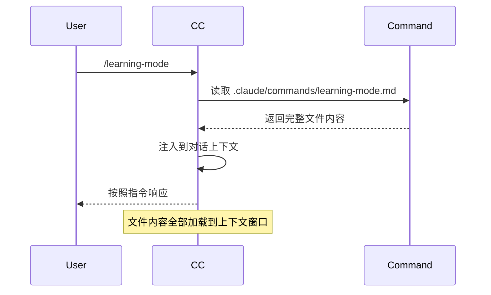
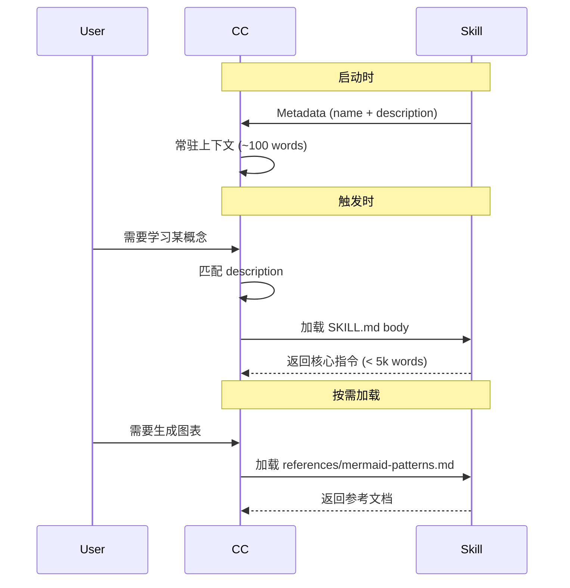

# Claude Code: Commands vs Skills - 完整对比指南

> **目标**: 理解 Custom Slash Commands 和 Claude Skills 的区别、使用场景和最佳实践

---

## 一、核心概念对比

### 1. Custom Slash Command (自定义斜杠命令)

**定义**: 存储在项目 `.claude/commands/` 目录中的 Markdown 文件，定义了 AI 在特定场景下的行为模式。

**本质**: 项目特定的"行为配置文件"

**触发方式**: `/command-name`

**作用域**: 仅限当前代码库

### 2. Claude Skill (Claude 技能)

**定义**: 可打包、可分享的自包含功能包，包含专业知识、工作流和工具集成。

**本质**: 跨项目的通用能力扩展

**触发方式**: 自动触发（基于 description）或手动选择

**作用域**: 所有项目（全局可用）

---

## 二、详细对比表

| 特性 | Custom Slash Command | Claude Skill |
|------|---------------------|--------------|
| **存储位置** | `.claude/commands/*.md` | `~/.claude/skills/` 或插件目录 |
| **文件结构** | 单个 Markdown 文件 | 目录结构（SKILL.md + resources/） |
| **版本控制** | ✅ 随代码库一起管理 | ❌ 需要单独管理 |
| **可分享性** | ❌ 手动复制文件 | ✅ 打包为 .skill 文件 |
| **跨项目使用** | ❌ 仅限当前项目 | ✅ 全局可用 |
| **上下文感知** | ✅ 可访问项目所有文件 | ⚠️ 需要显式传递上下文 |
| **触发机制** | 手动输入 `/command` | 自动（基于 description 匹配）或手动 |
| **适用场景** | 项目特定工作流 | 通用功能/专业知识 |
| **依赖管理** | 无（本地文件） | 可包含 scripts/、assets/ |
| **更新方式** | 编辑 Markdown 文件 | 重新打包 .skill 文件 |
| **加载时机** | 触发时加载到对话 | Metadata 常驻，body 按需加载 |
| **复杂度** | 简单（< 500 行建议） | 可复杂（模块化 resources） |
| **命名空间** | 项目内唯一 | 全局唯一（推荐带前缀） |

---

## 三、文件结构对比

### Command 结构

```
.claude/
└── commands/
    └── learning-mode.md          # 单个文件包含所有逻辑
        ├── YAML frontmatter       # name, description, tools
        └── Markdown instructions  # 完整的行为指令
```

**特点**:
- 扁平结构
- 所有内容在一个文件
- 无额外资源

### Skill 结构

```
learning-mode/                    # Skill 目录
├── SKILL.md                      # 必需：主文件
│   ├── YAML frontmatter           # name, description (必需)
│   └── Markdown instructions     # 核心工作流
├── references/                   # 可选：参考文档
│   ├── question-templates.md     # 按需加载
│   ├── mermaid-patterns.md       # 按需加载
│   └── progress-template.md      # 按需加载
├── scripts/                      # 可选：可执行脚本
│   └── (Python/Bash/etc.)
└── assets/                       # 可选：输出资源
    └── (templates, images, etc.)
```

**特点**:
- 目录结构
- 模块化资源
- Progressive Disclosure（渐进式加载）

---

## 四、加载机制对比

### Command 加载流程



**特点**:
- 触发时一次性加载
- 整个文件进入上下文
- 无按需加载机制

### Skill 加载流程



**特点**:
- 三层加载：Metadata → Body → Resources
- Progressive Disclosure
- 优化上下文使用

---

## 五、何时使用 Command vs Skill

### 使用 Custom Slash Command 的场景

✅ **适合 Commands**:
1. **项目特定工作流**
   - 示例: `/run-week2-tests` - 运行特定周的测试
   - 示例: `/update-api-docs` - 更新项目 API 文档

2. **依赖项目上下文**
   - 示例: `/explore-week` - 分析当前项目结构
   - 示例: `/refactor-module` - 重构项目特定模块

3. **简单重复任务**
   - 示例: `/format-code` - 格式化项目代码
   - 示例: `/check-lint` - 运行 linting

4. **快速原型/实验**
   - 测试新的工作流
   - 不确定是否值得做成 Skill

### 使用 Claude Skill 的场景

✅ **适合 Skills**:
1. **跨项目通用功能**
   - 示例: `document-skills:pdf` - PDF 处理
   - 示例: `Notion:notion-create-page` - Notion 集成

2. **专业知识/工作流**
   - 示例: `skill-creator` - 创建技能的指南
   - 示例: `frontend-design` - 前端设计模式

3. **复杂多步骤流程**
   - 需要可复用的 scripts
   - 需要参考文档
   - 需要模板资产

4. **需要分享的功能**
   - 团队共享工作流
   - 发布到 Community

---

## 六、learning-mode 的两种实现对比

### 作为 Command 的实现

**位置**: `.claude/commands/learning-mode.md`

**优势**:
- ✅ 简单快速创建
- ✅ 版本控制友好
- ✅ 项目特定配置
- ✅ 即插即用

**限制**:
- ❌ 无法跨项目使用
- ❌ 无法分享给他人
- ❌ 所有内容在一个文件（可能很长）
- ❌ 无法包含可执行脚本

**适用**: 个人项目，课程特定学习模式

### 作为 Skill 的实现

**位置**: `skills/learning-mode/`

**优势**:
- ✅ 可打包分享 (`learning-mode.skill`)
- ✅ 模块化结构（SKILL.md + references/）
- ✅ Progressive Disclosure（按需加载）
- ✅ 可包含 scripts/、assets/
- ✅ 跨项目使用

**限制**:
- ❌ 需要打包/安装
- ❌ 更新复杂（需重新打包）
- ❌ 可能过度工程（对简单场景）

**适用**: 通用学习工具，可分享给其他学习者

---

## 七、转换指南：Command → Skill

### 场景：你的 Command 已经很成功，想分享给团队

#### 步骤 1: 评估是否值得转换

**转换的信号**:
- ✅ 多个项目都需要类似功能
- ✅ Command 文件超过 500 行
- ✅ 有可复用的代码片段
- ✅ 团队成员请求类似功能

**保持 Command 的信号**:
- ✅ 项目特定逻辑
- ✅ 简单工作流（< 100 行）
- ✅ 频繁修改中

#### 步骤 2: 创建 Skill 结构

```bash
# 初始化 Skill 目录
mkdir -p skills/my-skill/{scripts,references,assets}

# 创建 SKILL.md
touch skills/my-skill/SKILL.md
```

#### 步骤 3: 提取内容到 Skill

**Command 内容**:
```markdown
---
name: my-command
description: "..."
---

# 长篇指令...

## 详细步骤 1
...

## 详细步骤 2
...

## 代码示例
...
```

**Skill 内容**:
```
SKILL.md:
---
name: my-skill
description: "..."
---

# 核心工作流
简化的核心指令...

references/detailed-steps.md:
详细的步骤说明...

references/code-examples.md:
代码示例...
```

#### 步骤 4: 打包 Skill

```bash
# 如果有 package_skill.py
python scripts/package_skill.py skills/my-skill

# 或手动打包
cd skills/my-skill
zip -r my-skill.skill .
```

#### 步骤 5: 保留 Command 作为快捷方式

```markdown
---
name: my-command
description: "Quick alias for my-skill"
---

# My Command

This is a shortcut for the `my-skill` skill.

For full capabilities, the skill will be loaded automatically.
```

---

## 八、最佳实践建议

### Commands 最佳实践

1. **保持简洁**
   - 推荐 < 300 行
   - 聚焦单一职责
   - 避免"瑞士军刀"式命令

2. **项目特定**
   - 使用项目路径和结构
   - 引用项目配置
   - 利用项目上下文

3. **清晰的命名**
   ```bash
   /test-week2          # 好：明确作用
   /run-tests          # 差：太通用
   ```

4. **版本控制友好**
   - 随代码库提交
   - 文档化在 README 中
   - 团队共享

### Skills 最佳实践

1. **Progressive Disclosure**
   - SKILL.md: 核心工作流 (< 500 行)
   - references/: 详细文档按需加载
   - scripts/: 可执行代码

2. **通用性设计**
   - 不依赖特定项目结构
   - 接受参数/配置
   - 提供清晰的 description

3. **命名空间**
   ```
   company-name:skill-name
   domain:capability
   ```

4. **文档化**
   - 清晰的 description（触发机制）
   - 使用示例在 SKILL.md
   - 版本控制在 skill 内部

---

## 九、实际应用示例

### 示例 1: 项目测试命令 (Command)

**场景**: 每次都要运行特定周的测试

**Command 实现**:
```markdown
---
name: test-week2
description: "Run tests for week2 with coverage"
---

# Test Week2

Run these commands:

```bash
cd week2
pytest tests/ -v --cov=app --cov-report=html
```
```

**为什么用 Command**:
- 项目特定路径
- 简单工作流
- 无需分享

### 示例 2: PDF 处理技能 (Skill)

**场景**: 跨项目的 PDF 处理能力

**Skill 实现**:
```
pdf/
├── SKILL.md
├── scripts/
│   ├── extract_text.py
│   ├── rotate_pdf.py
│   └── merge_pdfs.py
└── references/
    └── forms.md
```

**为什么用 Skill**:
- 跨项目通用
- 包含可执行脚本
- 需要分享

### 示例 3: learning-mode 的双实现

**当前实现**: Command + Skill

**使用建议**:
- **个人项目**: 用 Command (`.claude/commands/learning-mode.md`)
- **分享给他人**: 打包 Skill 为 `.skill` 文件
- **团队使用**: 发布到团队插件仓库

---

## 十、决策树

```
需要创建新的 AI 能力
│
├─ 仅在当前项目使用？
│  └─ YES → Custom Slash Command
│     └─ 位置: .claude/commands/my-command.md
│
├─ 需要跨项目使用？
│  ├─ YES → Claude Skill
│  │  └─ 需要分享？
│  │     ├─ YES → 打包为 .skill，可发布
│  │     └─ NO → 本地 Skill 目录
│  │
└─ 不确定？
   └─ 先创建 Command，成功后再升级为 Skill
```

---

## 总结

| 方面 | Command | Skill |
|------|---------|-------|
| **学习曲线** | 低（简单 Markdown） | 中（需理解结构） |
| **创建速度** | 快（分钟级） | 慢（小时级） |
| **灵活性** | 高（随意编辑） | 低（需重新打包） |
| **可维护性** | 项目内管理 | 需专门维护 |
| **可分享性** | 手动复制 | 一键分享 |
| **适用范围** | 项目特定 | 通用能力 |

**推荐策略**:
1. 从 Command 开始（快速迭代）
2. 成功后考虑升级为 Skill（跨项目使用）
3. 保持 Command 作为快捷方式（即使在有 Skill 的情况下）

---

## 相关资源

- [Claude Code Best Practices](https://www.anthropic.com/engineering/claude-code-best-practices)
- [Skills Documentation](https://docs.anthropic.com/en/docs/claude-code/sub-agents)
- [示例 Commands](.claude/commands/)
- [示例 Skills](skills/)
