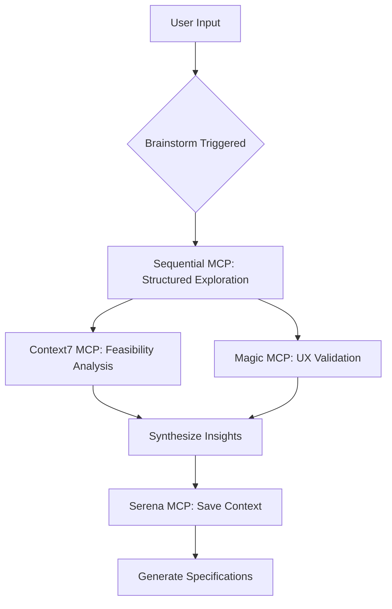

# /sc:brainstorm - Interactive Requirements Discovery System

**Command**: `/sc:brainstorm`
**Category**: Requirements Engineering & Ideation
**Purpose**: Transform ambiguous ideas into concrete specifications through systematic exploration and multi-persona coordination

---

## 📖 Table of Contents

- [Quick Start](#quick-start)
- [Core Philosophy](#core-philosophy)
- [Five-Phase Workflow](#five-phase-workflow)
- [Multi-Persona System](#multi-persona-system)
- [MCP Integration](#mcp-integration)
- [Usage Patterns](#usage-patterns)
- [Real-World Examples](#real-world-examples)
- [Best Practices](#best-practices)
- [Integration with Other Tools](#integration-with-other-tools)

---

## 🚀 Quick Start

### 5-Minute Getting Started

**Step 1: Basic Idea Exploration**
```bash
# Explore a vague idea with systematic questioning
/sc:brainstorm "AI-powered project management tool"
```

**Step 2: Choose Your Strategy**
```bash
# Deep dive with systematic exploration
/sc:brainstorm "real-time collaboration features" --strategy systematic --depth deep

# Quick agile feature exploration
/sc:brainstorm "user onboarding flow" --strategy agile --parallel

# Enterprise solution validation
/sc:brainstorm "data analytics platform" --strategy enterprise --validate
```

**Step 3: Progressive Refinement**
```bash
# Cross-session iteration with Serena memory
/sc:brainstorm "mobile app monetization" --depth normal
# (Session saves context, continue later)
/sc:brainstorm "continue previous discussion"
```

### Command Syntax

```bash
/sc:brainstorm [topic/idea] [options]

Options:
  --strategy <systematic|agile|enterprise>
                           Exploration approach (default: systematic)
  --depth <shallow|normal|deep>
                           Analysis depth (default: normal)
  --parallel              Enable parallel exploration paths
  --validate              Focus on feasibility assessment
  --continue              Resume from previous session (Serena)

Aliases: /sc:brainstorm, /brainstorm, /brain
```

### Key Outputs

| Phase | Output | Format |
|-------|--------|--------|
| **Explore** | Discovered requirements | Structured questions + answers |
| **Analyze** | Multi-domain analysis | Persona-specific insights |
| **Validate** | Feasibility report | Technical/business assessment |
| **Specify** | Concrete specifications | PRD, technical specs, user stories |
| **Handoff** | Implementation brief | Ready for `/sc:pm` or `/sc:implement` |

---

## 🧠 Core Philosophy

### The Problem It Solves

**Traditional Approach**:
```
User: "I want to build an AI tool"
AI: [Starts coding immediately]
   Result: Wrong product, wasted time, requirements gaps
```

**Brainstorm Approach**:
```
User: "I want to build an AI tool"
AI: [Socratic questioning]
   → "What problem does it solve?"
   → "Who are the users?"
   → "What's the MVP?"
   → "What are the technical constraints?"
   Result: Clear requirements, validated assumptions, concrete specs
```

### Three Core Principles

#### 1. **Socratic Dialogue**
- Question-driven exploration, not answer-driven
- Discover requirements through systematic inquiry
- Uncover implicit assumptions

**Example**:
```markdown
Instead of: "Here's a feature list for your AI tool"
Brainstorm:  "What specific problem does this AI solve?
             → Who experiences this problem most?
             → What solutions have they tried?
             → Why do those solutions fail?"
```

#### 2. **Multi-Persona Coordination**
- Different perspectives = comprehensive understanding
- Parallel exploration without conflict
- Cross-pollination of insights

**Personas**:
| Persona | Domain | Contribution |
|---------|--------|--------------|
| **Architect** | System Design | Scalability, patterns, trade-offs |
| **Analyst** | Feasibility | Technical risks, constraints |
| **Frontend** | User Experience | UI/UX, interaction patterns |
| **Backend** | Data & APIs | Data models, API design |
| **Security** | Risk Assessment | Security implications |
| **Product** | User Value | Market fit, prioritization |

#### 3. **Progressive Specification**
```
Ambiguous Idea
    ↓ (Explore)
Discovered Requirements
    ↓ (Analyze)
Multi-Domain Insights
    ↓ (Validate)
Feasibility Assessment
    ↓ (Specify)
Concrete Specifications
    ↓ (Handoff)
Implementation Brief
```

---

## 🔄 Five-Phase Workflow

### Phase 1: Explore 🔍

**Goal**: Transform vague ideas into structured questions

**Process**:
1. Listen to initial idea
2. Identify ambiguity points
3. Ask targeted questions
4. Surface hidden assumptions
5. Organize findings

**Example Dialogue**:
```markdown
User: "I want a mobile app for grocery shopping"

Brainstorm explores:
→ What pain point in grocery shopping? (time, money, quality?)
→ Who is the target user? (busy parents, students, elderly?)
→ What makes it different from existing apps?
→ What's the core value proposition?
→ What are the technical constraints? (offline, AR, payments?)

Output: Structured requirement categories
```

**Triggers**: Ambiguous project ideas, early-stage concepts, "I want to build X"

---

### Phase 2: Analyze 🧠

**Goal**: Multi-domain expert analysis

**Process**:
1. Spawn relevant personas
2. Each persona analyzes from their perspective
3. Identify cross-domain dependencies
4. Surface conflicting requirements
5. Synthesize insights

**Persona Contributions**:

```markdown
🏗️ Architect: "We need a scalable microservice architecture
              → Real-time inventory sync across stores
              → Event-driven order processing"

📊 Analyst: "Technical feasibility: HIGH
           → Risk: Real-time inventory complexity
           → Recommendation: Start with MVP, scale later"

🎨 Frontend: "User flow needs to be frictionless
           → Voice search for hands-free shopping
           → AR for product location in store"

🔐 Security: "Payment data must be PCI compliant
           → User location privacy (GDPR)
           → Secure API authentication"
```

**Output**: Multi-dimensional analysis report

---

### Phase 3: Validate ✅

**Goal**: Feasibility and risk assessment

**Validation Dimensions**:

| Dimension | Questions | Tools |
|-----------|-----------|-------|
| **Technical** | Can we build this? | Context7 MCP, Sequential MCP |
| **Business** | Should we build this? | Market research, competitive analysis |
| **User** | Will people use this? | User testing, feedback loops |
| **Resource** | Do we have capacity? | Team skills, timeline, budget |

**MCP Integration**:
```python
# Context7 MCP: Framework-specific feasibility
context7.analyze_feasibility(
    idea="real-time collaboration",
    frameworks=["WebSocket", "WebRTC", "CRDT"],
    constraints=["scalability", "offline support"]
)

# Sequential MCP: Structured reasoning
sequential.validate_assumptions(
    assumptions=["users want real-time", "tech stack supports it"],
    evidence=["market research", "technical PoC"]
)
```

**Output**: Feasibility report with risk matrix

---

### Phase 4: Specify 📋

**Goal**: Generate concrete specifications

**Output Documents**:

1. **PRD (Product Requirements Document)**
   - Problem statement
   - User personas
   - Functional requirements
   - Non-functional requirements
   - Success metrics

2. **Technical Specifications**
   - Architecture diagram
   - API contracts
   - Data models
   - Tech stack rationale

3. **User Stories**
   - As a [user], I want [feature], so that [benefit]
   - Acceptance criteria
   - Priority ranking

**Example Output**:
```markdown
# PRD: Grocery Shopping Assistant

## Problem Statement
Busy parents spend 2+ hours/week grocery shopping with inefficient trips

## Target Users
- Primary: Parents with children under 10
- Secondary: Elderly shoppers with mobility constraints

## Core Features (MVP)
1. Smart shopping list (auto-suggest based on recipes)
2. Store inventory integration (real-time availability)
3. Optimal route planning (minimize store time)

## Technical Architecture
- Frontend: React Native (cross-platform mobile)
- Backend: FastAPI + PostgreSQL
- Real-time: WebSocket for inventory updates
- Maps: MapKit/Google Maps API

## Success Metrics
- Reduce shopping time by 30%
- Increase list completion rate to 95%
- NPS score > 50
```

---

### Phase 5: Handoff 🚀

**Goal**: Create actionable implementation brief

**Handoff Package**:
```markdown
# Implementation Brief

## Ready for Development
✅ Requirements validated
✅ Architecture designed
✅ Tech stack selected
✅ Risks assessed

## Next Steps
1. Use /sc:pm to create project plan
2. Use /sc:implement to start development
3. Set up Serena memory for context tracking

## Handoff Artifacts
- [ ] PRD (link to document)
- [ ] Technical specs (link to document)
- [ ] Architecture diagram (link)
- [ ] User stories (Jira/Linear export)

## Dependencies
- Team allocation: 1 frontend, 1 backend, 1 PM
- Timeline: 8 weeks MVP
- Budget: $50k development + $5k infrastructure
```

---

## 👥 Multi-Persona System

### Persona Selection Strategy

**Automatic Selection**:
```python
if topic == "real-time features":
    personas = ["architect", "frontend", "backend", "security"]
elif topic == "payment system":
    personas = ["backend", "security", "analyst", "product"]
elif topic == "user onboarding":
    personas = ["frontend", "product", "analyst"]
```

**Manual Selection**:
```bash
/sc:brainstorm "API gateway" --personas "architect,backend,security"
```

### Persona Interaction Patterns

#### Pattern 1: Parallel Exploration
```markdown
All personas work simultaneously on different aspects:
→ Architect: System design
→ Frontend: User experience
→ Backend: API design
→ Security: Risk assessment

Benefit: Fast, diverse perspectives
Best for: Early exploration, broad features
```

#### Pattern 2: Sequential Deep Dive
```markdown
Personas build on each other's work:
1. Architect proposes structure
2. Backend evaluates feasibility
3. Frontend adapts for UX
4. Security validates approach

Benefit: Coherent, validated design
Best for: Complex systems, critical features
```

#### Pattern 3: Adversarial Review
```markdown
Personas challenge each other:
→ Product: "We need feature X"
→ Analyst: "Too complex for MVP"
→ Architect: "Can we simplify?"
→ Security: "What about risks?"

Benefit: Robust, realistic plans
Best for: Enterprise solutions, critical systems
```

### Persona Capabilities

| Persona | Core Questions | Key Outputs |
|---------|----------------|-------------|
| **Architect** | How do we structure this? | Architecture, patterns, trade-offs |
| **Analyst** | Can we build this? | Feasibility, risks, constraints |
| **Frontend** | How will users interact? | UX flows, UI patterns, interactions |
| **Backend** | How do we manage data? | Data models, APIs, services |
| **Security** | What could go wrong? | Threats, mitigations, compliance |
| **Product** | Do users want this? | User value, prioritization, metrics |

---

## 🔌 MCP Integration

### Primary MCP Servers

#### 1. **Sequential MCP** - Structured Reasoning

**Purpose**: Complex multi-step reasoning for systematic exploration

**Usage**:
```python
sequentialthinking.chain_of_thought(
    prompt="Analyze real-time collaboration feasibility",
    steps=[
        "Define technical requirements",
        "Identify potential solutions",
        "Evaluate trade-offs",
        "Recommend approach"
    ]
)
```

**When to Use**:
- Complex technical decisions
- Multi-criteria evaluation
- Architectural trade-offs

#### 2. **Context7 MCP** - Framework Analysis

**Purpose**: Framework-specific feasibility and pattern analysis

**Usage**:
```python
context7.analyze(
    query="WebSocket vs WebRTC for real-time chat",
    frameworks=["WebSocket", "WebRTC", "Server-Sent Events"],
    context={"scale": "10k concurrent users", "features": ["video", "text"]}
)
```

**When to Use**:
- Tech stack decisions
- Framework comparisons
- Pattern recommendations

#### 3. **Magic MCP** - UI/UX Analysis

**Purpose**: User experience validation and design system integration

**Usage**:
```python
magic.analyze_ui_feasibility(
    feature="voice-controlled shopping",
    platforms=["iOS", "Android"],
    constraints=["battery", "privacy"]
)
```

**When to Use**:
- UX feasibility
- Design system integration
- User interaction patterns

#### 4. **Serena MCP** - Cross-Session Memory

**Purpose**: Persistent context and iterative refinement

**Usage**:
```python
# Save brainstorm session
serena.save_memory(
    type="plan",
    key="grocery-app-requirements",
    data={
        "requirements": [...],
        "decisions": [...],
        "open_questions": [...]
    }
)

# Resume later
serena.load_memory(key="grocery-app-requirements")
```

**When to Use**:
- Long-running projects
- Iterative refinement
- Cross-session collaboration

### MCP Coordination Flow



---

## 🎯 Usage Patterns

### Pattern 1: Greenfield Discovery

**When**: Starting from scratch, no clear requirements

**Workflow**:
```bash
# 1. Initial exploration
/sc:brainstorm "I want to build a dev tool" --depth normal

# 2. Deep dive into specific aspect
/sc:brainstorm "continue: focus on AI integration" --depth deep

# 3. Validate feasibility
/sc:brainstorm "previous topic" --validate --parallel

# 4. Generate specifications
/sc:brainstorm "finalize specs for dev tool"
```

**Timeline**: 2-3 sessions over 1-2 days

**Output**: Complete PRD + technical specs

---

### Pattern 2: Feature Expansion

**When**: Existing product, adding new feature

**Workflow**:
```bash
# 1. Explore feature idea
/sc:brainstorm "Add AI code review to our IDE plugin" --strategy agile

# 2. Analyze integration
/sc:brainstorm "continue: how to integrate with existing architecture"

# 3. Validate with constraints
/sc:brainstorm "validate: can we ship in 4 weeks?" --depth shallow
```

**Timeline**: 1 session, 1-2 hours

**Output**: Feature spec + integration plan

---

### Pattern 3: Enterprise Solution

**When**: Complex, multi-stakeholder system

**Workflow**:
```bash
# 1. Comprehensive exploration
/sc:brainstorm "Enterprise data platform" --strategy enterprise --depth deep

# 2. Multi-persona validation
/sc:brainstorm "continue: security and compliance review" --parallel

# 3. Risk assessment
/sc:brainstorm "continue: risk mitigation strategies"

# 4. Governance requirements
/sc:brainstorm "finalize: governance and compliance specs"
```

**Timeline**: 3-5 sessions over 1 week

**Output**: Enterprise architecture + compliance docs + risk matrix

---

### Pattern 4: Cross-Session Iteration

**When**: Long-running project, evolving requirements

**Workflow**:
```bash
# Session 1: Initial exploration
/sc:brainstorm "Mobile learning app"

# Session 2: Next day - refine
/sc:brainstorm --continue  # Serena loads previous context

# Session 3: Next week - pivot
/sc:brainstorm --continue  # Resume from where we left off
/sc:brainstorm "pivot: focus on corporate market instead of consumer"

# Session 4: Finalize
/sc:brainstorm "finalize all requirements and specs"
```

**Timeline**: Weeks to months

**Output**: Evolution history + final specs

---

## 💼 Real-World Examples

### Example 1: SaaS Product Discovery

**Initial Input**:
```bash
/sc:brainstorm "AI-powered customer support automation"
```

**Exploration Phase**:
```markdown
Q: What problem does this solve?
A: Companies spend 40% of support time on repetitive queries

Q: Who are the users?
A: Support teams at mid-sized SaaS companies (50-500 employees)

Q: What's different from existing solutions?
A: Uses LLMs to understand context, not just keyword matching

Q: Technical constraints?
A: Must integrate with existing tools (Zendesk, Intercom)
```

**Analysis Phase**:
```markdown
🏗️ Architect: "Need event-driven architecture for real-time processing
              → Vector database for semantic search
              → LLM gateway for cost control"

📊 Analyst: "Feasibility: HIGH
           → Tech stack: FastAPI + pgvector + OpenAI
           → Risk: LLM cost unpredictability
           → Mitigation: Hybrid approach (rules + AI)"

🔐 Security: "Customer data privacy critical
           → Data anonymization before LLM
           → SOC 2 compliance required"
```

**Validation Phase**:
```markdown
Technical: ✅ Proven technologies available
Business: ✅ Clear market need, $20B TAM
User: ✅ Pain point validated through interviews
Resource: ⚠️  Need ML engineer on team
```

**Specification Phase**:
```markdown
# MVP Scope
1. AI email responder (top 20 queries)
2. Knowledge base integration
3. Analytics dashboard
4. Zendesk/Intercom integration

# Not in MVP
- Voice support
- Multi-language
- Custom model training
```

**Handoff**:
```markdown
Ready for /sc:pm to create 12-week roadmap
Ready for /sc:implement to start development
```

---

### Example 2: Technical Architecture Decision

**Initial Input**:
```bash
/sc:brainstorm "Microservices vs monolith for our e-commerce platform" --validate
```

**Exploration**:
```markdown
Current state:
- 50k users, growing 20% MoM
- Monolithic Rails app
- Team of 8 developers
- Deployment pain points: slow builds, difficult scaling
```

**Multi-Persona Analysis**:
```markdown
🏗️ Architect: "Microservices benefits:
              → Independent deployment
              → Technology diversity
              → Team scaling

              Microservices costs:
              → Distributed complexity
              → Data consistency challenges
              → Operational overhead"

📊 Analyst: "Recommendation: Hybrid approach
           → Keep core monolith (checkout, user accounts)
           → Extract services for:
             - Search (Elasticsearch)
             - Recommendations (ML service)
             - Email (third-party API)

           Risk mitigation:
           → Start with 2-3 services
           → Use service mesh for observability"

🔐 Security: "Network segmentation critical in microservices
           → Service-to-service authentication (mTLS)
           → API gateway for edge security"
```

**Validation**:
```markdown
✅ Technical feasibility: HIGH
✅ Team capability: MEDIUM (need training)
✅ Business case: POSITIVE (faster feature shipping)
⚠️  Timeline: 6-month migration
```

**Specification**:
```markdown
# Migration Roadmap
Phase 1 (2 months): Extract search service
Phase 2 (2 months): Extract recommendation service
Phase 3 (2 months): Implement service mesh + observability
```

---

### Example 3: User Experience Redesign

**Initial Input**:
```bash
/sc:brainstorm "Redesign onboarding flow to increase activation rate" --strategy agile
```

**Current State Analysis**:
```markdown
Current activation rate: 35%
Industry benchmark: 50-60%
Drop-off points:
- Step 2: Profile setup (40% drop-off)
- Step 4: Credit card entry (25% drop-off)
```

**Multi-Persona Insights**:
```markdown
🎨 Frontend: "Friction points identified:
           → Too many form fields (12 fields)
           → No progress indication
           → Credit card required too early

           Recommendations:
           → Social login (Google, GitHub)
           → Progressive profiling (ask over time)
           → Skip credit card until usage threshold"

📊 Product: "User value not demonstrated early enough
           → Users don't see why they should complete setup
           → Need 'aha moment' in first 30 seconds

           Recommendation:
           → Interactive product tour
           → Sample data to explore immediately"

🔐 Security: "Social login considerations:
           → OAuth 2.0 implementation
           → Data minimization (only request necessary scopes)
           → Clear privacy policy"
```

**Validation with Magic MCP**:
```python
magic.analyze_ui_patterns(
    feature="progressive onboarding",
    similar_products=["Slack", "Notion", "Figma"],
    best_practices=["delay account creation", "interactive tour", "sample data"]
)
```

**Specification**:
```markdown
# New Onboarding Flow
1. Landing page: Clear value proposition (5 sec)
2. Social login: One-click entry (30 sec)
3. Interactive tour: Guided exploration (2 min)
4. Create first project: Hands-on (3 min)
5. Progressive profile: 3 fields only (30 sec)
6. Skip credit card: Ask after 7 days or 100 uses

Target: Increase activation to 50% (15 percentage points)
```

---

## 🎓 Best Practices

### DO's ✅

#### 1. Start Broad, Then Deep
```bash
# Good: Progressive exploration
/sc:brainstorm "E-commerce platform"           # Broad
/sc:brainstorm "continue: payment system"      # Narrower
/sc:brainstorm "continue: Stripe integration"  # Specific

# Bad: Too specific too early
/sc:brainstorm "Stripe API for subscription billing with webhooks"
```

#### 2. Leverage Multi-Persona Insights
```bash
# Good: Explicitly request multiple perspectives
/sc:brainstorm "API design" --parallel  # Gets architect + backend + security

# Better: Specify personas
/sc:brainstorm "API design" --personas "backend,security,product"
```

#### 3. Use Serena for Long Projects
```bash
# Session 1
/sc:brainstorm "Mobile app for fitness tracking"

# Session 2 (next day)
/sc:brainstorm --continue
# "Welcome back! Last time we explored:
#  - Core features: workout logging, progress tracking
#  - Tech stack: React Native + FastAPI
#  - Open question: offline mode strategy
#
#  Shall we continue with offline mode exploration?"
```

#### 4. Validate Before Specifying
```bash
# Good workflow
/sc:brainstorm "Real-time collaboration"  # Explore
/sc:brainstorm "continue: validate feasibility"  # Validate
/sc:brainstorm "continue: generate specs"  # Specify

# Risky: Skip validation
/sc:brainstorm "Real-time collaboration" --depth deep
# (Might generate specs for infeasible features)
```

#### 5. Iterate on Requirements
```markdown
Don't expect perfect specs in one session.

Session 1: Rough requirements
Session 2: Refine and prioritize
Session 3: Technical deep-dive
Session 4: Finalize and handoff

Use Serena to maintain context across sessions.
```

### DON'Ts ❌

#### 1. Don't Rush to Implementation
```bash
# Bad: Skip brainstorming
/sc:implement "build a todo app"

# Good: Explore first
/sc:brainstorm "personal productivity tool"
# (Might discover unique angle, not just another todo app)
```

#### 2. Don't Ignore Constraints
```bash
# Bad: Unrealistic scope
/sc:brainstorm "Build a full Slack competitor in 4 weeks"

# Good: Acknowledge constraints
/sc:brainstorm "MVP for team chat: 4 weeks, 2 developers"
```

#### 3. Don't Skip Multi-Persona Analysis
```bash
# Bad: Single perspective
/sc:brainstorm "API design" --personas "backend"

# Good: Multiple perspectives
/sc:brainstorm "API design" --personas "backend,frontend,security"
```

#### 4. Don't Treat Brainstorm as One-Shot
```bash
# Bad: Expect perfection in one session
/sc:brainstorm "Complex system" --depth deep

# Good: Iterative refinement
/sc:brainstorm "Complex system"
# ... time passes ...
/sc:brainstorm --continue
/sc:brainstorm --continue
```

---

## 🔗 Integration with Other Tools

### Tool Ecosystem

```mermaid
graph LR
    A[/sc:brainstorm] -->|Requirements| B[/sc:pm]
    B -->|Implementation| C[/sc:implement]
    C -->|Testing| D[/sc:test]
    D -->|Review| E[/sc:analyze]
    A -->|Context| F[Serena MCP]
    B -->|Memory| F
    C -->|Tracking| F
```

### Workflow Integration

#### 1. **Brainstorm → PM**
```bash
# 1. Discover requirements
/sc:brainstorm "AI code review tool"
# Output: PRD, technical specs

# 2. Create project plan
/sc:pm "Implement AI code review tool"
# Input: PRD from brainstorm
# Output: Project roadmap, task breakdown
```

#### 2. **Brainstorm → Implement**
```bash
# 1. Quick feature exploration
/sc:brainstorm "Add dark mode" --strategy agile --depth shallow

# 2. Start implementation
/sc:implement "Dark mode for web app"
# Input: Feature spec from brainstorm
```

#### 3. **Brainstorm → Serena → Resume**
```bash
# Session 1
/sc:brainstorm "Mobile game idea"
# Serena saves context

# Session 2 (after research)
/sc:brainstorm --continue
# "Welcome back! Since last time, what have you learned?"
# Brainstorm incorporates new insights

# Session 3 (after user testing)
/sc:brainstorm --continue
# "How did user testing go? Let's refine based on feedback"
```

#### 4. **Brainstorm → Spec Panel**
```bash
# 1. Generate initial specs
/sc:brainstorm "Microservices architecture"

# 2. Expert review
/sc:spec-panel ./specs/microservices.md
# Experts: Martin Fowler, Sam Newman, etc.
# Output: Improved specs with expert insights
```

### When to Use Each Tool

| Scenario | Primary Tool | Supporting Tools |
|----------|--------------|------------------|
| **New product idea** | `/sc:brainstorm` → `/sc:pm` | Serena for context |
| **Feature addition** | `/sc:brainstorm` (agile) → `/sc:implement` | Context7 for feasibility |
| **Architecture decision** | `/sc:brainstorm` (validate) → `/sc:spec-panel` | Sequential MCP for reasoning |
| **Bug investigation** | `/sc:troubleshoot` | `/sc:analyze` for root cause |
| **Code review** | `/sc:analyze` | `/review-pr` for PR review |
| **Performance issue** | `/sc:troubleshoot` → Performance Optimizer agent | System profiling |

---

## 📚 Advanced Topics

### Custom Persona Configuration

Create custom personas for specific domains:

```yaml
# .claude/personas/ml-engineer.yml
name: ML Engineer
expertise:
  - Machine Learning
  - Data Science
  - MLOps
questions:
  - "What's the training data strategy?"
  - "How do we handle model drift?"
  - "What's the inference latency budget?"
frameworks:
  - TensorFlow
  - PyTorch
  - Scikit-learn
```

Usage:
```bash
/sc:brainstorm "ML-powered feature" --personas "ml-engineer,backend,product"
```

### Domain-Specific Prompts

**Healthcare**:
```bash
/sc:brainstorm "Telemedicine platform" --domain healthcare
# Adds HIPAA compliance, clinical workflows, patient safety personas
```

**Fintech**:
```bash
/sc:brainstorm "Trading platform" --domain fintech
# Adds regulatory compliance, security, risk management personas
```

**EdTech**:
```bash
/sc:brainstorm "Learning management system" --domain edtech
# Adds pedagogy, accessibility, analytics personas
```

### Output Templates

**PRD Template**:
```markdown
# Product Requirements Document: [Product Name]

## 1. Problem Statement
[What problem are we solving?]

## 2. Target Users
[Who are we building for?]

## 3. Goals & Success Metrics
[What does success look like?]

## 4. Functional Requirements
[What must the product do?]

## 5. Non-Functional Requirements
[Performance, security, scalability]

## 6. Out of Scope
[What are we NOT building?]
```

**Technical Spec Template**:
```markdown
# Technical Specification: [Feature/System]

## Architecture Overview
[High-level system design]

## API Contracts
[Endpoint definitions]

## Data Models
[Database schema]

## Tech Stack Rationale
[Why these technologies?]

## Deployment Strategy
[How do we deploy and operate?]
```

---

## 🎯 Quick Reference

### Strategy Selection Guide

| Strategy | When to Use | Depth | Focus |
|----------|-------------|-------|-------|
| **Systematic** | Complex systems, new products | deep | Comprehensive exploration |
| **Agile** | Feature iterations, quick decisions | shallow/normal | Fast, actionable |
| **Enterprise** | Business-critical systems | deep | Risk, compliance, governance |

### Depth Selection Guide

| Depth | When to Use | Output | Time |
|-------|-------------|--------|------|
| **Shallow** | Quick validation, simple features | Key questions, high-level specs | 30 min |
| **Normal** | Most scenarios | Detailed requirements, initial specs | 1-2 hours |
| **Deep** | Complex systems, critical decisions | Complete PRD, full technical specs | 3-5 hours |

### Common Workflows

| Goal | Command Pattern |
|------|-----------------|
| **Explore new idea** | `/sc:brainstorm "[idea]" --depth normal` |
| **Validate feasibility** | `/sc:brainstorm "[idea]" --validate --parallel` |
| **Quick feature spec** | `/sc:brainstorm "[feature]" --strategy agile --depth shallow` |
| **Enterprise system** | `/sc:brainstorm "[system]" --strategy enterprise --depth deep` |
| **Resume previous** | `/sc:brainstorm --continue` |
| **Cross-session iteration** | `/sc:brainstorm [topic]` → `/sc:brainstorm --continue` |

---

## 📖 Further Reading

### Related Documentation

- [Business Panel Guide](./business-panel-guide.md) - Multi-expert business analysis
- [Prompt Layer Design](../04-deep-dive/prompt-layer-design.md) - 4-layer prompt engineering
- [AI Engineering Principles](../02-understand/ai-engineering-principles.md) - ROI and optimization
- [Serena Memory System](../serena-mcp/README.md) - Cross-session context management

### External Resources

- [User Story Mapping](https://www.amazon.com/Story-Mapping-Build-Products-Right/dp/1491947285) - User-centered requirements
- [The Mom Test](https://www.amazon.com/Mom-Test-talk-customers-business/dp/1491906647) - Customer discovery
- [Inspired](https://www.amazon.com/Inspired-Create-Tech-Products-Customers-Love/dp/1119387503) - Product management
- [Running Lean](https://www.amazon.com/Running-Lean-Iterate-Plan-Document/dp/1449305172) - Iterative product development

---

**Document Version**: 1.0
**Last Updated**: 2025-01-04
**Author**: SuperClaude Community
**License**: MIT

---

## 🤝 Contributing

Have you used `/sc:brainstorm` successfully? Share your experience!

1. **Report Success Stories**: What did you build?
2. **Suggest Improvements**: What could be better?
3. **Share Patterns**: Unique use cases we haven't covered?

**Community**: [SuperClaude GitHub](https://github.com/superclaude)
**Discussions**: [Claude Code Discord](https://discord.gg/claude-code)
