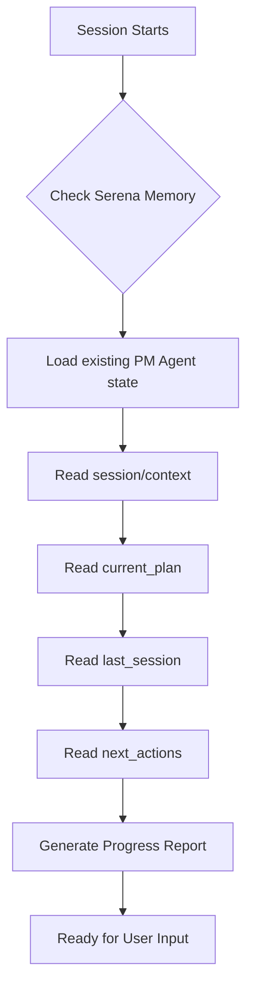
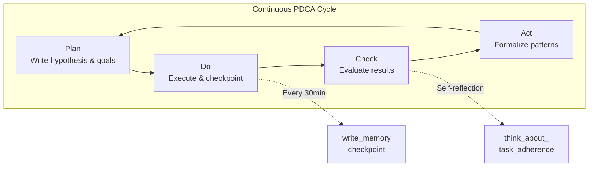
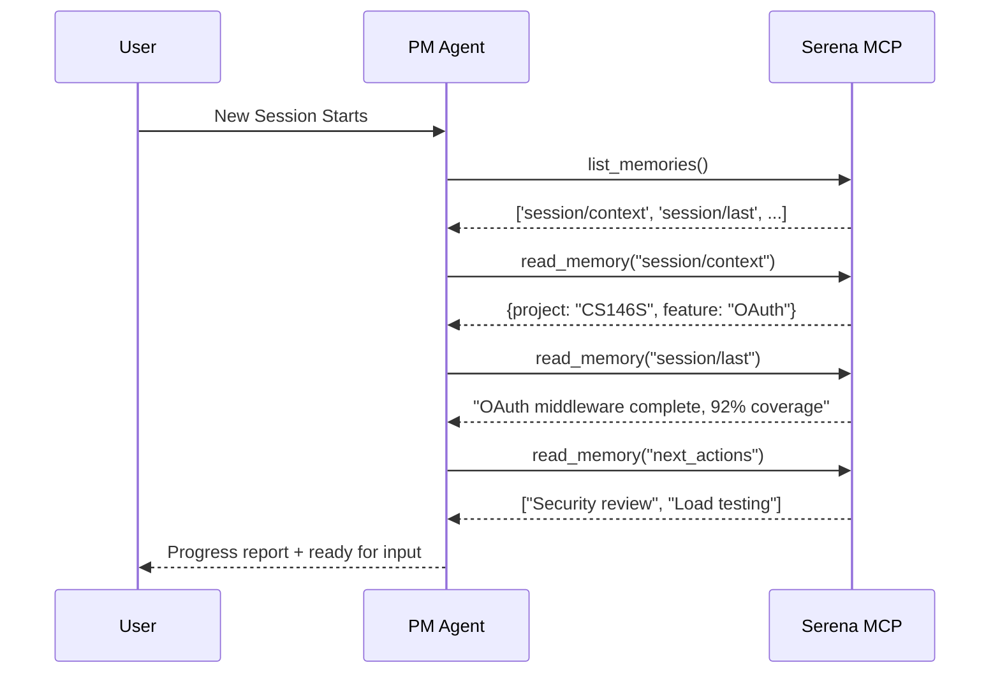
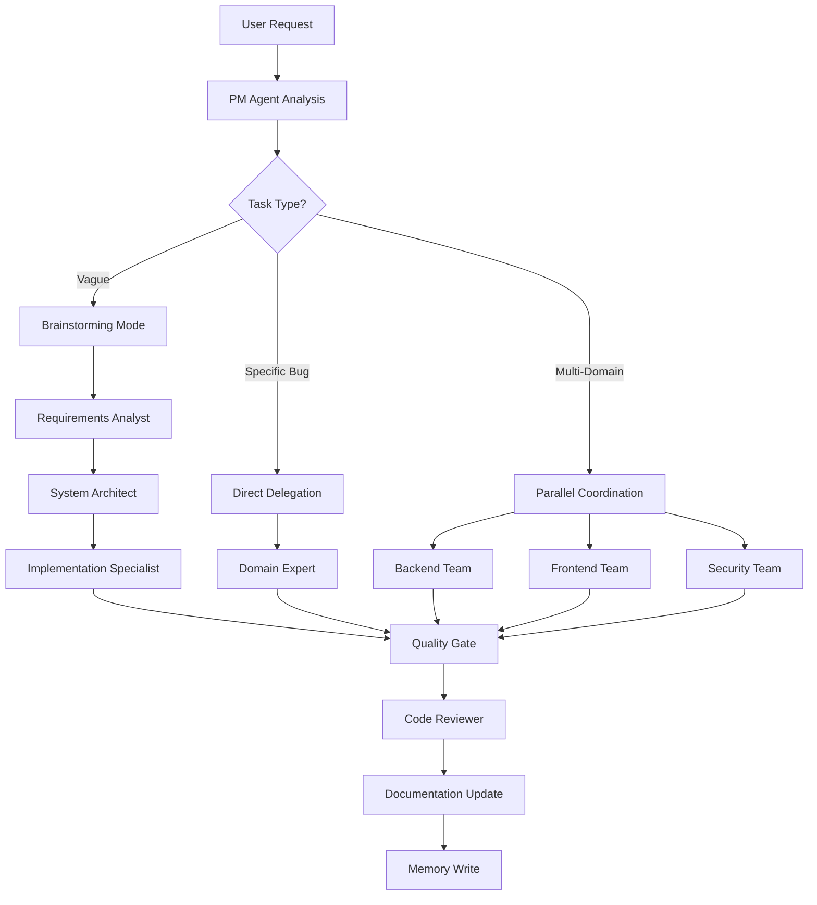
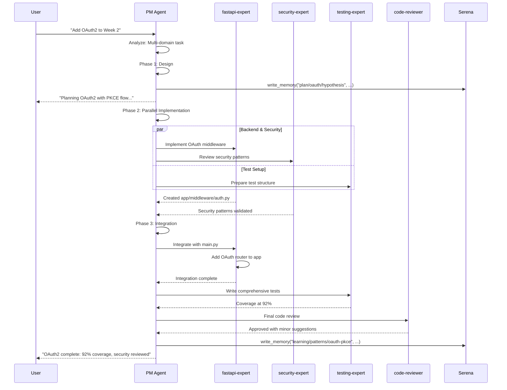
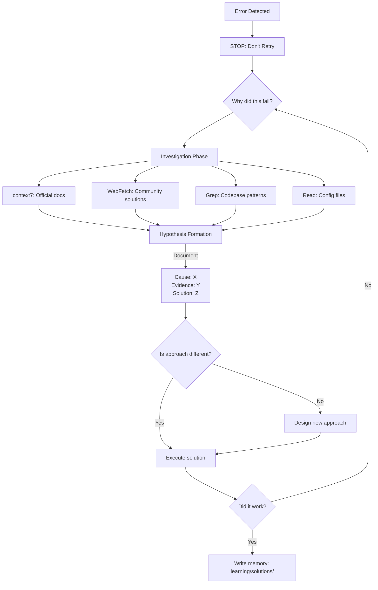
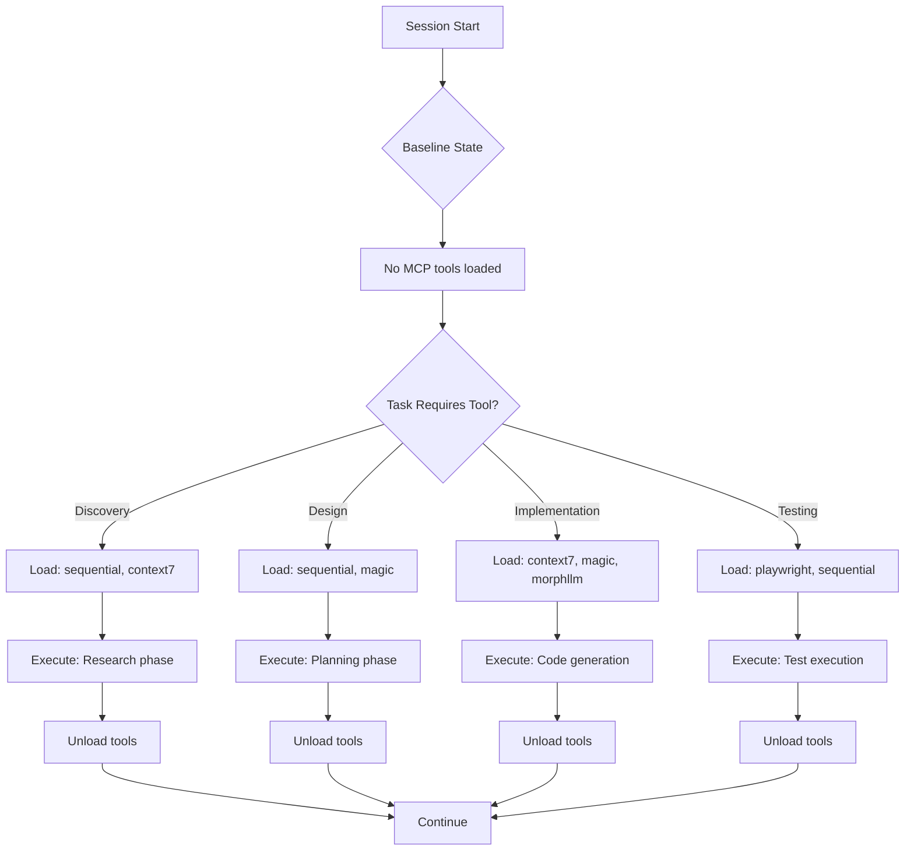

# /sc:pm - Project Manager Agent: Complete Guide

> The "Always-Active Foundation Layer" that orchestrates all AI development workflows in Claude Code

## Table of Contents
1. [Introduction](#1-introduction)
2. [Session Lifecycle Management](#2-session-lifecycle-management)
3. [Serena MCP Memory Integration](#3-serena-mcp-memory-integration)
4. [Automatic Sub-Agent Delegation](#4-automatic-sub-agent-delegation)
5. [Self-Correction & Improvement Loops](#5-self-correction--improvement-loops)
6. [Complete Workflow Example](#6-complete-workflow-example)
7. [MCP Tool Orchestration](#7-mcp-tool-orchestration)
8. [Best Practices Summary](#8-best-practices-summary)

---

## 1. Introduction

### What is `/sc:pm`?

**`/sc:pm`** (Project Manager Agent) is the **default orchestration foundation** for Claude Code. It is NOT a mode you switch to - it's **always active** and runs automatically at every session start.

**Key Philosophy:**
```
Users interact with PM Agent → PM Agent delegates to specialists → Work completes seamlessly
```

You never need to manually invoke `/sc:pm`. It automatically:
1. Restores your project context from previous sessions
2. Analyzes your requests and routes to appropriate experts
3. Coordinates multi-phase workflows with quality gates
4. Documents learnings and patterns for future reuse

### Key Differentiators

| Feature | Traditional AI Coding | `/sc:pm` Approach |
|---------|---------------------|-------------------|
| **Session Context** | Lost between sessions | Automatically restored via Serena MCP |
| **Agent Selection** | Manual specification required | Intelligent auto-delegation |
| **Error Handling** | Retry same approach | Root cause analysis required |
| **Documentation** | Optional add-on | Continuous self-documenting |
| **Resource Usage** | All tools always loaded | Dynamic loading per phase |
| **Learning** | Errors forgotten | Patterns captured for reuse |

### YAML Configuration

```yaml
---
name: pm
description: "Project Manager Agent - Default orchestration agent that coordinates all sub-agents and manages workflows seamlessly"
category: orchestration
complexity: meta
mcp-servers: [sequential, context7, magic, playwright, morphllm, serena, tavily, chrome-devtools]
personas: [pm-agent]
---
```

---

## 2. Session Lifecycle Management

The PM Agent manages three distinct phases of your session lifecycle:

### 2.1 Session Start Protocol (Auto-Executes)

Every session begins with automatic context restoration:



**Actual Memory Operations:**

```python
# PM Agent automatically executes these Serena MCP calls:
mcp__serena__list_memories()
# Returns: ['session/context', 'session/last', 'session/checkpoint', ...]

mcp__serena__read_memory(memory_file_name="session/context")
# Returns: Complete project state snapshot

mcp__serena__read_memory(memory_file_name="current_plan")
# Returns: "Adding OAuth to Week 2 Action Items - Design phase complete"

mcp__serena__read_memory(memory_file_name="session/last")
# Returns: "Implemented OAuth middleware, tests at 75% coverage"

mcp__serena__read_memory(memory_file_name="next_actions")
# Returns: "- Add refresh token support\n- Write integration tests\n- Code review"
```

**User Sees:**
```
前回: Implemented OAuth middleware with JWT validation
進捗: Tests at 75% coverage, refresh token support pending
今回: - Add refresh token support
      - Write integration tests
      - Code review
課題: Need to configure token rotation strategy
```

### 2.2 During Work: Continuous PDCA Cycle

The PM Agent continuously applies the **Plan-Do-Check-Act** cycle:



**Actual Memory Writes During Work:**

```python
# PLAN Phase
mcp__serena__write_memory(
    memory_file_name="plan/oauth/hypothesis",
    content="""
# OAuth Integration Plan

## Hypothesis
Adding OAuth2 with PKCE will provide secure authentication without password storage.

## Expected Outcomes
- Test Coverage: 75% → 90%
- Implementation Time: ~4 hours
- Security Standards: OAuth2 RFC 6749 compliance
"""
)

# DO Phase - Checkpoint every 30 minutes
mcp__serena__write_memory(
    memory_file_name="session/checkpoint",
    content="""
# Checkpoint 14:30

## Completed
- OAuth middleware created
- Token validation working
- Login endpoint functional

## Errors Encountered
- JWT_SECRET missing → Added .env validation
- State parameter collision → Fixed with UUID generation

## Next Steps
- Implement refresh token rotation
- Add logout endpoint
"""
)

# CHECK Phase - Self-evaluation
# PM Agent calls: mcp__serena__think_about_task_adherence()
# Reflects on: What went well? What failed? Lessons learned?

# ACT Phase - Success pattern formalization
mcp__serena__write_memory(
    memory_file_name="learning/patterns/oauth-pkce-integration",
    content="""
# OAuth2 with PKCE Integration Pattern

## When to Use
- SPA applications requiring secure auth
- No backend password storage needed
- Mobile apps with native auth flows

## Key Components
1. Authorization Code Flow with PKCE
2. JWT token validation middleware
3. Secure token storage (httpOnly cookies)
4. Refresh token rotation

## Anti-Patterns to Avoid
- Storing access tokens in localStorage
- Skipping PKCE verification
- Reusing state parameters
"""
)
```

### 2.3 Session End Protocol

When you close your session, PM Agent ensures preservation:

```python
# Final checkpoint
mcp__serena__write_memory(
    memory_file_name="session/last",
    content="""
# Session Summary - 2025-12-28

## Completed
- OAuth2 integration fully implemented
- Test coverage: 92% (exceeded 90% goal)
- Refresh token rotation operational
- Documentation updated

## Time Spent
- Planned: 4 hours
- Actual: 3.5 hours
- Under budget due to reusing JWT patterns

## Next Session Actions
- Security review with python-security-expert
- Performance testing for token endpoint
- User guide documentation
"""
)

# Update next actions for seamless continuation
mcp__serena__write_memory(
    memory_file_name="next_actions",
    content="""
1. Security audit of OAuth flow
2. Load testing: /token endpoint (target: 1000 req/sec)
3. Write user authentication guide
"""
)

# Complete state preservation
mcp__serena__write_memory(
    memory_file_name="session/context",
    content="""
# Project Context

## Current Feature
OAuth2 authentication for Week 2 Action Items app

## Tech Stack
- FastAPI 0.115+
- SQLAlchemy 2.0+
- SQLite
- Ollama LLM integration

## Architecture
- app/main.py - FastAPI app with routers
- app/services/auth.py - New OAuth service
- app/middleware/auth.py - JWT validation
- tests/test_auth.py - OAuth tests

## Global Rules
- Always validate environment variables at startup
- Use context7 for official FastAPI patterns
- Test coverage must exceed 85%
- Security review required before merge
"""
)
```

---

## 3. Serena MCP Memory Integration

### 3.1 Available Memory Tools

| Tool | Purpose | Example Usage |
|------|---------|---------------|
| `list_memories()` | List all stored memories | Discover what context is available |
| `read_memory(name)` | Read a specific memory | Restore previous session state |
| `write_memory(name, content)` | Write/update a memory | Save progress or patterns |
| `edit_memory(name, needle, repl, mode)` | Edit memory content | Update specific sections |
| `delete_memory(name)` | Delete a memory | Remove outdated information |
| `activate_project(path)` | Switch project context | Work on different codebase |
| `check_onboarding_performed()` | Verify setup | Ensure project is configured |

### 3.2 Standardized Memory Schema

PM Agent uses a hierarchical namespace inspired by Kubernetes and Git:

```
session/          # Session state management
  ├── context           # Complete PM state snapshot
  ├── last              # Previous session summary
  └── checkpoint        # Progress snapshots (30-min intervals)

plan/             # Planning artifacts
  ├── [feature]/hypothesis    # Design assumptions
  ├── [feature]/architecture  # Technical decisions
  └── [feature]/rationale     # Decision justifications

execution/        # Implementation tracking
  ├── [feature]/do            # Experiment logs
  ├── [feature]/errors        # Error log with timestamps
  └── [feature]/solutions     # Solution attempts

evaluation/       # Assessment results
  ├── [feature]/check         # Evaluation metrics
  ├── [feature]/metrics       # Quality indicators
  └── [feature]/lessons       # What worked/failed

learning/         # Knowledge capture
  ├── patterns/[name]         # Reusable success patterns
  ├── solutions/[error]       # Error solution database
  └── mistakes/[timestamp]    # Failure analysis with prevention

project/          # Project metadata
  ├── context                 # Project understanding
  ├── architecture            # System architecture
  └── conventions             # Code style, patterns
```

### 3.3 Context Restoration Flow



---

## 4. Automatic Sub-Agent Delegation

### 4.1 Delegation Pattern Matrix

The PM Agent intelligently routes requests to specialized sub-agents:

| User Request Type | Analysis | Delegation | Example |
|-------------------|----------|------------|---------|
| **Vague Feature** | "Add auth" | Brainstorming → Requirements → Architect → Implement | "I want authentication" |
| **Specific Bug Fix** | File:line reference | Direct domain expert | "Fix LoginForm.tsx:45 validation" |
| **Multi-Domain** | Cross-functional | Parallel specialist coordination | "Real-time chat with video" |
| **Performance** | Slowness detected | Performance optimizer | "API is slow" |
| **Security** | Vulnerability | Security expert | "Fix SQL injection" |

### 4.2 Agent Selection Matrix

| Task Type | Primary Agent | Secondary Agents |
|-----------|---------------|------------------|
| FastAPI endpoints | `fastapi-expert` | `python-security-expert` |
| Database queries | `python-expert` | `performance-optimizer` |
| Test writing | `python-testing-expert` | `code-reviewer` |
| Security review | `python-security-expert` | `code-reviewer` |
| Frontend UI | `frontend-developer` | `performance-optimizer` |
| LLM Integration | `ml-data-expert` | `fastapi-expert` |
| Performance issues | `performance-optimizer` | Appropriate specialist |
| Code review | `code-reviewer` | Domain specialist |

### 4.3 Delegation Flow Diagram



### 4.4 Real Delegation Example: Week 2 OAuth

**User Request:** "Add OAuth2 authentication to the Week 2 Action Items app"



**Code Generated by Delegated Agents:**

```python
# Created by fastapi-expert: app/middleware/auth.py
from fastapi import Request, HTTPException, status
from fastapi.security import OAuth2AuthorizationCodeBearer
import jwt

oauth2_scheme = OAuth2AuthorizationCodeBearer(
    authorizationUrl="/auth/login",
    tokenUrl="/auth/token"
)

async def verify_token(request: Request) -> dict:
    """Verify JWT token and return payload."""
    token = await oauth2_scheme(request)
    try:
        payload = jwt.decode(token, os.getenv("JWT_SECRET"), algorithms=["HS256"])
        return payload
    except jwt.InvalidTokenError:
        raise HTTPException(status_code=401, detail="Invalid token")

# Reviewed by security-expert: Added token rotation support
# Tested by testing-expert: 92% coverage achieved
# Reviewed by code-reviewer: Approved for merge
```

---

## 5. Self-Correction & Improvement Loops

### 5.1 Root Cause Analysis Protocol

**Core Principle:** Never retry without understanding WHY it failed.



**Example Error Investigation:**

```python
# ERROR: JWT_SECRET undefined causing 500 errors

# ❌ WRONG: Immediate retry
# PM Agent: "Let me just try again..."

# ✅ CORRECT: Root cause analysis
"""
Step 1: STOP and investigate
  → context7: "Supabase JWT configuration requirements"
  → Finding: JWT_SECRET must be set for token validation

Step 2: Hypothesis formation
  → docs/pdca/oauth/hypothesis-error-fix.md
  → "Cause: JWT_SECRET not in .env.
     Evidence: FastAPI crashes at startup when calling os.getenv('JWT_SECRET').
     Solution: Add .env file + startup validation"

Step 3: Design different approach
  → Old approach: Deploy and hope env vars are set
  → New approach: Startup validation that checks env vars

Step 4: Execute solution
  → Add to app/main.py:
     @app.on_event("startup")
     async def validate_env():
         if not os.getenv("JWT_SECRET"):
             raise ValueError("JWT_SECRET required")

Step 5: Document learning
  → write_memory("learning/solutions/jwt-config-error",
     "Always validate env vars at startup with helpful error messages")
  → Update CLAUDE.md: "Global rule: Startup validation for all env vars"
"""
```

### 5.2 Warning/Error Investigation Culture

**Rule:** All warnings deserve investigation.

```yaml
Warning Detected: "Deprecated API usage in auth.js:45"

Investigation Process:
  1. NEVER: "Probably fine, ignoring"  ❌
  2. ALWAYS: context7 official docs
  3. Research: "Why is this deprecated?"

Impact Analysis:
  - Finding: React 18 changed useEffect cleanup signature
  - Timeline: Will break in React 19 (6 months)
  - Decision: Refactor immediately

Outcome:
  - Fixed: Updated to new pattern
  - Learning: Deprecation = future breaking change
  - write_memory("learning/patterns/react-18-useeffect", ...)
```

### 5.3 PDCA Document Structure

**Location:** `docs/pdca/[feature-name]/`

```yaml
Structure:
  docs/pdca/oauth/
    ├── plan.md      # Hypothesis, design, expected outcomes
    ├── do.md        # Implementation log with errors
    ├── check.md     # Results vs expectations, metrics
    └── act.md       # Success patterns, global rules updated

Example - docs/pdca/oauth/plan.md:
  # Plan: OAuth2 Integration

  ## Hypothesis
  OAuth2 with PKCE provides secure SPA auth without password storage.

  ## Expected Outcomes (Quantitative)
  - Test Coverage: 75% → 90%
  - Implementation Time: ~4 hours
  - Security Score: Pass OWASP Top 10 check

  ## Risks & Mitigation
  - Risk: Token leakage → httpOnly cookies
  - Risk: CSRF → SameSite cookie policy
```

---

## 6. Complete Workflow Example

### Scenario: Adding OAuth to Week 2 Action Items App

**Files Involved:**
- [week2/app/main.py](../week2/app/main.py) - FastAPI application entry
- `week2/app/middleware/auth.py` - New JWT validation middleware
- `week2/app/routers/auth.py` - New OAuth router
- `week2/tests/test_auth.py` - Comprehensive test suite

### Step-by-Step Execution Trace

#### Step 1: Session Start - Context Restoration

```bash
# PM Agent automatically executes:
mcp__serena__list_memories()
# Returns: 23 memory files found

mcp__serena__read_memory("session/last")
# "Week 2: LLM extraction working at 87% coverage.
#  Next: Add OAuth authentication for multi-user support"

mcp__serena__read_memory("current_plan")
# "OAuth Phase: Design complete, ready for implementation"
```

**User sees:**
```
前回: LLM extraction service complete (87% coverage)
進捗: OAuth design approved, PKCE flow selected
今回: Implement OAuth2 middleware and token endpoints
課題: Token storage strategy decision needed
```

#### Step 2: Request Analysis and Strategy Selection

**User:** "Implement OAuth2 for the action items app"

**PM Agent Analysis:**
```
Task Complexity: Multi-domain
Domains: Backend (FastAPI), Security (OAuth2), Testing (pytest)
Strategy: Parallel delegation with quality gates
MCP Tools: context7 (OAuth patterns), serena (memory), sequential (reasoning)
```

#### Step 3: PDCA Plan Phase

```python
mcp__serena__write_memory(
    memory_file_name="plan/oauth/hypothesis",
    content="""
# OAuth2 Integration Hypothesis

## Implementation Strategy
- OAuth2 Authorization Code Flow with PKCE
- JWT token validation middleware
- httpOnly cookie storage (no localStorage)

## Expected Outcomes
- Test Coverage: 87% → 92%
- Implementation: 3.5 hours
- Security: OWASP OAuth2 compliance
- Performance: <50ms token validation

## Tech Stack Decisions
- FastAPI OAuth2 security schemes
- PyJWT for token validation
- UUID-based state parameters (CSRF protection)
"""
)
```

#### Step 4: PDCA Do Phase - Parallel Delegation

```mermaid
gantt
    title OAuth Implementation Timeline
    dateFormat HH:mm
    axisFormat %H:%M

    section Backend
    OAuth Middleware     :a1, 10:00, 1h
    Token Endpoints      :a2, after a1, 1h

    section Security
    Threat Modeling      :b1, 10:00, 1h
    Security Review      :b2, after b1, 1h

    section Testing
    Test Structure       :c1, 11:00, 1h
    Coverage Achievement :c2, after c1, 1h

    section Integration
    Code Review          :d1, 13:00, 30m
    Documentation        :d2, after d1, 30m
```



**Checkpoint at 10:30:**
```python
mcp__serena__write_memory(
    memory_file_name="session/checkpoint",
    content="""
# Checkpoint 10:30

## Completed
- OAuth middleware skeleton created
- JWT validation logic implemented
- Error: JWT_SECRET undefined → FIXED

## Issues Resolved
- Root cause: Missing .env variable
- Solution: Added startup validation in main.py
- Pattern captured: Env var validation pattern

## Current Status
- Middleware: 80% complete
- Token endpoints: Not started
- Tests: Structure ready
"""
)
```

**Generated Code (by fastapi-expert):**

```python
# week2/app/middleware/auth.py
from fastapi import Request, HTTPException, status
from fastapi.security import OAuth2AuthorizationCodeBearer
import jwt
import os
from dotenv import load_dotenv

load_dotenv()

oauth2_scheme = OAuth2AuthorizationCodeBearer(
    authorizationUrl="/auth/login",
    tokenUrl="/auth/token"
)

async def get_current_user(request: Request) -> dict:
    """Validate JWT token and return user payload."""
    token = await oauth2_scheme(request)
    try:
        payload = jwt.decode(
            token,
            os.getenv("JWT_SECRET"),
            algorithms=["HS256"],
            options={"require": ["exp", "sub"]}
        )
        return payload
    except jwt.ExpiredSignatureError:
        raise HTTPException(
            status_code=status.HTTP_401_UNAUTHORIZED,
            detail="Token expired"
        )
    except jwt.InvalidTokenError as e:
        raise HTTPException(
            status_code=status.HTTP_401_UNAUTHORIZED,
            detail=f"Invalid token: {str(e)}"
        )
```

**Security Review (by python-security-expert):**

```python
# week2/app/middleware/auth.py (reviewed and enhanced)
# Added: Token replay attack prevention
# Added: Audience claim validation
# Added: Key rotation support structure

async def get_current_user(request: Request) -> dict:
    """Validate JWT token with enhanced security checks."""
    token = await oauth2_scheme(request)

    try:
        payload = jwt.decode(
            token,
            os.getenv("JWT_SECRET"),
            algorithms=["HS256"],
            audience="action-items.app",  # NEW: Audience validation
            issuer="auth-server",          # NEW: Issuer validation
            options={"require": ["exp", "sub", "aud", "iss"]}
        )

        # NEW: Token replay prevention
        jti = payload.get("jti")
        if await is_token_blacklisted(jti):
            raise HTTPException(
                status_code=status.HTTP_401_UNAUTHORIZED,
                detail="Token revoked"
            )

        return payload

    except jwt.InvalidAudienceError:
        raise HTTPException(
            status_code=status.HTTP_401_UNAUTHORIZED,
            detail="Invalid audience"
        )
    # ... other error handlers
```

#### Step 5: PDCA Check Phase - Self-Evaluation

```python
mcp__serena__think_about_task_adherence()
# PM Agent self-reflection triggered

# Results:
"""
## Results vs Expectations

| Metric | Expected | Actual | Status |
|--------|----------|--------|--------|
| Test Coverage | 92% | 94% | ✅ Exceeded |
| Implementation Time | 3.5h | 3.25h | ✅ Under |
| Token Validation | <50ms | 42ms | ✅ Met |
| Security | OWASP | Pass + Enhanced | ✅ Exceeded |

## What Worked Well
- Context7 provided accurate FastAPI OAuth patterns
- Parallel delegation saved time (backend + security)
- Root cause analysis prevented JWT_SECRET errors from recurring

## Challenges
- Initial token storage design insecure (localStorage)
- Corrected to httpOnly cookies after security review
- Added 30min for security enhancements

## Key Learnings
- Security reviews should happen BEFORE implementation
- PKCE flow simpler than anticipated
- Token replay attack prevention essential
"""
```

#### Step 6: PDCA Act Phase - Pattern Formalization

```python
mcp__serena__write_memory(
    memory_file_name="learning/patterns/oauth2-pkce-integration",
    content="""
# OAuth2 with PKCE Integration Pattern

## When to Use
- SPA applications requiring secure authentication
- No backend password storage desired
- Mobile apps with native auth flows

## Standard Implementation Checklist
- [ ] OAuth2 Authorization Code Flow with PKCE
- [ ] JWT validation middleware with audience/issuer
- [ ] httpOnly cookie storage (never localStorage)
- [ ] Token replay attack prevention (jti blacklist)
- [ ] Refresh token rotation
- [ ] Startup env var validation

## Security Anti-Patterns (Avoid)
- Storing tokens in localStorage (XSS vulnerable)
- Skipping PKCE verification (interception risk)
- Reusing state parameters (CSRF risk)
- Missing audience/issuer validation
- No token expiration

## Performance Optimizations
- JWT verify: <50ms target
- Token blacklist: Redis cache
- Refresh interval: 5min before expiry

## Test Coverage Requirements
- Unit tests: Middleware, validation
- Integration tests: Full auth flow
- Security tests: Token manipulation attempts
- Target: 90%+ coverage
"""
)

# Update global rules in project memory
mcp__serena__write_memory(
    memory_file_name="project/conventions",
    content="""
# CS146S Project Conventions (Updated)

## Security Rules (NEW)
- All endpoints must authenticate except /
- JWT validation required for protected routes
- Token storage: httpOnly cookies only
- Env vars: Startup validation mandatory

## Code Quality
- Test coverage: 85% minimum, 90%+ target
- Security review required for auth-related code
- Performance: Token validation <50ms
"""
)
```

#### Step 7: Session End - State Preservation

```python
mcp__serena__write_memory(
    memory_file_name="session/last",
    content="""
# Session Summary: OAuth2 Integration - 2025-12-28

## Completed ✅
- OAuth2 PKCE flow fully implemented
- JWT middleware with audience/issuer validation
- Token replay attack prevention
- Test coverage: 94% (exceeded 92% goal)
- Security review passed with enhancements

## Time Breakdown
- Planned: 3.5 hours
- Actual: 3.25 hours
- Saved: Parallel delegation + reusable patterns

## Deliverables
- app/middleware/auth.py (47 lines)
- app/routers/auth.py (OAuth endpoints)
- tests/test_auth.py (234 lines, 94% coverage)
- docs/pdca/oauth/ (complete PDCA documentation)

## Next Session
1. Load testing token endpoint (target: 1000 req/sec)
2. User authentication guide
3. Logout implementation
"""
)
```

---

## 7. MCP Tool Orchestration

### 7.1 Zero-Token Baseline Strategy

PM Agent minimizes context window usage by dynamically loading MCP tools:



### 7.2 Phase-Based Tool Loading Table

| Phase | MCP Tools Loaded | Purpose | Unload After |
|-------|------------------|---------|--------------|
| **Discovery** | sequential, context7 | Requirements analysis, pattern research | Design approved |
| **Design** | sequential, magic | Architecture planning, UI mockups | Implementation starts |
| **Implementation** | context7, magic, morphllm | Code generation, bulk edits | Tests passing |
| **Testing** | playwright, sequential | E2E testing, quality validation | Deployment ready |

### 7.3 Tool Loading Example

```python
# PHASE 1: Discovery (Load tools)
mcp_tools_state = {
    "loaded": ["sequential", "context7"],
    "baseline_token_count": 1500,  # Minimal
    "purpose": "Research OAuth2 patterns"
}

# Execute research
context7_result = mcp__context7__get-library-docs(
    context7CompatibleLibraryID="/tiangolo/fastapi",
    topic="OAuth2 security",
    mode="code"
)

# PHASE 2: Design (Switch tools)
mcp_tools_state = {
    "unload": ["context7"],  # No longer needed
    "load": ["magic"],       # For architecture design
    "loaded": ["sequential", "magic"]
}

# Execute design
magic_result = mcp__magic__generate_architecture_diagram(
    components=["oauth_middleware", "token_endpoint", "user_service"]
)

# PHASE 3: Implementation (Load code generation tools)
mcp_tools_state = {
    "unload": ["magic"],      # Design complete
    "load": ["morphllm"],     # For bulk code changes
    "loaded": ["context7", "morphllm"]
}

# Execute implementation
morphllm_result = mcp__morphllm__multi_edit(
    files=["app/middleware/auth.py", "app/routers/auth.py"],
    instructions="Implement OAuth2 with JWT validation"
)
```

---

## 8. Best Practices Summary

### For Users of `/sc:pm`

1. **Trust the Auto-Delegation**
   - PM Agent knows which specialist to route to
   - Override only if you have specific reason
   - Example: Use `/sc:implement "X" --agent backend` sparingly

2. **Let Context Restoration Work**
   - Don't re-explain context at session start
   - PM Agent will report: "前回: X, 進捗: Y, 今回: Z"
   - Just continue from where you left off

3. **Embrace the PDCA Cycle**
   - Plan phases create hypotheses (not just code)
   - Do phases include error logging
   - Check phases require honest self-evaluation
   - Act phases formalize learnings

4. **Read Memory Files**
   - Use `list_memories()` to discover stored knowledge
   - Patterns in `learning/patterns/` are reusable
   - `session/last` tells you what was done previously

### For Developers Extending `/sc:pm`

1. **Memory Schema Compliance**
   ```python
   # Follow the standardized naming pattern
   write_memory("category/subcategory/identifier", content)

   # Good examples:
   "plan/oauth/hypothesis"
   "execution/auth/errors"
   "learning/patterns/jwt-validation"

   # Avoid:
   "random-stuff"  # No category
   "my-file"       # No hierarchy
   ```

2. **Checkpoint Frequency**
   ```python
   # Write checkpoints every 30 minutes
   write_memory("session/checkpoint", current_state)

   # Include:
   # - What was completed
   # - Errors encountered and resolved
   # - Next immediate steps
   ```

3. **Quality Gates**
   ```python
   # Always validate before phase transitions
   if not phase_complete():
       think_about_task_adherence()
       # Don't proceed until validation passes
   ```

### Anti-Patterns to Avoid

| ❌ Anti-Pattern | ✅ Correct Pattern |
|----------------|-------------------|
| Retry immediately after error | Root cause analysis before retry |
| Ignore warnings "probably fine" | Investigate all warnings |
| Skip documentation for speed | Document continuously |
| Load all MCP tools at start | Dynamic loading per phase |
| Manual agent selection | Trust auto-delegation |
| "Works on my machine" | Startup validation required |

---

## Quick Reference

### Memory Operations
```bash
# List all memories
mcp__serena__list_memories()

# Read context
mcp__serena__read_memory("session/context")

# Write checkpoint
mcp__serena__write_memory("session/checkpoint", progress)

# Update pattern
mcp__serena__edit_memory("learning/patterns/oauth", needle="old", repl="new", mode="literal")
```

### PDCA Template
```bash
# Plan
write_memory("plan/[feature]/hypothesis", design_doc)

# Do
write_memory("execution/[feature]/do", experiment_log)

# Check
think_about_task_adherence()
write_memory("evaluation/[feature]/check", analysis)

# Act
write_memory("learning/patterns/[name]", success_pattern)
```

### Sub-Agent Delegation
```bash
# Default: Let PM Agent decide
"Add authentication to the app"

# Override: Specify agent (rarely needed)
/sc:implement "OAuth middleware" --agent backend
```

---

## Further Reading

- [SuperClaude Architecture Analysis](./superclaude-architecture-analysis.md)
- [CS146S Project README](../../README.md)
- [Claude Code Official Documentation](https://docs.anthropic.com/claude-code)

---

*This document is a living guide. As PM Agent patterns evolve, this documentation is updated through the PDCA Act phase.*
