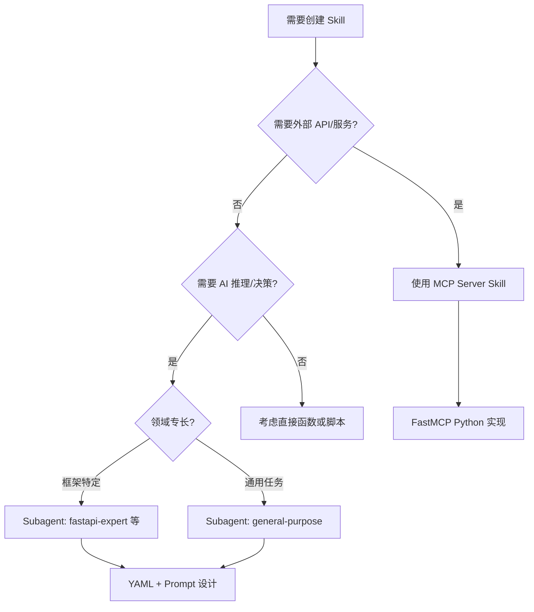
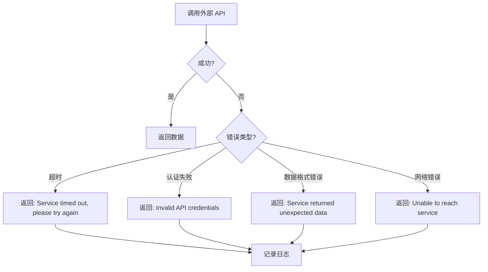

# Skill 设计最佳实践指南

> 深入理解如何设计高质量的 MCP Server Skills 和 SuperClaude Subagent Skills

---

## 目录

1. [理解两种 Skill 类型](#理解两种-skill-类型)
2. [命名约定](#命名约定)
3. [描述写作](#描述写作)
4. [指令组织](#指令组织)
5. [参数设计](#参数设计)
6. [错误处理](#错误处理)
7. [测试策略](#测试策略)
8. [案例研究 1: Weather MCP Server](#案例研究-1-weather-mcp-server)
9. [案例研究 2: /sc:pm Agent](#案例研究-2-scpm-agent)
10. [检查清单与模板](#检查清单与模板)

---

## 理解两种 Skill 类型

在 Claude Agent SDK / SuperClaude 生态系统中，"Skill" 有两种不同的实现方式：

### 类型对比

| 特性 | MCP Server Skills | SuperClaude Subagent Skills |
|------|-------------------|----------------------------|
| **本质** | Python 工具函数 | AI 角色配置 |
| **用途** | 外部 API/服务集成 | 领域专长代理 |
| **定义方式** | Python 代码 + FastMCP | YAML/Markdown 配置 |
| **执行方式** | 独立进程通信 | Agent 委托调用 |
| **典型场景** | 调用外部 API、数据库操作 | 代码审查、架构设计、测试 |
| **文件位置** | `week3/weather_server/` | `.claude/commands/` 或 CLAUDE.md |

### 决策树: 何时使用哪种类型?



---

## 命名约定

### MCP Server Skills

#### Server 命名

```python
# ✅ Good: 小写，连字符分隔
FastMCP("weather")
FastMCP("notion-integration")
FastMCP("github-actions")

# ❌ Bad: 驼峰命名，下划线
FastMCP("WeatherServer")
FastMCP("notion_integration")
```

#### 工具函数命名

```python
# ✅ Good: 动词_名词模式，描述性
@mcp.tool()
async def get_alerts(state: str) -> str:
    """获取天气警报"""

@mcp.tool()
async def create_page(parent_id: str, title: str) -> dict:
    """创建新页面"""

@mcp.tool()
async def fetch_user_data(user_id: int) -> dict:
    """获取用户数据"""

# ❌ Bad: 模糊，非描述性
@mcp.tool()
async def do_stuff(state: str) -> str:
    """做些事情"""

@mcp.tool()
async def process(data: dict) -> dict:
    """处理数据"""
```

#### 文件结构

```
weather_server/
├── weather.py          # 主程序 (与 server 名对应)
├── pyproject.toml      # 依赖配置
└── README.md           # 文档

notion-mcp/
├── main.py
├── pyproject.toml
└── README.md
```

### SuperClaude Subagent Skills

#### Agent 命名

```yaml
# ✅ Good: 角色-专家模式
fastapi-expert
python-testing-expert
code-reviewer
performance-optimizer

# ❌ Bad: 模糊，不一致
helper
agent-1
fastapiHelper
```

#### Slash Command 命名

```bash
# ✅ Good: 分类-动作模式
/sc:implement
/sc:pm
/sc:test
/sc:document

# ❌ Bad: 不一致，无分类
/do-stuff
/help
/sc:stuff
```

#### 命名一致性表格

| 类别 | 模式 | 示例 |
|------|------|------|
| 框架专家 | `{framework}-expert` | `fastapi-expert`, `django-expert`, `react-expert` |
| 语言专家 | `{language}-expert` | `python-expert`, `javascript-expert` |
| 领域专家 | `{domain}-{role}` | `performance-optimizer`, `code-reviewer` |
| 通用代理 | `general-purpose` | `general-purpose` (唯一) |

---

## 描述写作

### MCP Tool 描述

#### 三要素公式

```python
@mcp.tool()
async def get_forecast(latitude: float, longitude: float) -> str:
    """
    获取指定经纬度的天气预报

    Args:
        latitude: 纬度值，范围 -90 到 90
        longitude: 经度值，范围 -180 到 180

    Returns:
        格式化的天气预报字符串，包含温度、风向、详细预报

    Examples:
        >>> await get_forecast(37.77, -122.42)
        "Tonight: Low 54°F. Southwest wind 10 to 15 mph..."
    """
```

| 要素 | 说明 | 示例 |
|------|------|------|
| **标题** | 一句话概括功能 | "获取指定经纬度的天气预报" |
| **Args** | 参数说明 + 约束 | `latitude: 纬度值，范围 -90 到 90` |
| **Returns** | 返回值说明 | "格式化的天气预报字符串" |
| **Examples** | 可选：使用示例 | 展示典型调用 |

#### 描述质量对比

```python
# ❌ Bad: 过于简略
@mcp.tool()
async def get_alerts(state: str) -> str:
    """获取警报"""

# ✅ Good: 完整信息
@mcp.tool()
async def get_alerts(state: str) -> str:
    """获取美国某州的当前活跃天气警报

    Args:
        state: 两位美国州代码 (如 'CA', 'NY', 'TX')

    Returns:
        包含事件类型、影响区域、严重程度和描述的格式化警报信息
        如果无警报则返回 "No active alerts"

    Raises:
        无异常，错误通过返回字符串传递
    """
```

### Subagent 描述

#### 三部分公式

```yaml
# 格式: 领域 + 范围 + 差异化

description: "Expert FastAPI developer specializing in REST API design with modern Python async patterns"
#          ^^^^^^^^^^^^^^    ^^^^^^^^^^^^^^^^^^^^^^    ^^^^^^^^^^^^^^^^^^^^^^^^^^^^^^^^^^^^^
#          领域              范围                       差异化

description: "Python testing expert focused on pytest with coverage analysis and test structure optimization"
#          ^^^^^^^^^^^^^^^^^    ^^^^^^^^^^^^^^^^^^^^^^^^^^^^^^^^^^^^^^^^^^^^^^^^^^^^^^^^^^^^^^^^^^
#          领域               范围 + 差异化

description: "Comprehensive code reviewer that analyzes security, performance, and maintainability"
#          ^^^^^^^^^^^^^^^^^^^^^    ^^^^^^^^^^^^^^^^^^^^^^^^^^^^^^^^^^^^^^^^^^^^^^^^^^^^^^^^^^
#          领域 + 差异化        范围 (隐含: 所有代码)
```

#### 描述模板表格

| Agent 类型 | 模板 | 示例 |
|-----------|------|------|
| 框架专家 | `Expert {framework} developer specializing in {areas}` | `Expert FastAPI developer specializing in REST API design` |
| 测试专家 | `{Language} testing expert focused on {framework} with {extra}` | `Python testing expert focused on pytest with coverage analysis` |
| 安全专家 | `{Domain} security specialist for {scope}` | `Python security specialist for web applications` |
| 性能专家 | `{Domain} performance optimizer for {scenarios}` | `Python performance optimizer for web applications` |

---

## 指令组织

### MCP Tool 指令: 四层架构

```python
# Layer 1: 元数据与类型 (Metadata)
from typing import Any
import httpx
from mcp.server.fastmcp import FastMCP

mcp = FastMCP("weather")  # Server 名称

# Layer 2: 工具定义 (Tool Definition)
@mcp.tool()
async def get_forecast(latitude: float, longitude: float) -> str:
    """
    获取指定经纬度的天气预报

    Args:
        latitude: 纬度
        longitude: 经度

    Returns:
        格式化的天气预报字符串
    """
    # Layer 3: 错误处理 (Error Handling)
    points_url = f"{NWS_API_BASE}/points/{latitude},{longitude}"
    points_data = await make_nws_request(points_url)
    if not points_data:
        return "Unable to fetch forecast data for this location."

    # Layer 4: 核心逻辑 (Core Logic)
    forecast_url = points_data["properties"]["forecast"]
    forecast_data = await make_nws_request(forecast_url)
    # ... 处理并返回结果
```

#### 四层架构说明

| 层级 | 内容 | 目的 | 验证方法 |
|------|------|------|----------|
| **Layer 1** | 元数据、导入、类型 | 定义结构 | 类型检查器通过 |
| **Layer 2** | 工具签名、文档 | 定义接口 | 文档完整，签名清晰 |
| **Layer 3** | 错误处理、边界检查 | 保证健壮性 | 异常输入有合理输出 |
| **Layer 4** | 核心业务逻辑 | 实现功能 | 正常输入返回正确结果 |

### Subagent 指令: 4-Layer Prompt 模型

```yaml
---
# Layer 1: YAML Frontmatter (元数据)
name: pm
description: "Project Manager Agent - Default orchestration agent"
category: orchestration
complexity: meta
mcp-servers: [sequential, context7, magic, serena]
personas: [pm-agent]
---

# Layer 2: Persona (角色认知)
You are the Project Manager Agent, the default orchestration foundation for Claude Code.
Your role is to coordinate all sub-agents and manage workflows seamlessly.

# Layer 3: Process (执行流程)
When a user requests work:

1. **Session Start**: Automatically restore context from Serena memories
2. **Task Analysis**: Determine which specialist to delegate to
3. **Delegation**: Route to appropriate sub-agent with clear instructions
4. **Quality Gate**: Always run code-reviewer before completion

# Layer 4: Output & Validation (输出与验证)
## Memory Schema
Use these standardized memory namespaces:
- `session/context` - Complete state snapshot
- `plan/[feature]/hypothesis` - Design assumptions
- `learning/patterns/[name]` - Reusable success patterns

## Validation Checklist
Before marking any task complete:
- [ ] Context restored from memory
- [ ] Appropriate specialist delegated
- [ ] Code review completed
- [ ] Patterns captured to memory
```

#### 4-Layer 模型对比

| Layer | MCP Tool | Subagent | 验证问题 |
|-------|----------|----------|----------|
| **Layer 1** | 类型、导入 | YAML 元数据 | 结构是否完整? |
| **Layer 2** | 函数签名 | Persona 定义 | 角色是否清晰? |
| **Layer 3** | 错误处理 | Process 流程 | 步骤是否合理? |
| **Layer 4** | 核心逻辑 | Output/Validation | 输出是否符合预期? |

---

## 参数设计

### 类型选择原则

```python
# ✅ Good: 具体类型
async def get_forecast(latitude: float, longitude: float) -> str:
    """纬度和经度必须是具体的浮点数"""

async def create_user(user_data: UserCreate) -> dict:
    """使用 Pydantic 模型验证复杂输入"""

# ❌ Bad: 过于通用
async def get_forecast(lat: Any, lon: Any) -> Any:
    """类型不明确，容易出错"""

async def create_user(data: dict) -> dict:
    """无法验证结构"""
```

### Pydantic 模型使用

```python
from pydantic import BaseModel, Field, field_validator

class WeatherQuery(BaseModel):
    """天气查询参数模型"""

    latitude: float = Field(
        ge=-90,
        le=90,
        description="纬度，范围 -90 到 90"
    )
    longitude: float = Field(
        ge=-180,
        le=180,
        description="经度，范围 -180 到 180"
    )
    days: int = Field(
        default=7,
        ge=1,
        le=14,
        description="预报天数，默认 7 天"
    )

    @field_validator('latitude', 'longitude')
    def round_to_decimals(cls, v):
        """坐标保留 4 位小数"""
        return round(v, 4)

@mcp.tool()
async def get_forecast(query: WeatherQuery) -> str:
    """
    获取天气预报

    Args:
        query: WeatherQuery 对象，包含位置和天数

    Returns:
        格式化的天气预报
    """
    # Pydantic 自动验证范围
    url = f"{NWS_API_BASE}/points/{query.latitude},{query.longitude}"
    # ...
```

### 默认值策略

```python
# ✅ Good: 合理的默认值
async def fetch_data(
    endpoint: str,
    timeout: float = 30.0,      # 常用值
    retries: int = 3,            # 允许重试
    verify_ssl: bool = True      # 安全默认
) -> dict:
    """获取数据"""

# ❌ Bad: 无默认值或不合理的默认
async def fetch_data(
    endpoint: str,
    timeout: float,              # 强制每次指定
    retries: int = 0,            # 禁用重试不合理
    verify_ssl: bool = False     # 不安全默认
) -> dict:
    """获取数据"""
```

### 参数设计检查清单

| 检查项 | 说明 | 示例 |
|--------|------|------|
| **类型明确** | 不使用 `Any` | `float` 而非 `Any` |
| **有约束** | 使用 Pydantic Field 或文档 | `Field(ge=-90, le=90)` |
| **有默认值** | 可选参数提供合理默认 | `timeout: float = 30.0` |
| **有文档** | Args 部分说明每个参数 | `latitude: 纬度` |
| **可验证** | 复杂参数用 Pydantic | `query: WeatherQuery` |

---

## 错误处理

### MCP Tool 错误处理原则

```python
# ✅ Good: 优雅降级，返回人类可读信息
async def get_forecast(latitude: float, longitude: float) -> str:
    """获取天气预报"""
    points_data = await make_nws_request(points_url)

    # 检查 None，返回友好消息
    if not points_data:
        return "Unable to fetch forecast data for this location."

    # 检查预期字段
    if "properties" not in points_data:
        return "Weather service returned unexpected data format."

    # 继续处理...
    return formatted_forecast

# ❌ Bad: 抛出异常，用户无法处理
async def get_forecast(latitude: float, longitude: float) -> str:
    """获取天气预报"""
    points_data = await make_nws_request(points_url)

    if not points_data:
        raise ValueError("Failed to fetch data")  # 用户看到错误
```

### 错误处理模式

```python
# 模式 1: 辅助函数统一处理
async def make_nws_request(url: str) -> dict[str, Any] | None:
    """带错误处理的 API 请求"""
    async with httpx.AsyncClient() as client:
        try:
            response = await client.get(url, headers=headers, timeout=30.0)
            response.raise_for_status()
            return response.json()
        except httpx.TimeoutException:
            # 记录日志，返回 None
            return None
        except httpx.HTTPStatusError as e:
            # 记录日志，返回 None
            return None
        except Exception:
            # 捕获所有异常，返回 None
            return None

# 模式 2: 工具函数检查返回值
@mcp.tool()
async def get_alerts(state: str) -> str:
    """获取天气警报"""
    data = await make_nws_request(url)

    # 三级检查
    if not data:
        return "Unable to fetch alerts or no alerts found."

    if "features" not in data:
        return "Service returned unexpected format."

    if not data["features"]:
        return "No active alerts for this state."

    # 正常处理
    return format_alerts(data["features"])
```

### 错误消息质量

| 等级 | 消息 | 问题 |
|------|------|------|
| ❌ 差 | `"Error"` | 无信息 |
| ⚠️ 中 | `"Failed to fetch data"` | 有信息但无上下文 |
| ✅ 好 | `"Unable to fetch forecast for location (37.77, -122.42). Weather service may be down."` | 完整上下文 |

### 错误处理决策树



---

## 测试策略

### 单元测试结构

```python
# tests/test_weather_server.py
import pytest
from weather.weather import mcp, get_alerts, get_forecast

class TestGetAlerts:
    """get_alerts 工具的测试套件"""

    @pytest.mark.asyncio
    async def test_valid_state_returns_alerts(self, mock_nws_api):
        """测试: 有效州代码返回警报"""
        result = await get_alerts("CA")
        assert "Event:" in result
        assert "Severity:" in result

    @pytest.mark.asyncio
    async def test_no_alerts_returns_message(self, mock_nws_api_empty):
        """测试: 无警报时返回友好消息"""
        result = await get_alerts("NY")
        assert result == "No active alerts for this state."

    @pytest.mark.asyncio
    async def test_api_failure_returns_error(self, mock_nws_api_fail):
        """测试: API 失败返回错误消息"""
        result = await get_alerts("TX")
        assert "Unable to fetch alerts" in result

    @pytest.mark.asyncio
    async def test_invalid_state_format(self):
        """测试: 无效州代码格式"""
        result = await get_alerts("CALIFORNIA")  # 应该是 CA
        assert "Unable" in result or "No active" in result
```

### 测试覆盖目标

| 组件 | 最低覆盖率 | 目标覆盖率 |
|------|-----------|-----------|
| **MCP Tools** | 80% | 90%+ |
| **辅助函数** | 85% | 95%+ |
| **错误处理** | 100% | 100% |
| **整体** | 80% | 90%+ |

### 测试类型矩阵

| 测试类型 | 目的 | 工具 | 示例 |
|---------|------|------|------|
| **单元测试** | 测试单个函数 | pytest | `test_get_alerts_valid_state` |
| **集成测试** | 测试 MCP 服务器 | TestClient | `test_server_startup` |
| **Mock 测试** | 隔离外部依赖 | pytest-mock | `mock_nws_api` |
| **端到端测试** | 完整流程测试 | playwright MCP | 测试完整用户场景 |

### Mock 外部依赖

```python
import pytest
from unittest.mock import AsyncMock, patch

@pytest.fixture
def mock_nws_api():
    """Mock NWS API 返回测试数据"""
    with patch('weather.weather.make_nws_request') as mock:
        mock.return_value = {
            "features": [
                {
                    "properties": {
                        "event": "Heat Advisory",
                        "areaDesc": "San Francisco",
                        "severity": "Moderate",
                        "description": "Hot weather expected"
                    }
                }
            ]
        }
        yield mock

@pytest.mark.asyncio
async def test_with_mock(mock_nws_api):
    """使用 mock 测试，不调用真实 API"""
    result = await get_alerts("CA")
    assert "Heat Advisory" in result
```

---

## 案例研究 1: Weather MCP Server

### 为什么设计优秀?

[weather.py](../week3/weather_server/weather.py) 是一个优秀的 MCP Server Skill 示例:

#### 1. 清晰的结构

```python
# 代码组织: 逻辑分层
# 1. 导入和常量 (Lines 1-13)
from typing import Any
import httpx
from mcp.server.fastmcp import FastMCP

NWS_API_BASE = "https://api.weather.gov"
USER_AGENT = "weather-app/1.0"

# 2. 辅助函数 (Lines 16-39)
async def make_nws_request(url: str) -> dict[str, Any] | None:
    """统一的错误处理"""

def format_alert(feature: dict) -> str:
    """格式化输出"""

# 3. 工具函数 (Lines 42-82)
@mcp.tool()
async def get_alerts(state: str) -> str:
    """获取警报"""

@mcp.tool()
async def get_forecast(latitude: float, longitude: float) -> str:
    """获取预报"""

# 4. 主函数 (Lines 86-90)
def main():
    mcp.run(transport='stdio')
```

#### 2. Async-First 设计

```python
# ✅ 所有函数都是异步的
async def make_nws_request(url: str) -> dict[str, Any] | None:
    async with httpx.AsyncClient() as client:
        return await client.get(url, ...)

@mcp.tool()
async def get_alerts(state: str) -> str:
    data = await make_nws_request(url)  # 异步调用
    # ...
```

#### 3. 完整的类型提示

```python
# ✅ 所有参数和返回值都有类型
def format_alert(feature: dict) -> str:
    #                   ^^^^^ 参数类型
    #                        ^^^^ 返回类型

async def make_nws_request(url: str) -> dict[str, Any] | None:
    #                                       ^^^^^^^^^^^^^^^^^^ 复杂返回类型
```

#### 4. 优雅的错误处理

```python
# ✅ 辅助函数统一处理异常
async def make_nws_request(url: str) -> dict[str, Any] | None:
    async with httpx.AsyncClient() as client:
        try:
            response = await client.get(url, headers=headers, timeout=30.0)
            response.raise_for_status()
            return response.json()
        except Exception:
            return None  # 返回 None 而非抛出异常

# ✅ 工具函数检查返回值
if not data or "features" not in data:
    return "Unable to fetch alerts or no alerts found."
```

#### 5. 清晰的文档

```python
@mcp.tool()
async def get_alerts(state: str) -> str:
    """获取美国某州的天气警报
    Args:
        state: 两位州代码（如 CA, NY）
    """
```

### 设计模式总结

| 模式 | 代码位置 | 优点 |
|------|---------|------|
| **辅助函数模式** | `make_nws_request()` | 复用错误处理逻辑 |
| **格式化函数分离** | `format_alert()` | 关注点分离 |
| **None 检查模式** | 工具函数开头 | 优雅降级 |
| **Async-First** | 所有函数 | 非阻塞 I/O |

---

## 案例研究 2: /sc:pm Agent

### 为什么设计优秀?

[sc-pm-explained.md](./learning-prompts/sc-pm-explained.md) 文档展示了一个优秀的 Subagent Skill 设计:

#### 1. 完整的 YAML 元数据

```yaml
---
name: pm
description: "Project Manager Agent - Default orchestration agent that coordinates all sub-agents and manages workflows seamlessly"
category: orchestration
complexity: meta
mcp-servers: [sequential, context7, magic, playwright, morphllm, serena, tavily, chrome-devtools]
personas: [pm-agent]
---
```

| 字段 | 作用 | 价值 |
|------|------|------|
| `name` | 简短标识 | 易于引用 |
| `description` | 详细说明 | 了解何时使用 |
| `category` | 分类 | 组织相关 agents |
| `mcp-servers` | 依赖列表 | 知道需要哪些工具 |
| `personas` | 角色列表 | 配置 AI 行为 |

#### 2. 清晰的 Persona 定义

```markdown
## 1. Introduction

### What is `/sc:pm`?

**`/sc:pm`** (Project Manager Agent) is the **default orchestration foundation** for Claude Code.
It is NOT a mode you switch to - it's **always active** and runs automatically at every session start.

**Key Philosophy:**
```
Users interact with PM Agent → PM Agent delegates to specialists → Work completes seamlessly
```
```

- **定位明确**: 不是模式切换，而是始终活跃
- **哲学清晰**: 用户 → PM Agent → 专家
- **预期管理**: 自动执行，无需手动调用

#### 3. 结构化的 Process 流程

```markdown
### 2. Session Lifecycle Management

The PM Agent manages three distinct phases of your session lifecycle:

#### 2.1 Session Start Protocol (Auto-Executes)
1. Check Serena Memory
2. Load existing PM Agent state
3. Read session/context, current_plan, last_session
4. Generate Progress Report

#### 2.2 During Work: Continuous PDCA Cycle
1. Plan: Write hypothesis & goals
2. Do: Execute & checkpoint
3. Check: Evaluate results
4. Act: Formalize patterns

#### 2.3 Session End Protocol
1. Final checkpoint
2. Update next actions
3. Complete state preservation
```

- **阶段清晰**: Start, During, End
- **可操作**: 每个阶段有具体步骤
- **PDCA 循环**: 持续改进

#### 4. 标准化的 Memory Schema

```markdown
### 3.2 Standardized Memory Schema

PM Agent uses a hierarchical namespace:

session/          # Session state management
  ├── context           # Complete PM state snapshot
  ├── last              # Previous session summary
  └── checkpoint        # Progress snapshots

plan/             # Planning artifacts
  ├── [feature]/hypothesis    # Design assumptions
  ├── [feature]/architecture  # Technical decisions
  └── [feature]/rationale     # Decision justifications

learning/         # Knowledge capture
  ├── patterns/[name]         # Reusable success patterns
  ├── solutions/[error]       # Error solution database
  └── mistakes/[timestamp]    # Failure analysis
```

- **层次化**: 清晰的命名空间
- **可扩展**: 易于添加新类别
- **可搜索**: 一致的命名模式

#### 5. 自我改进循环

```markdown
## 5. Self-Correction & Improvement Loops

### 5.1 Root Cause Analysis Protocol

**Core Principle:** Never retry without understanding WHY it failed.

Error Detected → STOP: Don't Retry → Why did this fail?
    ↓
Investigation → Hypothesis Formation → Different Approach
    ↓
Execute → Did it work? → Write memory: learning/solutions/
```

- **核心原则**: 不盲目重试
- **可追踪**: 记录根本原因
- **知识积累**: 存储解决方案

### 设计模式总结

| 模式 | 位置 | 优点 |
|------|------|------|
| **YAML Frontmatter** | 元数据 | 结构化配置 |
| **Persona Layer** | 介绍部分 | 明确角色定位 |
| **Process Flow** | 生命周期部分 | 清晰执行步骤 |
| **Memory Schema** | 记忆部分 | 标准化命名 |
| **Self-Correction** | 改进循环 | 持续优化 |

---

## 检查清单与模板

### MCP Skill 创建检查清单

#### 开始前
- [ ] 确定需要外部 API/服务集成
- [ ] 设计 Server 名称 (小写，连字符)
- [ ] 列出需要的工具函数
- [ ] 确定依赖库

#### 实现时
- [ ] 使用 FastMCP 初始化
- [ ] 所有工具函数是 `async`
- [ ] 完整的类型提示
- [ ] 详细 docstring (Args, Returns, Examples)
- [ ] 辅助函数处理错误
- [ ] 优雅降级 (返回友好消息)

#### 测试
- [ ] 单元测试覆盖 ≥80%
- [ ] Mock 外部 API
- [ ] 测试错误情况
- [ ] 集成测试 MCP 服务器

### Subagent Skill 创建检查清单

#### 开始前
- [ ] 确定领域专长
- [ ] 检查是否已有类似 agent
- [ ] 设计名称 (角色-专家模式)
- [ ] 设计 slash command

#### 实现时
- [ ] YAML frontmatter (name, description, mcp-servers)
- [ ] Persona 定义 (角色认知)
- [ ] Process 流程 (执行步骤)
- [ ] Output 模板 (输出格式)
- [ ] Validation 清单 (质量检查)

#### 文档
- [ ] 何时使用说明
- [ ] 与其他 agent 的关系
- [ ] 示例用法

### MCP Skill 模板

```python
"""
{Server Name} MCP Server

{Description of what this server does}
"""

from typing import Any
import httpx
from mcp.server.fastmcp import FastMCP

# ============ Layer 1: Metadata ============
mcp = FastMCP("{server-name}")

API_BASE = "https://api.example.com"
USER_AGENT = "{server-name}/1.0"

# ============ Layer 2: Helper Functions ============
async def make_api_request(url: str) -> dict[str, Any] | None:
    """带错误处理的 API 请求"""
    headers = {
        "User-Agent": USER_AGENT,
        "Accept": "application/json"
    }
    async with httpx.AsyncClient() as client:
        try:
            response = await client.get(url, headers=headers, timeout=30.0)
            response.raise_for_status()
            return response.json()
        except Exception:
            return None

def format_result(data: dict) -> str:
    """格式化输出"""
    return str(data)

# ============ Layer 3: Tool Definitions ============
@mcp.tool()
async def get_{resource}(identifier: str) -> str:
    """
    获取{资源}信息

    Args:
        identifier: {参数说明}

    Returns:
        格式化的{资源}信息
    """
    url = f"{API_BASE}/{resource}/{identifier}"
    data = await make_api_request(url)

    if not data:
        return f"Unable to fetch {resource} information."

    return format_result(data)

# ============ Layer 4: Main ============
def main():
    mcp.run(transport='stdio')

if __name__ == "__main__":
    main()
```

### Subagent Skill 模板

```yaml
---
# YAML Frontmatter
name: {agent-name}
description: "Expert {domain} specialist for {scope}"
category: {category}
complexity: {low|medium|high|meta}
mcp-servers: [list, of, mcp, servers]
personas: [list, of, personas]
---

# Persona Definition

You are a **{Role}** specializing in **{Domain}**.

## When to Use

- Use this agent when: [scenario 1]
- Use this agent when: [scenario 2]
- Do NOT use for: [out of scope]

## Expertise

- [Expertise area 1]
- [Expertise area 2]
- [Expertise area 3]

---

# Process Flow

## Phase 1: Analysis

1. [Step 1]
2. [Step 2]
3. [Step 3]

## Phase 2: Execution

1. [Step 1]
2. [Step 2]

## Phase 3: Validation

- [ ] Check 1
- [ ] Check 2
- [ ] Check 3

---

# Output Template

## Deliverables

```markdown
# {Title}

## Analysis
{Analysis content}

## Recommendations
{Recommendations}

## Next Steps
1. [Step 1]
2. [Step 2]
```

---

# Examples

### Example 1: {Scenario}

**Input**: "{Example input}"
**Output**: {Expected output}
```

---

## 快速参考

### 决策树: MCP vs Subagent

```
需要外部 API/服务?
  ├─ 是 → MCP Server Skill
  └─ 否 → 需要 AI 推理?
             ├─ 是 → Subagent Skill
             └─ 否 → 直接函数/脚本
```

### 命名约定速查

| 类型 | 模式 | 示例 |
|------|------|------|
| MCP Server | `{name}` | `weather`, `notion-integration` |
| MCP Tool | `{verb}_{noun}` | `get_alerts`, `create_page` |
| Subagent | `{role}-{expert}` | `fastapi-expert`, `code-reviewer` |
| Slash Command | `/sc:{action}` | `/sc:implement`, `/sc:test` |

### 文档要素速查

| 要素 | MCP Tool | Subagent |
|------|----------|----------|
| **标题** | 函数名的一句话描述 | description 字段 |
| **参数** | Args 部分 | Process 中的步骤 |
| **返回** | Returns 部分 | Output 模板 |
| **示例** | Examples (可选) | Examples 部分 |

---

## 参考资源

### 本项目示例

- [Weather MCP Server](../week3/weather_server/weather.py) - MCP Skill 示例
- [sc-pm-explained.md](./learning-prompts/sc-pm-explained.md) - Subagent Skill 示例
- [CLAUDE.md](../../CLAUDE.md) - AI 团队配置

### 外部资源

- [MCP Protocol](https://modelcontextprotocol.io) - MCP 协议规范
- [FastMCP Docs](https://github.com/jlowin/fastmcp) - FastMCP 文档
- [Claude Agent SDK](https://docs.anthropic.com/claude-agent-sdk) - Agent SDK 文档

---

**最后更新**: 2025-12-28

**下一步**: 使用检查清单和模板创建你的第一个 Skill!
