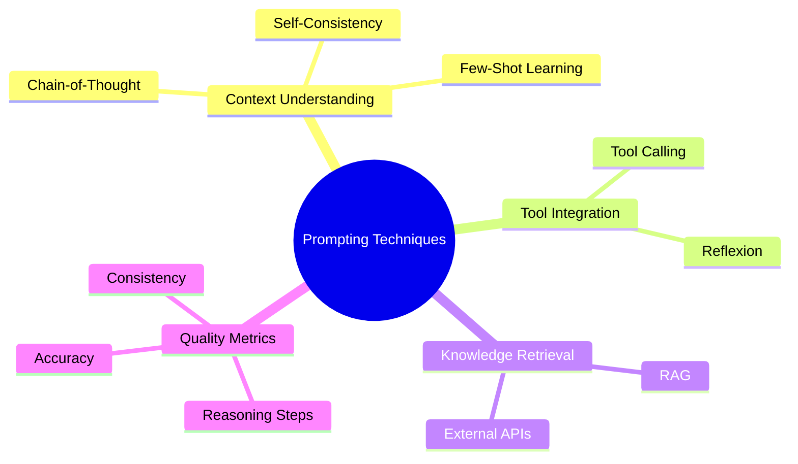

# Week 1: Prompting Techniques

> **Navigation**: [CS146S Docs](../INDEX.md) > [Weeks](../weeks/) > [Week 1](../weeks/week01/) > Overview

> **Goal**: Build a solid theoretical foundation before implementing the 6 core Prompting techniques
> **Learning Period**: Week 1 — Prompting Fundamentals

---

## Learning Objectives

By the end of Week 1, you will be able to:

- **Understand** the 6 core prompting techniques and their theoretical foundations
- **Diagnose** when and why LLMs fail at specific tasks
- **Apply** K-shot prompting effectively to overcome semantic interference
- **Design** systematic prompting strategies using the 5W1H framework
- **Evaluate** prompting techniques based on cost, quality, and reliability trade-offs

---

## Key Concepts

### 1. Concept Map



### 2. Core Terminology

| Term | Definition | AI Engineer Significance |
|------|------------|-------------------------|
| **Prompt** | Instructions or questions input to an LLM | Interface for controlling LLM behavior; quality directly impacts output |
| **Few-Shot Learning** | Teaching a model tasks through minimal examples | Adapts to new tasks without fine-tuning |
| **Chain-of-Thought** | Making models show reasoning steps instead of direct answers | Improves accuracy on complex reasoning tasks; enhances interpretability |
| **Self-Consistency** | Sampling reasoning paths multiple times, selecting majority answer | Improves robustness through voting mechanism |
| **Tool Calling** | LLM invoking external tools and functions | Extends LLM capabilities; enables hybrid systems |
| **RAG** | Retrieval-Augmented Generation | Integrates real-time knowledge bases into LLM generation |
| **Reflexion** | Model self-assessment and improvement | Enables adaptive feedback loops for LLMs |

### 3. The AI Engineering Mindset

#### Why This Matters

**Core Pain Points Addressed**:

1. **LLM Limitations**
   - **Fact hallucination**: Models generate plausible but incorrect information
   - **Reasoning capability**: Insufficient accuracy on complex logic
   - **Stale knowledge**: Training data is fixed; cannot access real-time information

2. **Production System Requirements**
   - **Reliability**: Need consistent and verifiable outputs
   - **Integration**: Must work with existing systems, databases, APIs
   - **Interpretability**: Need to understand LLM decision-making

#### Real-World Applications

1. **Customer Service Systems** (Few-Shot + RAG)
   - Use historical conversation examples to teach model style
   - Retrieve knowledge base for accurate answers
   - Avoid repeating identical responses

2. **Code Generation** (Chain-of-Thought)
   - "Make model explain algorithmic thinking step-by-step"
   - Generated code logic is clearer, fewer bugs
   - Facilitates code review and maintenance

3. **Data Analysis** (Tool Calling + Reflexion)
   - LLM identifies required analysis, automatically invokes database queries
   - Validates results, retries if unsatisfied
   - No manual SQL writing needed

4. **Medical Diagnosis** (Self-Consistency)
   - Multiple reasoning paths vote
   - Improves diagnostic accuracy and credibility
   - Critical scenarios require enhanced reliability

### 4. Common Pitfalls & Anti-Patterns

#### ❌ Pitfall 1: "Longer prompts always work better"

**Trap**: Overly long prompts increase token costs while reducing key information weight

**Correct approach**:
- Use clear structure rather than lengthy descriptions
- Separate "role" from "task"
- Place critical information at the beginning

#### ❌ Pitfall 2: "Chain-of-Thought is always better than direct answers"

**Trap**: Over-engineering simple problems adds latency

**Correct approach**:
- Simple problems: Ask directly
- Complex problems: Request reasoning steps
- Choose based on task complexity

#### ❌ Pitfall 3: "RAG can completely replace fine-tuning"

**Trap**: RAG solves knowledge problems but cannot change model reasoning patterns

**Correct approach**:
- RAG: Adds knowledge
- Fine-tuning: Changes behavior and style
- Combined use is optimal

#### ❌ Pitfall 4: "One prompt works for all users"

**Trap**: Different users, languages, and scenarios require adjustment

**Correct approach**:
- A/B test different prompt versions
- Monitor output quality metrics
- Regularly iterate and optimize

### 5. Expert Best Practices

#### ✅ Best Practice 1: Systematic Prompt Engineering

```
Implementation Steps:
1. Clearly define task goals and success metrics
2. Design basic prompt template
3. Evaluate effectiveness using test set
4. Iteratively optimize (improve examples, instructions, structure)
5. A/B test to validate
```

#### ✅ Best Practice 2: Multi-Technique Composition

```python
# Example: Complex reasoning task
pipeline = [
    FewShotPrompt(examples=best_examples),  # Set context
    ChainOfThoughtPrompt(),                  # Show reasoning
    SelfConsistencyVoting(n_samples=5),      # Multiple voting
    ToolCalling(tools=available_tools)       # Verify and adjust
]
```

#### ✅ Best Practice 3: Cost-Quality Trade-offs

| Scenario | Recommended Approach | Rationale |
|----------|---------------------|-----------|
| High cost sensitivity | Few-Shot Prompting | Few tokens, fast |
| High precision requirements | Chain-of-Thought + Self-Consistency | Multiple steps ensure accuracy |
| Real-time systems | Tool Calling + Caching | Integrate external data, reduce hallucination |
| Continuous improvement | Reflexion + Monitoring | Automatic feedback and optimization |

#### ✅ Best Practice 4: Observability & Monitoring

```
Key Metrics:
- Accuracy: Compare with ground truth
- Consistency: Do similar inputs produce similar outputs?
- Latency: Time from input to output
- Cost: Token usage
- User satisfaction: Feedback scores

Implementation:
→ Each prompt version has a version number
→ Log key metrics to database
→ Regularly generate reports and comparisons
```

---

## Prerequisites

### Technical Requirements
- Python 3.10+
- Ollama installed with `mistral-nemo:12b` model (or similar)
- Basic understanding of LLM concepts

### Conceptual Prerequisites
- Familiarity with basic prompt engineering
- Understanding of probability and sampling in LLMs
- Comfort with iterative experimentation

### Setup Commands

```bash
# Activate conda environment
conda activate cs146s

# Verify Ollama installation
ollama list

# Verify model is available
ollama show mistral-nemo:12b
```

---

## Resources

### Primary Resources
- [Week 1 Learning Notes - Pre-Learning Concepts](../../learning_notes/week1/01_pre_learning_concepts.md) - Comprehensive theoretical foundation
- [Week 1 Assignment](../../weeks/week1/) - Practical implementation exercises

### Supplementary Materials
- [Prompt Engineering Methodology](../../learning_notes/week1/01_prompt_engineering_methodology.md) - Systematic approach to prompt design
- [AI Agent Interaction Guide](../../learning_notes/week1/02_ai_agent_interaction_guide.md) - How to effectively collaborate with AI coding agents
- [Case Study: httpstatus Reversal](../../learning_notes/week1/03_case_study_httpstatus_reversal.md) - Detailed walkthrough of a complete problem-solving cycle
- [Code Review Feedback](../../learning_notes/week1/03_code_review_feedback.md) - Real feedback and improvements
- [Quick Reference](../../learning_notes/week1/04_quick_reference.md) - Technique selection matrix and cheat sheets
- [Chain-of-Thought Deep Dive](../../learning_notes/week1/05_chain_of_thought_deep_dive.md) - In-depth exploration of CoT

### External References
- [Ollama Documentation](https://ollama.com/docs) - Local LLM inference
- [Prompt Engineering Guide](https://www.promptingguide.ai/) - Comprehensive prompting techniques

---

## Related Patterns

- [K-Shot Prompting](../patterns/k-shot-prompting.md) - Detailed implementation pattern
- [Chain-of-Thought Prompting](../patterns/chain-of-thought.md) - Reasoning enhancement pattern
- [RAG Pattern](../patterns/rag.md) - Retrieval-augmented generation

---

## Quick Links

- [Implementation Details](./implementation.md) - Technical approach and code structure
- [Reflection](./reflection.md) - Learning outcomes and lessons learned
- [Weekly Deliverable](../../weeks/week1/writeup.md) - Submission writeup

---

## AI Engineering Mindset

### The Three Questions

1. **What's the bottleneck?**
   - Repetitive prompt trial-and-error without systematic diagnosis
   - Lack of observability in prompt performance
   - Manual evaluation of prompt variations

2. **What's the leverage point?**
   - Build reusable prompt templates with clear input/output contracts
   - Create automated evaluation frameworks for prompt testing
   - Develop systematic diagnosis workflows (5W1H framework)

3. **How to compound value?**
   - Combine multiple prompting techniques for complex tasks
   - Use learnings from Week 1 to accelerate Weeks 2-8
   - Build prompt versioning and A/B testing infrastructure

### Automation Level Target: Level 2-3

**Current state**: Most prompting is manual, one-off experimentation
**Target state**:
- **Level 2 (Reusable Functions)**: Prompt templates that can be parameterized for different tasks
- **Level 3 (Composable Systems)**: Prompt pipelines that chain multiple techniques together

### Week 1 Learning Roadmap

```
Day 1-2: Theory Learning
  ├─ Read this overview
  ├─ Understand 6 prompting techniques
  └─ Complete reflection questions

Day 3-7: Hands-On Implementation
  ├─ K-Shot Prompting (foundation)
  ├─ Chain-of-Thought (core)
  ├─ Tool Calling (integration)
  ├─ Self-Consistency (voting)
  ├─ RAG (retrieval)
  └─ Reflexion (feedback)

Day 8: Summary & Comparison
  └─ Understand use cases and combinations
```

---

## Technique Selection Matrix

```
┌─────────────────────────────────────────────────────────┐
│                 When to Use Which Technique              │
├─────────────────────────────────────────────────────────┤
│ K-Shot           │ Clear task format + cost-sensitive   │
├─────────────────────────────────────────────────────────┤
│ Chain-of-Thought │ Complex reasoning + interpretability  │
├─────────────────────────────────────────────────────────┤
│ Tool Calling     │ External data + real-time requirements│
├─────────────────────────────────────────────────────────┤
│ Self-Consistency │ High precision + sufficient compute   │
├─────────────────────────────────────────────────────────┤
│ RAG              │ Knowledge-intensive + factual accuracy│
├─────────────────────────────────────────────────────────┤
│ Reflexion        │ Iterative improvement + adaptation    │
└─────────────────────────────────────────────────────────┘
```

---

## Core Takeaways

### Why Learn Prompting?

1. **Most Direct LLM Optimization** - Works immediately without fine-tuning
2. **Foundation for Production Systems** - All subsequent systems build on this
3. **Optimal Cost-Benefit** - Highest quality improvement for lowest cost
4. **Universal Skill** - Applicable to all LLMs and scenarios

### The 6 Techniques Explained

- **Few-Shot**: Learn through examples → Rapid adaptation
- **Chain-of-Thought**: Explicit reasoning → Reduce errors
- **Tool Calling**: External integration → Extend capabilities
- **Self-Consistency**: Multi-path voting → Improve robustness
- **RAG**: Knowledge retrieval → Factual accuracy
- **Reflexion**: Self-improvement → Continuous optimization

### Practical Recommendations

1. **Start Simple** - Use Few-Shot as foundation
2. **Master Individually** - Practice each technique separately
3. **Combine Optimally** - Understand how techniques work together
4. **Measure Effects** - Use quantitative metrics for evaluation
5. **Iterate Continuously** - Production systems need ongoing improvement

---

*[Template: weekly_overview.md - Migrated from learning_notes/week1/]*
*[Last updated: 2026-01-02]*
