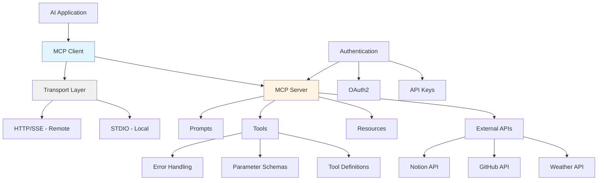

# Week 3: Model Context Protocol (MCP) Server

> **Navigation**: [CS146S Docs](../INDEX.md) > [Weeks](../weeks/) > [Week 3](../weeks/week03/) > Overview

> **Status**: Complete pre-learning content with comprehensive MCP server development guide

## Learning Objectives

By the end of Week 3, you will be able to:
- **Understand** the Model Context Protocol (MCP) and its role in AI systems
- **Build** functional MCP servers using Python and FastMCP framework
- **Implement** async/await patterns for non-blocking API calls
- **Apply** modern Python development practices (uv, pyproject.toml, virtual environments)
- **Test** MCP servers using client session and JSON-RPC protocol
- **Deploy** MCP servers to Claude Desktop with proper configuration

## Key Concepts

### Concept 1: Model Context Protocol (MCP)

**Description**: A standardized protocol for AI models to communicate with external tools, resources, and data sources through a unified interface.

**Why it matters**: MCP solves the "information silo" problem in AI systems by providing a standard bridge between LLMs and external APIs, making AI agents more powerful and versatile.

**Key points**:
- **Three core capabilities**: Tools (executable functions), Resources (data access), Prompts (template management)
- **Transport layers**: STDIO (local) and HTTP/SSE (remote)
- **Unified interface**: One MCP server works across Claude Desktop, Cursor IDE, and any MCP-compatible client
- **Type safety**: Automatic JSON Schema generation from Python type hints

**Architecture Diagram**:


**Real-world applications**:
- Enterprise AI assistants accessing multiple internal systems
- Code assistants integrating with GitHub, Jira, and documentation
- Data analysis agents querying databases and APIs dynamically

### Concept 2: AI Agent Tool-Use Pattern

**Description**: The fundamental design pattern where AI models dynamically select and execute tools to accomplish multi-step tasks.

**Why it matters**: This is the core mechanism that transforms static LLMs into autonomous agents capable of real-world actions.

**Key points**:
- **Autonomy**: Agents decide which tools to call based on user intent
- **Dynamicity**: Behavior adapts based on context and previous tool results
- **Composition**: Multiple tools can be chained together for complex workflows

**Example flow**:
```
User: "Check SF weather tomorrow and create calendar event if sunny"
  ↓
LLM Analysis: Need weather tool + calendar tool
  ↓
Call get_weather(latitude=37.77, longitude=-122.41)
  ↓
LLM Processing: Weather is sunny, 18°C
  ↓
Call create_calendar_event(title="Outdoor Activity", date="tomorrow")
  ↓
LLM Synthesis: "Created outdoor activity for tomorrow, sunny weather expected!"
```

### Concept 3: Async/Await Programming

**Description**: Python's asynchronous programming model for non-blocking I/O operations, essential for responsive MCP servers.

**Why it matters**: Synchronous code blocks during API calls, making servers unresponsive. Async enables concurrent operations, dramatically improving performance.

**Key points**:
- **async def**: Defines coroutine functions that return awaitable objects
- **await**: Pauses execution until the async operation completes
- **asyncio.run()**: Entry point for running async code
- **httpx.AsyncClient**: Modern async HTTP client with connection pooling

**Performance comparison**:
```python
# Synchronous: 4 seconds total
response1 = requests.get(url1)  # waits 2 seconds
response2 = requests.get(url2)  # waits 2 seconds

# Asynchronous: 2 seconds total (concurrent)
async with httpx.AsyncClient() as client:
    task1 = client.get(url1)
    task2 = client.get(url2)
    response1, response2 = await asyncio.gather(task1, task2)
```

**Common mistakes**:
- ❌ Forgetting `await` before async calls
- ❌ Using `print()` instead of `logging` (breaks stdio protocol)
- ❌ Not handling timeouts and errors gracefully

### Concept 4: Modern Python Development with uv

**Description**: Next-generation Python package manager written in Rust, offering 10-100x faster performance than pip.

**Why it matters**: Fast, reliable dependency management with automatic lock files ensures reproducible environments across teams.

**Key points**:
- **Speed**: Rust-powered, dramatically faster than pip/poetry
- **Reliability**: Generates `uv.lock` for precise version control
- **Simplicity**: Unified command interface
- **Python management**: Can install and manage Python versions

**Essential commands**:
```bash
uv init --name my-project    # Initialize project
uv venv                       # Create virtual environment
uv add httpx                  # Add dependency
uv add --dev pytest           # Add dev dependency
uv run my_script.py           # Run with virtual env
uv sync                       # Sync dependencies from lock file
```

**Project structure**:
```
weather_server/
├── .venv/              # Virtual environment (not in git)
├── .python-version     # Pin Python version (e.g., 3.13)
├── pyproject.toml      # Project configuration
├── uv.lock             # Dependency lock file
├── README.md           # Documentation
├── weather.py          # Main MCP server
└── test_server.py      # Test suite
```

### Concept 5: MCP Server Testing

**Description**: Testing methodology specific to MCP servers using client sessions to simulate real-world usage.

**Why it matters**: Ensures reliability before deployment and catches API failures, parameter errors, and edge cases early.

**Key points**:
- **Client session**: Programmatically connect to MCP server via stdio
- **Tool invocation**: Test tools with various arguments
- **Error scenarios**: Validate graceful failure handling
- **Integration tests**: Verify end-to-end functionality

**Test architecture**:
```python
from mcp import ClientSession, StdioServerParameters
from mcp.client.stdio import stdio_client

async def test_server():
    # 1. Configure server parameters
    server_params = StdioServerParameters(
        command="uv",
        args=["run", "weather.py"]
    )

    # 2. Start server and connect
    async with stdio_client(server_params) as (read, write):
        async with ClientSession(read, write) as session:
            await session.initialize()

            # 3. List tools
            tools = await session.list_tools()

            # 4. Test tool
            result = await session.call_tool(
                "get_alerts",
                arguments={"state": "CA"}
            )
```

### Concept 6: MCP Deployment & Integration

**Description**: Process of integrating MCP servers with AI applications like Claude Desktop.

**Why it matters**: Deployment is the final step that makes your MCP server usable in production environments.

**Key points**:
- **Configuration file**: `claude_desktop_config.json` for Claude Desktop
- **Absolute paths**: Use full paths to project directory
- **Environment variables**: Secure API key management
- **Logging**: Output to stderr, not stdout

**Claude Desktop config**:
```json
{
  "mcpServers": {
    "weather": {
      "command": "uv",
      "args": [
        "--directory",
        "/absolute/path/to/weather_server",
        "run",
        "weather.py"
      ],
      "env": {
        "WEATHER_API_KEY": "your_key_here"
      }
    }
  }
}
```

## Prerequisites

- **Python 3.10+**: Required for modern type hints (str | int syntax)
- **Basic Python**: Functions, classes, error handling
- **Terminal comfort**: Running commands, navigating directories
- **API understanding**: REST APIs, JSON, HTTP status codes

**Setup commands**:
```bash
# Install uv (package manager)
curl -LsSf https://astral.sh/uv/install.sh | sh

# Verify installation
uv --version

# Create project
mkdir my-mcp-server && cd my-mcp-server
uv init --name my-server
uv venv
uv add "mcp[cli]" httpx
```

## Resources

- **Primary**: [MCP Official Documentation](https://modelcontextprotocol.io) - Complete protocol specification and guides
- **Supplementary**: [FastMCP GitHub](https://github.com/modelcontextprotocol/mcp) - Framework reference and examples
- **Reference**: [uv Documentation](https://docs.astral.sh/uv/) - Package manager guide
- **Reference**: [httpx Documentation](https://www.python-httpx.org) - Async HTTP client

### Additional Reading

- [MCP Authorization Spec](https://modelcontextprotocol.io/specification/2025-06-18/basic/authorization) - Authentication patterns
- [Cloudflare MCP Deployment Guide](https://developers.cloudflare.com/agents/guides/remote-mcp-server/) - HTTP transport deployment
- [Vercel MCP Deployment](https://vercel.com/docs/mcp/deploy-mcp-servers-to-vercel) - Production hosting

## Common Pitfalls & Best Practices

### ❌ Common Mistakes

**Mistake 1: Using print() in MCP servers**
```python
# Wrong - breaks JSON-RPC protocol
@mcp.tool()
async def my_tool():
    print("Debug info")  # Pollutes stdout!
    return "result"

# Correct - use logging
import logging
import sys
logging.basicConfig(level=logging.INFO, stream=sys.stderr)
logger = logging.getLogger(__name__)

@mcp.tool()
async def my_tool():
    logger.info("Tool called")  # Goes to stderr
    return "result"
```

**Mistake 2: Forgetting await**
```python
# Wrong - gets coroutine object, not data
result = make_nws_request(url)

# Correct - awaits the async operation
result = await make_nws_request(url)
```

**Mistake 3: Ignoring API rate limits**
```python
# Dangerous - may get banned
for item in large_list:
    await call_external_api(item)

# Better - implements backoff
for i, item in enumerate(large_list):
    await call_external_api(item)
    if i % 10 == 0:
        await asyncio.sleep(1)  # Rate limiting
```

**Mistake 4: Hardcoding API keys**
```python
# Wrong - security risk
API_KEY = "sk-1234567890abcdef"

# Correct - environment variable
API_KEY = os.getenv("WEATHER_API_KEY")
if not API_KEY:
    raise ValueError("WEATHER_API_KEY not set")
```

### ✅ Best Practices

**Practice 1: Clear tool descriptions**
```python
@mcp.tool()
async def get_alerts(state: str) -> str:
    """Get weather alerts for a US state.

    Args:
        state: Two-letter state code (e.g., CA, NY, TX)

    Returns:
        Formatted string with active weather alerts
    """
```

**Practice 2: Comprehensive error handling**
```python
async def make_nws_request(url: str) -> dict | None:
    try:
        async with httpx.AsyncClient() as client:
            response = await client.get(url, timeout=30.0)
            response.raise_for_status()
            return response.json()
    except Exception as e:
        logger.error(f"Request failed: {e}")
        return None  # Graceful degradation
```

**Practice 3: Type hints for auto-schema**
```python
@mcp.tool()
async def search(
    query: str,           # Required string
    limit: int = 10,      # Optional with default
    active: bool = True   # Optional boolean
) -> str:
    """Search with typed parameters.

    FastMCP automatically generates JSON Schema from type hints.
    """
```

## Related Patterns

- [API Integration Pattern](../patterns/api-integration.md) - Connecting to external services
- [Error Handling Pattern](../patterns/error-handling.md) - Graceful degradation strategies
- [Async/Await Pattern](../patterns/async-programming.md) - Non-blocking I/O patterns

## Quick Links

- [Implementation Details](./implementation.md) - Technical approach and code structure
- [Reflection](./reflection.md) - Learning outcomes and lessons learned
- [Weekly Deliverable](../../weeks/week3/writeup.md) - Submission writeup (TODO)

## AI Engineering Mindset

### The Three Questions

1. **What's the bottleneck?**
   - Manual API integration for each new external service
   - Repetitive boilerplate for server setup and testing
   - Lack of standardization across AI agent tools

2. **What's the leverage point?**
   - MCP protocol provides unified interface for all external integrations
   - FastMCP framework automates schema generation and server initialization
   - Testing framework standardizes validation across all MCP servers

3. **How to compound value?**
   - Build reusable MCP servers for common APIs (GitHub, Notion, databases)
   - Create MCP server templates for quick project scaffolding
   - Develop automated testing suite that works for any MCP server

### Automation Level

**Current Level**: Level 3 (Composable System)
- MCP servers are reusable components
- Can be combined across different AI applications
- Standardized protocol enables ecosystem growth

**Next Level Goal**: Level 4 (Self-Improving)
- Automated MCP server discovery and registration
- Dynamic tool composition based on user intent
- Self-healing servers with automatic retry and fallback

## Content Summary

This Week 3 overview contains comprehensive pre-learning content sourced from two detailed learning notes:

1. **01_pre_learning_concepts.md** (881 lines): Core MCP concepts, architecture diagrams, common pitfalls, and expert best practices
2. **从零开始构建MCP服务器.md** (1,280 lines): Complete tutorial covering AI Agent basics, modern Python practices, async programming, MCP protocol, testing, and deployment

**Total content preserved**: 2,161 lines of high-quality technical documentation covering:
- AI Agent fundamentals and tool-use patterns
- MCP protocol architecture and capabilities
- Python async/await programming with httpx
- Modern Python development with uv
- FastMCP framework and server implementation
- Testing strategies and error handling
- Production deployment and security best practices
- Real-world code examples and debugging techniques

---

*[Template: weekly_overview.md - Content migrated from learning_notes/week3/]*
