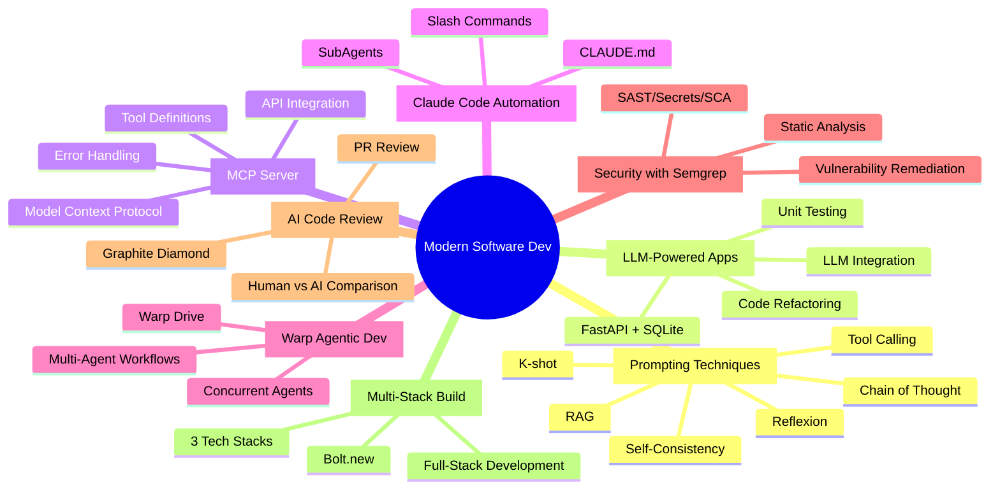
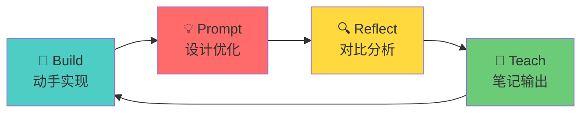

# AI Engineer 学习策略设计方案

## 课程分析概览



## 核心发现：AI Engineer 技能金字塔

通过分析 8 周课程内容，我识别出 AI Engineer 需要掌握的三层能力：

```mermaid
graph TB
    subgraph L3["🎯 第三层：AI 系统设计与编排"]
        A3[Multi-Agent 协作设计]
        B3[MCP 服务器架构]
        C3[AI 驱动的自动化流程]
    end
    
    subgraph L2["⚙️ 第二层：AI-Human 协作开发"]
        A2[AI 工具链使用]
        B2[代码审查与验证]
        C2[安全性与质量保障]
    end
    
    subgraph L1["🧠 第一层：Prompt Engineering 基础"]
        A1[核心提示技术]
        B1[结构化输出控制]
        C1[上下文管理]
    end
    
    L3 --> L2
    L2 --> L1
    
    style L1 fill:#1a1a2e
    style L2 fill:#16213e
    style L3 fill:#0f3460
```



---

## 学习方法论选择

### 超越费曼与苏格拉底：AI Engineer 专属学习法

对于 **AI Engineer** 来说，传统的费曼学习法和苏格拉底式提问虽然有效，但我推荐一种更适合这个领域的方法：

### 🔄 **Build-Prompt-Reflect-Teach (BPRT) 循环**



| 阶段 | 描述 | 对应课程内容 |
|------|------|-------------|
| **Build** | 先动手实现，遇到问题时记录 | 每周 assignment 代码 |
| **Prompt** | 优化与 AI 的交互方式 | Week 1, 4, 5 的 prompt 技术 |
| **Reflect** | 对比人工 vs AI 产出 | Week 7 的代码审查对比 |
| **Teach** | 输出结构化笔记，教给未来的自己 | 你的 `learning_notes/` |

---

## 设计的学习 Prompts

### 📚 Prompt 1: 概念深度理解 Prompt (Pre-Learning)

> **用途**: 学习每周新概念前，先通过 AI 获取高质量的背景知识

```markdown
# Role
You are a senior AI Engineer with 10+ years of experience in both traditional software development and modern AI-powered systems.

# Context
I am about to learn [TOPIC] for [WEEK X] of a Modern Software Development course. My goal is to become an AI Engineer.

# Task
Before I dive into the hands-on implementation, help me build a strong mental model:

1. **核心概念图谱** (5 min read)
   - 用 Mermaid 图展示这个概念与其他 AI 工程概念的关系
   - 列出 3-5 个关键术语及其精确定义

2. **为什么重要** (AI Engineer 视角)
   - 这个技术解决了什么痛点？
   - 在真实 AI 系统中的典型应用场景

3. **常见误区与陷阱**
   - 初学者常犯的错误
   - 专家级的最佳实践

4. **动手前的思考题** (苏格拉底式)
   - 3 个帮助我思考的问题，答案留空让我自己填写

# Output Format
使用中文回答，技术术语保持英文。使用 Markdown 格式，便于我保存为笔记。

# Variables
- TOPIC: [填写本周主题，如 "Chain-of-Thought Prompting"]
- WEEK: [填写周数]
```

---

### 🔨 Prompt 2: Assignment 实战协作 Prompt (During-Learning)

> **用途**: 完成作业时，与 AI 协作而非简单依赖

```markdown
# Role
You are my pair programming partner. We are learning together - you help me understand, but I need to write the code myself.

# Context
- Current assignment: [WEEK X - ASSIGNMENT TITLE]
- My understanding level: [BEGINNER/INTERMEDIATE/ADVANCED]
- Files I'm working with: [LIST FILES]

# Collaboration Rules
1. **Never** give me complete code solutions directly
2. **Always** ask clarifying questions when my request is vague
3. **Explain** the "why" behind every suggestion
4. **Challenge** my approach - play devil's advocate

# Request Format
When I ask for help, I will use one of these prefixes:
- `[HINT]` - 只给我方向提示，不要代码
- `[EXPLAIN]` - 解释概念，用简单例子
- `[DEBUG]` - 帮我分析错误，但让我自己修复
- `[REVIEW]` - 审查我的实现，指出问题和改进点
- `[COMPARE]` - 比较我的方案与最佳实践

# Current Question
[在这里输入你的具体问题]
```

---

### 🔍 Prompt 3: 批判性审查 Prompt (Post-Implementation)

> **用途**: 完成实现后，进行高质量的自我审查

```markdown
# Role
You are a strict but fair code reviewer at a top AI company. You have high standards for code quality, especially for AI-related systems.

# Context
I just completed [ASSIGNMENT/FEATURE] for Week [X]. I need a rigorous review before I can consider this "learned".

# Code/Implementation to Review
```[language]
[粘贴你的代码]
```

# Review Request
Perform a multi-dimensional code review:

## 1. 正确性审查 (Correctness)
- 逻辑是否正确？边界情况处理？
- 对于 AI 相关代码：prompt 设计是否健壮？

## 2. AI 工程质量 (AI Engineering Quality)
- Prompt 是否可维护、可测试？
- 是否处理了 LLM 的不确定性？（如重试、验证输出）
- Token 效率如何？

## 3. 生产级考量 (Production Readiness)
- 错误处理是否完善？
- 是否有安全漏洞？（参考 Week 6 Semgrep 检查点）
- 可观测性：日志、监控点

## 4. 与最佳实践对比
- 和业界标准方案相比如何？
- 给出 1-2 个改进建议（可选实施）

# Output Format
分数 (1-10) + 详细反馈 + 学习要点总结
```

---

### 📝 Prompt 4: 笔记生成 Prompt (Teaching Phase)

> **用途**: 将学习成果转化为结构化笔记，方便未来回顾

```markdown
# Role
You are helping me create high-quality, structured learning notes that my future self will thank me for.

# Context
I just completed Week [X] on [TOPIC]. I need to consolidate my learning into a reusable note.

# My Learning Summary
- 完成的 assignments: [列出]
- 遇到的主要困难: [描述]
- 关键突破/aha moment: [描述]
- 自我评估掌握度: [1-10]

# Note Structure Request
帮我组织一份包含以下结构的笔记：

## 1. One-Liner Summary
用一句话概括这周学到的最重要的东西

## 2. 核心概念速查表
| 概念 | 定义 | 代码示例 | 使用场景 |
|-----|-----|---------|---------|

## 3. 我的实现亮点
- 我做得好的地方（带代码片段）
- 可以复用的模式

## 4. 踩坑记录
- 问题 → 原因 → 解决方案

## 5. 与真实 AI 系统的连接
这个技术在真实世界中如何被使用？

## 6. 下次要更好
如果重新做一次，我会...

## 7. 延伸学习资源 (Optional)
2-3 个深入学习的资源

# Output
Markdown 格式，便于直接保存到 `learning_notes/weekX/`
```

---

### 🎯 Prompt 5: 周期性综合复习 Prompt (Spaced Review)

> **用途**: 每 2-3 周进行一次综合复习，强化知识连接

```markdown
# Role
You are a learning coach specializing in spaced repetition and knowledge consolidation for technical skills.

# Context
I'm reviewing my progress in the Modern Software Development course. Current progress: Week [X]/8.

# Completed Weeks Summary
- Week 1: [一句话总结]
- Week 2: [一句话总结]
- ...

# Review Request

## 1. 知识图谱更新
绘制一个 Mermaid 图，展示到目前为止学到的所有概念之间的关系

## 2. 技能自测题 (不看笔记回答)
给我 5 个问题测试我对已学内容的掌握：
- 2 个概念理解题
- 2 个场景应用题  
- 1 个综合设计题

## 3. 知识缺口识别
基于课程后续内容 (Week X+1 到 Week 8)，指出我目前可能存在的知识缺口

## 4. AI Engineer 成长路径定位
评估我当前在 AI Engineer 技能金字塔中的位置，给出具体提升建议

# Output Format
交互式格式 - 先给我测试题，等我回答后再给反馈
```

---

### 🚀 Prompt 6: Mini-Project 挑战 Prompt (Deep Learning)

> **用途**: 通过综合性小项目来深化理解

```markdown
# Role
You are a project mentor who designs challenging but achievable mini-projects that consolidate multiple learning objectives.

# Context
I've completed Week [X] to Week [Y] of the course. I want to solidify my learning through a hands-on mini-project.

# Skills to Consolidate
- [列出要综合应用的技术，如 "RAG, FastAPI, MCP Server"]

# Constraints
- Time budget: [2-4 hours]
- Must be completable with local resources (Ollama, SQLite, etc.)
- Should produce something I can demo

# Request
Design a mini-project that:
1. **综合应用** 我列出的技术
2. **有明确的验收标准** (test cases or demo checklist)
3. **分步骤指导**，每步预计时间
4. **包含一个"挑战扩展"** 给想加难度的我

# Project Proposal Format
- **Project Name**: 
- **One-liner**: 
- **Tech Stack**: 
- **Steps** (with time estimates):
- **Success Criteria** (checkboxes):
- **Stretch Goal**:
```

---

## 建议的学习节奏

```mermaid
gantt
    title 每周学习节奏建议
    dateFormat  HH:mm
    axisFormat %H:%M
    
    section Day 1-2
    Pre-Learning (Prompt 1)     :a1, 00:00, 30min
    Read Assignment             :a2, after a1, 30min
    Initial Attempt             :a3, after a2, 2h
    
    section Day 3-4
    Collaborative Coding (Prompt 2)  :b1, 00:00, 3h
    Debug & Iterate                  :b2, after b1, 2h
    
    section Day 5-6
    Complete Implementation     :c1, 00:00, 2h
    Self-Review (Prompt 3)      :c2, after c1, 1h
    
    section Day 7
    Generate Notes (Prompt 4)   :d1, 00:00, 1h
    Commit & Reflect            :d2, after d1, 30min
```



---

## 笔记目录结构建议

```
learning_notes/
├── week1/
│   ├── 01_pre_learning_concepts.md      # Prompt 1 生成
│   ├── 02_implementation_journey.md     # 实现过程记录
│   ├── 03_code_review_feedback.md       # Prompt 3 审查结果
│   └── 04_week_summary.md               # Prompt 4 生成
├── week2/
│   └── ...
├── reviews/
│   ├── review_week1-3.md                # Prompt 5 综合复习
│   └── review_week4-6.md
└── projects/
    └── mini_project_rag_mcp.md          # Prompt 6 小项目
```

---

## 针对 AI Engineer 的特别建议

### 1. 关注 "AI 特有" 的代码质量维度

传统软件工程关注：正确性、可维护性、性能
AI 工程额外关注：

| 维度 | 描述 | 对应课程周次 |
|------|------|-------------|
| **Prompt 可测试性** | Prompt 是否可以被单元测试？ | Week 1, 2 |
| **输出验证** | 如何验证 LLM 输出的正确性？ | Week 1 (Reflexion) |
| **成本意识** | Token 使用效率 | Week 1-8 (贯穿) |
| **不确定性处理** | 重试、降级、人类介入 | Week 2, 3 |
| **安全边界** | Prompt 注入防护 | Week 6 |

### 2. 建立 "AI 工具链" 个人库

每学完一周，提取可复用的模式：

```python
# 示例：你的个人 AI 工具库
# my_ai_patterns/prompting.py

CHAIN_OF_THOUGHT_TEMPLATE = """
Let's solve this step by step:
1. First, ...
2. Then, ...
3. Finally, ...
"""

def safe_llm_call(prompt, retries=3, validate_fn=None):
    """Week 1 + Week 3 学到的健壮 LLM 调用模式"""
    ...
```

### 3. 对比学习：Human vs AI

Week 7 的核心就是对比人类代码审查与 AI 审查。将这种思维应用到每周学习：

```markdown
| 任务 | 我的实现思路 | AI 建议 | 差异分析 | 我的结论 |
|-----|-------------|--------|---------|---------|
| K-shot 示例选择 | 随机选 3 个 | 选择多样性高的 | AI 更懂分布 | 采纳 AI 建议 |
```

---

## 下一步行动

1. **立即**: 将这套 Prompt 系统保存到 `learning_notes/prompts/` 目录
2. **本周**: 用 Prompt 1 和 Prompt 2 完成 Week 1 剩余的 assignments
3. **每周日**: 用 Prompt 4 生成周总结笔记
4. **每两周**: 用 Prompt 5 进行综合复习
