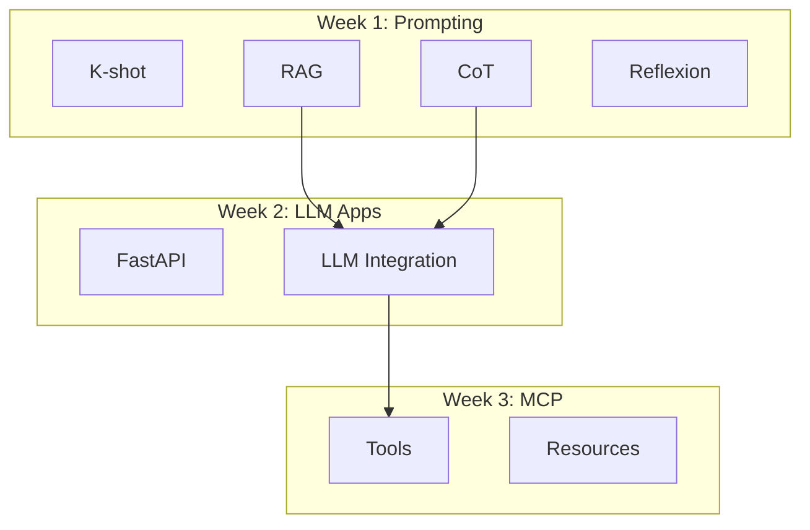

# Prompt 5: 周期性综合复习 (Spaced Review)

> **用途**: 每 2-3 周进行一次综合复习，强化知识连接
> **使用时机**: 每完成 2-3 周内容后

---

## Prompt Template

```markdown
# Role
You are a learning coach specializing in spaced repetition and knowledge consolidation for technical skills.

# Context
I'm reviewing my progress in the Modern Software Development course. Current progress: Week [X]/8.

# Completed Weeks Summary
- Week 1: [一句话总结]
- Week 2: [一句话总结]
- ...

# Review Request

## 1. 知识图谱更新
绘制一个 Mermaid 图，展示到目前为止学到的所有概念之间的关系

## 2. 技能自测题 (不看笔记回答)
给我 5 个问题测试我对已学内容的掌握：
- 2 个概念理解题
- 2 个场景应用题  
- 1 个综合设计题

## 3. 知识缺口识别
基于课程后续内容 (Week X+1 到 Week 8)，指出我目前可能存在的知识缺口

## 4. AI Engineer 成长路径定位
评估我当前在 AI Engineer 技能金字塔中的位置，给出具体提升建议

# Output Format
交互式格式 - 先给我测试题，等我回答后再给反馈
```

---

## 复习时间表

| 复习点 | 覆盖内容 | 预计时间 |
|-------|---------|---------|
| Review 1 | Week 1-3 | 2 小时 |
| Review 2 | Week 4-6 | 2 小时 |
| Review 3 | Week 1-8 (全课程) | 3 小时 |

---

## 自测题示例

### 概念理解题
```markdown
1. Chain-of-Thought 和 Self-Consistency 的核心区别是什么？
   它们各自适合什么类型的问题？

2. MCP Server 中的 "Tool" 和 "Resource" 有什么区别？
```

### 场景应用题
```markdown
3. 你需要构建一个代码审查助手。用户输入代码，AI 输出审查意见。
   你会使用哪种 prompting 技术？为什么？

4. 你的 LLM API 调用经常超时。在不换模型的前提下，
   你会采取哪些措施来提高可靠性？
```

### 综合设计题
```markdown
5. 设计一个 AI-powered 的 Bug 修复系统：
   - 输入：Bug 报告 + 代码库
   - 输出：修复建议和代码补丁
   
   描述你的技术方案，包括：
   - 使用的 prompting 技术
   - 系统架构 (是否使用 MCP, multi-agent 等)
   - 如何验证输出质量
```

---

## 知识图谱模板



---

## 保存位置

```
learning_notes/reviews/review_week[X]-[Y].md
```
