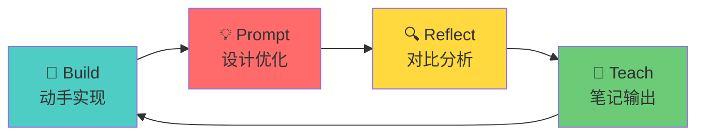

# 🎯 AI Engineer 学习 Prompts 使用指南

## 总览

这是为 **Modern Software Development** 课程设计的学习 Prompt 集合，采用 **Build-Prompt-Reflect-Teach (BPRT)** 方法论。



---

## 📚 Prompt 列表

| # | Prompt | 用途 | 使用时机 |
|---|--------|-----|---------|
| 1 | [Pre-Learning](./01_pre_learning.md) | 构建心智模型 | 每周开始前 |
| 2 | [Collaborative Coding](./02_collaborative_coding.md) | 与 AI 协作编程 | 做 assignment 时 |
| 3 | [Critical Review](./03_critical_review.md) | AI 工程级代码审查 | 完成实现后 |
| 4 | [Note Generation](./04_note_generation.md) | 生成结构化笔记 | 每周结束时 |
| 5 | [Spaced Review](./05_spaced_review.md) | 综合复习测试 | 每 2-3 周 |
| 6 | [Mini-Project](./06_mini_project.md) | 综合实践项目 | 想深化学习时 |

---

## 📅 Weekly Workflow

```
┌─────────────────────────────────────────────────────────────┐
│  Day 1-2: Pre-Learning                                      │
│  ├── 使用 Prompt 1 构建概念理解                              │
│  └── 阅读 assignment 要求                                   │
├─────────────────────────────────────────────────────────────┤
│  Day 3-4: Implementation                                     │
│  ├── 动手实现 (先不依赖 AI)                                  │
│  └── 卡住时使用 Prompt 2 协作                                │
├─────────────────────────────────────────────────────────────┤
│  Day 5-6: Review & Polish                                    │
│  ├── 使用 Prompt 3 进行代码审查                              │
│  └── 根据反馈改进实现                                        │
├─────────────────────────────────────────────────────────────┤
│  Day 7: Consolidation                                        │
│  ├── 使用 Prompt 4 生成周总结笔记                            │
│  └── Commit & Push                                           │
└─────────────────────────────────────────────────────────────┘
```

---

## 🗂️ 推荐的笔记目录结构

```
learning_notes/
├── prompts/                          # 本目录 (Prompt 模板)
│   ├── README.md                     # 使用指南
│   ├── 01_pre_learning.md
│   ├── 02_collaborative_coding.md
│   ├── 03_critical_review.md
│   ├── 04_note_generation.md
│   ├── 05_spaced_review.md
│   └── 06_mini_project.md
├── week1/
│   ├── 01_pre_learning_concepts.md   # Prompt 1 生成
│   ├── 02_implementation_journey.md  # 实现过程记录
│   ├── 03_code_review_feedback.md    # Prompt 3 审查结果
│   └── 04_week_summary.md            # Prompt 4 生成
├── week2/
│   └── ...
├── reviews/
│   ├── review_week1-3.md             # Prompt 5 综合复习
│   └── review_week4-6.md
└── projects/
    └── mini_project_xxx.md           # Prompt 6 小项目
```

---

## 🎓 课程内容概览

| Week | 主题 | 核心技能 |
|------|-----|---------|
| 1 | Prompting Techniques | K-shot, CoT, RAG, Reflexion, Tool calling |
| 2 | LLM-Powered Apps | FastAPI + LLM, Unit testing |
| 3 | MCP Server | Model Context Protocol, API 集成 |
| 4 | Claude Code Automation | Slash commands, CLAUDE.md, SubAgents |
| 5 | Warp Agentic Dev | Multi-agent, Warp Drive |
| 6 | Security with Semgrep | Static analysis, 漏洞修复 |
| 7 | AI Code Review | Graphite Diamond, Human vs AI |
| 8 | Multi-Stack Build | Bolt.new, 3 种技术栈 |

---

## 💡 Tips for AI Engineers

### 1. 每周提炼可复用模式
```python
# 示例：个人 AI 工具库
# my_patterns/prompting.py

COT_TEMPLATE = """
Let's solve this step by step:
1. First, I will...
2. Then, I will...
3. Finally, I will...
"""
```

### 2. 关注 AI 特有质量维度
- **Prompt 可测试性**: 你的 prompt 能被单元测试吗？
- **输出验证**: 如何验证 LLM 输出正确性？
- **成本意识**: Token 使用效率如何？
- **不确定性处理**: 有重试和降级策略吗？

### 3. 建立对比学习习惯
| 任务 | 我的方案 | AI 建议 | 差异分析 | 最终选择 |
|-----|---------|--------|---------|---------|
| ... | ... | ... | ... | ... |

---

## 🚀 Quick Start

1. 准备开始 Week N 的学习
2. 打开 [01_pre_learning.md](./01_pre_learning.md)
3. 填入 `TOPIC` 和 `WEEK` 变量
4. 发送给 AI，获取概念理解
5. 开始实现 assignment
6. 遇到问题时使用 [02_collaborative_coding.md](./02_collaborative_coding.md)

祝学习顺利！🎯
