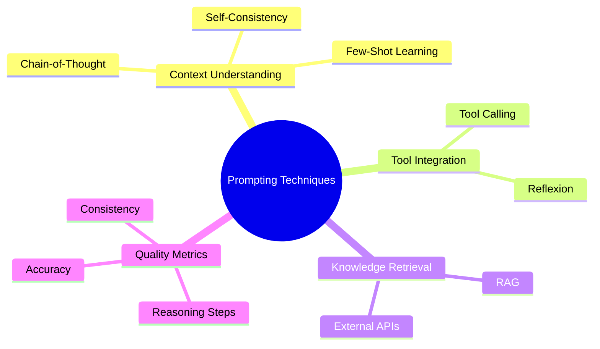

# Week 1: Prompting Techniques — 深度学习笔记

> **目标**: 在动手实现 6 大 Prompting 技术前，建立坚实的理论基础
> **学习周期**: Week 1 — Prompting 技术基础

---

## 1. 核心概念图谱



### 关键术语定义

| 术语 | 定义 | AI Engineer 意义 |
|-----|------|-----------------|
| **Prompt** | 向 LLM 输入的指令或问题 | 控制 LLM 行为的接口，质量直接影响输出 |
| **Few-Shot Learning** | 通过少量示例教会模型完成任务 | 无需微调就能快速适应新任务 |
| **Chain-of-Thought** | 让模型展示推理步骤而非直接答案 | 提升复杂推理任务的准确性，增强可解释性 |
| **Self-Consistency** | 多次采样推理路径，选择多数答案 | 通过投票机制提高鲁棒性 |
| **Tool Calling** | LLM 调用外部工具和函数 | 扩展 LLM 能力，实现混合系统 |
| **RAG** | 检索增强生成 (Retrieval-Augmented Generation) | 将实时知识库集成到 LLM 生成过程 |
| **Reflexion** | 模型自我评估和改进 | 实现 LLM 的自适应反馈循环 |

---

## 2. 为什么重要？(AI Engineer 视角)

### 解决的核心痛点

#### 问题 1: LLM 的局限性
- **事实幻觉**: 模型生成看似合理但错误的信息
- **推理能力**: 复杂逻辑推理准确性不足
- **知识过时**: 训练数据固定，无法获取实时信息

#### 问题 2: 生产系统需求
- **可靠性**: 需要一致和可验证的输出
- **集成**: 需要与现有系统、数据库、API 协作
- **可解释性**: 需要理解 LLM 的决策过程

### 真实应用场景

1. **客服系统** (Few-Shot + RAG)
   - 使用历史对话示例教会模型风格
   - 检索知识库提供准确答案
   - 避免重复回答相同问题

2. **代码生成** (Chain-of-Thought)
   - "让模型逐步说明算法思路"
   - 生成的代码逻辑更清晰，bug 更少
   - 便于代码审查和维护

3. **数据分析** (Tool Calling + Reflexion)
   - LLM 识别需要的分析，自动调用数据库查询
   - 验证结果，不满意则重试
   - 无需人工编写 SQL

4. **医疗诊断** (Self-Consistency)
   - 多次推理路径投票
   - 提高诊断准确性和可信度
   - 关键场景必须提高可靠性

### AI Engineer 的三大核心能力

```
┌─────────────────────────────────┐
│   提高 LLM 质量 (Week 1)         │
│  ├─ Prompting 技巧             │
│  ├─ 多模型集成策略             │
│  └─ 评估和迭代框架             │
├─────────────────────────────────┤
│   构建完整系统 (Week 2-5)       │
│  ├─ 后端集成                   │
│  ├─ 数据管道                   │
│  └─ 测试和部署                 │
├─────────────────────────────────┤
│   工程最佳实践 (Week 6-8)       │
│  ├─ 安全和防护                 │
│  ├─ 性能优化                   │
│  └─ 团队协作                   │
└─────────────────────────────────┘
```

---

## 3. 常见误区与陷阱

### 初学者误区

#### ❌ 误区 1: "写越详细的 prompt，效果越好"
- **陷阱**: 过长的 prompt 反而增加 token 成本，降低关键信息的权重
- **正确做法**: 
  - 用清晰的结构而非冗长的描述
  - 使用"角色"和"任务"分离
  - 关键信息放在前面

#### ❌ 误区 2: "Chain-of-Thought 一定比直接回答好"
- **陷阱**: 对简单问题过度设计，增加延迟
- **正确做法**:
  - 简单问题: 直接提问
  - 复杂问题: 要求展示推理步骤
  - 基于任务复杂度选择

#### ❌ 误区 3: "RAG 可以完全替代微调"
- **陷阱**: RAG 解决知识问题，但无法改变模型的推理方式
- **正确做法**:
  - RAG: 增加知识
  - 微调: 改变行为和风格
  - 混合使用效果最佳

#### ❌ 误区 4: "一个 prompt 对所有用户有效"
- **陷阱**: 不同用户、不同语言、不同场景需要调整
- **正确做法**:
  - A/B 测试不同 prompt 版本
  - 监控输出质量指标
  - 定期迭代优化

### 专家级最佳实践

#### ✅ 最佳实践 1: 系统化的 Prompt 工程

```
实施步骤:
1. 明确定义任务目标和成功指标
2. 设计基础 prompt 模板
3. 使用测试集评估效果
4. 迭代优化（改进例子、指令、结构）
5. A/B 测试对比验证
```

#### ✅ 最佳实践 2: 多技术组合

```python
# 实例: 复杂推理任务
pipeline = [
    FewShotPrompt(examples=best_examples),  # 设置上下文
    ChainOfThoughtPrompt(),                  # 展示推理
    SelfConsistencyVoting(n_samples=5),      # 多次投票
    ToolCalling(tools=available_tools)       # 验证和调整
]
```

#### ✅ 最佳实践 3: 成本-质量权衡

| 场景 | 推荐方案 | 理由 |
|-----|--------|------|
| 高成本敏感 | Few-Shot Prompting | 少 token，快速 |
| 高精度需求 | Chain-of-Thought + Self-Consistency | 多步骤确保准确 |
| 实时系统 | Tool Calling + 缓存 | 集成外部数据，减少 hallucination |
| 持续改进 | Reflexion + 监控 | 自动反馈和优化 |

#### ✅ 最佳实践 4: 可观测性和监控

```
关键指标:
- 准确性: 与 ground truth 对比
- 一致性: 相同输入是否产生相似输出
- 延迟: 从输入到输出的时间
- 成本: Token 使用量
- 用户满意度: 反馈评分

实施方式:
→ 每个 prompt 版本都有版本号
→ 记录关键指标到日志/数据库
→ 定期生成报告和对比
```

---

## 4. 动手前的思考题 (苏格拉底式)

### 🤔 思考题 1: 推理过程的价值
**问题**: 为什么要求模型展示推理步骤（Chain-of-Thought）反而能提高最终答案的准确性？

*思考方向*:
- 推理过程中错误是否更容易被发现？
- 模型显式思考与隐式思考的区别是什么？
- 是否与人类学习方式有类似之处？

**你的答案**:
```
[请写下你的思考...]
```

---

### 🤔 思考题 2: Few-Shot 的学习机制
**问题**: Few-Shot prompting 不会改变模型参数，它如何"教会"模型新的任务？

*思考方向*:
- 示例是否改变了模型的推理上下文？
- 如何选择最有效的示例？
- 示例数量和质量哪个更重要？

**你的答案**:
```
[请写下你的思考...]
```

---

### 🤔 思考题 3: 系统设计的权衡
**问题**: 如果需要构建一个高可靠性的客服 AI 系统，为什么不能仅使用 Chain-of-Thought，还需要结合 RAG 和 Tool Calling？

*思考方向*:
- Chain-of-Thought 能否保证答案的准确性？
- 实时信息和知识库的作用是什么？
- 如何评估系统整体的可靠性？

**你的答案**:
```
[请写下你的思考...]
```

---

### 🤔 思考题 4: 成本优化策略
**问题**: 在实际生产系统中，如果 Self-Consistency 需要采样 5 次才能提高准确性 5%，是否应该使用它？

*思考方向*:
- 成本增加 5 倍是否值得精度提升 5%？
- 如何衡量不同场景的成本阈值？
- 是否存在其他更高效的替代方案？

**你的答案**:
```
[请写下你的思考...]
```

---

## 5. Week 1 实战路线图

### 学习顺序
```
Day 1-2: 理论学习
  ├─ 阅读本笔记
  ├─ 理解 6 个 prompting 技术的原理
  └─ 完成思考题

Day 3-7: 动手实现
  ├─ K-Shot Prompting (基础)
  ├─ Chain-of-Thought (核心)
  ├─ Tool Calling (集成)
  ├─ Self-Consistency (投票)
  ├─ RAG (检索)
  └─ Reflexion (反馈)

Day 8: 总结对比
  └─ 理解 6 个技术的适用场景和组合方式
```

### 代码练习检查表

- [ ] 安装 Ollama 和所需模型
- [ ] K-Shot Prompting: 设计有效的示例
- [ ] Chain-of-Thought: 分解复杂问题
- [ ] Tool Calling: 集成外部工具
- [ ] Self-Consistency: 实现投票机制
- [ ] RAG: 集成知识库
- [ ] Reflexion: 实现反馈循环
- [ ] 所有测试通过
- [ ] 记录最佳 prompt 版本和性能指标

---

## 6. 快速参考: 技术选择矩阵

```
┌─────────────────────────────────────────────────────────┐
│                 何时使用哪个技术                          │
├─────────────────────────────────────────────────────────┤
│ K-Shot           │ 任务格式明确 + 成本敏感              │
├─────────────────────────────────────────────────────────┤
│ Chain-of-Thought │ 复杂推理 + 需要可解释性              │
├─────────────────────────────────────────────────────────┤
│ Tool Calling     │ 需要访问外部数据 + 实时性            │
├─────────────────────────────────────────────────────────┤
│ Self-Consistency │ 高精度要求 + 计算预算充足            │
├─────────────────────────────────────────────────────────┤
│ RAG              │ 知识密集型 + 需要事实准确性          │
├─────────────────────────────────────────────────────────┤
│ Reflexion        │ 迭代改进 + 自适应系统                │
└─────────────────────────────────────────────────────────┘
```

---

## 7. 核心要点总结

### 为什么学 Prompting？
1. **最直接的 LLM 优化方式** - 无需微调，立即生效
2. **生产系统的基础** - 所有后续系统都建立在此之上
3. **成本效益最优** - 最低成本获得最高质量提升
4. **通用技能** - 适用于所有 LLM 和应用场景

### 6 个技术的本质
- **Few-Shot**: 通过示例学习 → 快速适应
- **Chain-of-Thought**: 显式推理 → 减少错误
- **Tool Calling**: 外部集成 → 扩展能力
- **Self-Consistency**: 多路投票 → 提高鲁棒性
- **RAG**: 知识检索 → 事实准确性
- **Reflexion**: 自我改进 → 持续优化

### 实战建议
1. **从简单开始** - Few-Shot 作为起点
2. **逐个掌握** - 每个技术单独练习
3. **组合优化** - 理解不同技术的配合
4. **衡量效果** - 使用量化指标评估
5. **持续迭代** - 生产系统需要不断改进

---

*最后更新: 2025-12-07*
