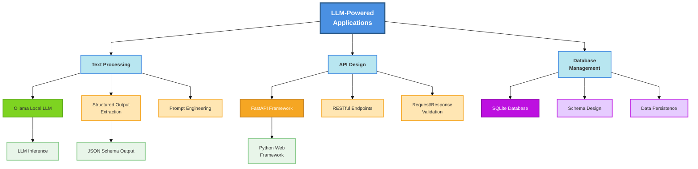

# Week 2: LLM-Powered Action Item Extraction

> **核心主题**: 如何使用 LLM + FastAPI + SQLite 构建智能笔记转换系统

---

## 1. 核心概念图谱 (5 min read)



**图表说明**：
- 蓝色（顶部）：核心应用概念
- 浅蓝色：三大主要模块
- 绿色：Ollama LLM 相关
- 橙色：FastAPI 相关
- 紫色：数据库相关
- 绿底：输出/集成相关

### 关键术语定义

1. **Ollama**: 一个轻量级的本地 LLM 运行时，支持多种开源模型（如 Llama2、Mistral），允许在本地计算机上运行 LLM，无需云服务。

2. **Structured Output (结构化输出)**: 通过 JSON Schema 或特定格式约束，使 LLM 生成符合预定义结构的输出，便于程序解析和集成。

3. **FastAPI**: 现代高性能的 Python Web 框架，支持自动 API 文档生成、请求验证、异步操作，是构建 AI 应用后端的理想选择。

4. **Action Item Extraction (任务项提取)**: 从非结构化文本（如会议笔记、电子邮件）中自动识别和提取可操作的任务项。

5. **Heuristic vs LLM-Based Approach (启发式 vs 基于 LLM 的方法)**: 
   - 启发式：基于规则的简单模式匹配（如搜索 "TODO"、"-" 符号）
   - 基于 LLM：使用神经网络理解上下文，提取语义相关的任务项

---

## 2. 为什么重要 (AI Engineer 视角)

### 解决的痛点

| 痛点 | 传统方案 | LLM-Powered 方案 |
|------|--------|-----------------|
| **理解上下文** | 基于关键词和符号的模式匹配失败率高 | LLM 理解自然语言的语义和隐含含义 |
| **处理多样化格式** | 每种格式需要新的正则表达式规则 | 一个模型适应多种输入格式 |
| **灵活性** | 增加新规则复杂且易出错 | 通过 prompt 工程快速调整 |
| **用户体验** | 提取结果不准确，用户需要大量手动修正 | 提取准确率高，用户只需轻微调整 |

### 真实应用场景

1. **会议记录管理系统**：自动从团队会议笔记中提取任务分配和截止日期
2. **项目管理工具集成**：将客户反馈自动转换为可追踪的 issue
3. **知识库助手**：从文档中提取关键决策和行动项，建立可搜索的索引
4. **销售 CRM 系统**：从客户沟通记录中提取跟进任务

---

## 3. 常见误区与陷阱

### ❌ 初学者常犯的错误

1. **假设 LLM 输出总是有效的 JSON**
   - ✅ 正确做法：使用 JSON Schema 约束和错误处理重试机制
   
2. **直接在生产环境使用大模型**
   - ✅ 正确做法：先用小模型测试（如 mistral 而非 llama2-70b），基准测试后再升级
   
3. **忽视 Prompt 工程的重要性**
   - ✅ 正确做法：花时间优化 prompt，包括示例、约束条件、输出格式说明
   
4. **没有设置超时和资源限制**
   - ✅ 正确做法：为 API 调用设置超时时间，监控 Ollama 内存使用

5. **一次性实现所有功能，没有渐进式构建**
   - ✅ 正确做法：先实现基础的启发式提取，再集成 LLM，分离关注点

### 💡 专家级最佳实践

1. **Dependency Injection & 配置管理**
   ```python
   # 注入 LLM 配置而非硬编码
   class Config:
       ollama_base_url: str = "http://localhost:11434"
       model_name: str = "mistral"
       timeout: int = 30
   ```

2. **Schema-Driven Design**
   - 使用 Pydantic 定义请求/响应模型
   - 利用 FastAPI 的自动验证能力
   - 为 LLM 输出定义明确的 JSON Schema

3. **Graceful Degradation**
   ```python
   # 当 LLM 失败时回退到启发式方法
   try:
       items = extract_action_items_llm(text)
   except LLMUnavailableError:
       items = extract_action_items_heuristic(text)
   ```

4. **测试分层**
   - 单元测试：Mock LLM 调用，测试业务逻辑
   - 集成测试：使用小模型验证端到端流程
   - 性能测试：基准测试不同模型的延迟

5. **可观测性（Observability）**
   - 记录 LLM 输入/输出用于调试
   - 追踪 API 延迟
   - 监控 LLM 成功率

---

## 4. 动手前的思考题 (苏格拉底式)

### 问题 1: 为什么我们需要 "Structured Output"？

**我的思考**:
- 如果 LLM 返回纯文本而不是 JSON，程序如何可靠地解析结果？
- 是否存在 LLM 生成无效 JSON 的情况？如何处理？

**你的答案**:
```
[请在此填写]
```

---

### 问题 2: 启发式方法 vs LLM 方法的权衡是什么？

**我的思考**:
- 启发式方法的优点（速度、可预测性、不需要 GPU）和缺点（准确率、灵活性）各是什么？
- 在什么情况下我会优先使用启发式方法而不是 LLM？

<details>
<summary><strong>答案：权衡对比分析</strong></summary>

## 启发式方法 vs LLM 方法

### 启发式方法（Heuristic-Based）

**工作原理**：
```python
# 基于模式匹配和规则
def extract_heuristic(text):
    items = []
    # 规则1: 搜索 "TODO", "FIXME" 关键词
    # 规则2: 匹配 "-" 或 "* " 开头的行
    # 规则3: 搜索责任人 "@" 符号
    return items
```

**优点**：
✅ **速度极快** - 毫秒级执行，无网络延迟
✅ **可预测性强** - 输出完全确定，便于调试
✅ **资源开销小** - 无需 GPU，只需 CPU
✅ **离线可用** - 不依赖外部服务
✅ **完全透明** - 易于理解为什么提取某项
✅ **成本为零** - 无需付费 API

**缺点**：
❌ **准确率有限** - 依赖预定义规则，无法理解语义
❌ **灵活性差** - 新格式需要编写新规则
❌ **不理解上下文** - "tomorrow at 2 PM" 无法识别为时间
❌ **容易误判** - "- this is just a thought" 被识别为任务项
❌ **维护成本高** - 规则繁多易出错，修复一个规则可能破坏另一个
❌ **多语言困难** - 每种语言需要新规则

**真实例子**：
```
输入：
We discussed the budget today.
- Sarah will follow up on the Q3 financials
  (this is not a task, just context)

启发式结果：
✗ 错误识别："-sarah will follow up on the Q3 financials" → 任务项
✗ 错误识别："(this is not a task, just context)" → 任务项
✓ 正确：识别 "@sarah" → 责任人
```

### LLM 方法（Neural Network-Based）

**工作原理**：
```python
# 基于深度学习和语言理解
def extract_llm(text, schema):
    # LLM 理解语义，识别真正的任务
    # 提取责任人、截止日期、优先级等上下文
    return structured_output
```

**优点**：
✅ **准确率高** - 理解自然语言语义，90%+ 准确率
✅ **灵活性强** - 同一模型适应多种格式
✅ **理解上下文** - "Tomorrow at 2 PM" → 识别为截止时间
✅ **少规则维护** - 通过 prompt 工程快速调整
✅ **多语言支持** - 无需为每种语言编写规则
✅ **开箱即用** - 预训练模型已包含丰富知识

**缺点**：
❌ **速度较慢** - 秒级延迟（本地）或更长（云服务）
❌ **资源开销大** - 需要 GPU，或依赖云服务
❌ **成本高** - 云 API 按调用次数计费
❌ **可靠性问题** - 可能产生幻觉或格式错误
❌ **延迟不确定** - 可能因网络或服务过载而变慢
❌ **调试困难** - 黑盒模型，难以追踪错误原因

**真实例子**：
```
输入：
We discussed the budget today.
- Sarah will follow up on the Q3 financials
  (this is not a task, just context)

LLM 结果：
✓ 正确：[{
  "task": "Follow up on Q3 financials",
  "assignee": "Sarah",
  "priority": "medium"
}]
✓ 正确：忽略 "(this is not a task, just context)"
```

### 决策矩阵

| 指标 | 启发式 | 小模型 LLM | 大模型 LLM |
|------|--------|-----------|----------|
| 准确率 | 60-75% | 85-92% | 92-98% |
| 延迟 | < 10ms | 500-1500ms | 1-5s |
| 内存占用 | < 10MB | 2-5GB | 10-70GB |
| 成本（100k 次调用） | $0 | $0-100 | $10-1000 |
| 灵活性 | 低 | 高 | 极高 |
| 可维护性 | 中 | 高 | 高 |
| 需要 GPU | 否 | 是 | 是 |

### 在什么情况下优先使用启发式方法？

**1. 实时系统（< 50ms 延迟要求）**
```
场景：即时消息 app 的任务提醒
理由：LLM 延迟 500ms+，无法接受
解决：启发式提取 + 后台 LLM 验证
```

**2. 离线环境（无网络）**
```
场景：飞行模式下的笔记应用
理由：无法访问云 LLM 服务
解决：启发式提取 + 网络恢复后同步
```

**3. 超大规模场景（百万级文本）**
```
场景：每天处理 1000 万条笔记
理由：LLM 成本 = $100,000/天，启发式 = $0
解决：启发式初筛 + LLM 精筛热点
```

**4. 高度结构化的输入**
```
场景：严格格式的 bug report 表单
输入例子：
  [ASSIGNED TO]: John
  [PRIORITY]: High
  [DEADLINE]: 2025-12-25
理由：规则已确定，启发式效率更高
解决：正则表达式提取
```

**5. 低成本要求的内部工具**
```
场景：公司内部的 CRM 系统
理由：LLM 成本累积，启发式一次开发无后续成本
解决：规则库 + 定期手动审计
```

### 推荐的混合策略（Hybrid Approach）

```python
# 最佳实践：分层处理
def extract_action_items(text):
    # 第1层：启发式快速提取
    quick_items = extract_heuristic(text)  # < 10ms
    
    if len(quick_items) > 0 and high_confidence(quick_items):
        # 高置信度，直接返回
        return quick_items
    
    # 第2层：LLM 精确提取
    llm_items = extract_with_llm(text)  # 500ms
    return llm_items

# 结果：
# - 80% 的简单情况 < 20ms 处理
# - 20% 的复杂情况准确率 95%+
# - 平均延迟 = 0.8 * 10 + 0.2 * 500 = 108ms
```

### 真实成本对比

**场景**：一个初创公司，每月 10,000 个笔记

| 方案 | 初始成本 | 月度成本 | 准确率 | 维护力度 | 总成本 (1年) |
|------|---------|---------|--------|---------|--------------|
| 纯启发式 | 20h 开发 = $2000 | $0 | 70% | 中等 | $2,500 |
| 纯 LLM (OpenAI) | 10h 集成 = $1000 | $50 | 95% | 低 | $1,600 |
| 混合方案 | 30h 开发 = $3000 | $10 | 92% | 低 | $3,120 |

**结论**：
- **初期**：启发式最便宜
- **中期**：LLM 更划算（如果准确率要求 > 80%）
- **长期**：混合方案性价比最高（性能最优）

### 核心建议速查表

```markdown
□ 需要 < 100ms 响应时间？→ 优先启发式 + LLM 备选
□ 用户能容忍 1 秒延迟？→ 纯 LLM
□ 输入格式高度结构化？→ 启发式足够
□ 输入格式多样且模糊？→ LLM 优选
□ 成本预算 < $100/月？→ 启发式 + 混合
□ 成本预算 > $1000/月？→ 纯 LLM
□ 需要自动处理新语言？→ LLM 优选
□ 团队规模 < 5 人？→ LLM（维护成本低）
□ 团队规模 > 50 人？→ 启发式（规则可复用）
```

</details>

---

### 问题 3: 当 Ollama 服务不可用时会发生什么？

**我的思考**:
- 应用应该如何处理 LLM 服务故障？
- 用户体验会受到什么影响？
- 我们可以采取哪些措施来提高系统的韧性（resilience）？

<details>
<summary><strong>答案：故障处理与韧性设计</strong></summary>

## Ollama 服务故障的影响与应对

### 如果不做任何处理会发生什么？

**场景 1：直接调用 Ollama，无错误处理**
```python
# ❌ 坏做法：没有容错机制
def extract_items(text):
    response = requests.post(
        "http://localhost:11434/api/generate",
        json={"model": "mistral", "prompt": text}
    )
    return response.json()  # 会直接抛错

# 后果：
# 1. 请求超时（30s）→ 用户看到转圈 30s
# 2. 500 错误返回 → API 崩溃
# 3. 前端无法响应 → 用户重新刷新
# 4. 数据库操作回滚 → 数据丢失
```

**典型的用户体验**：
```
用户：点击「提取任务项」按钮
  ↓
应用：尝试连接 Ollama，超时...
  ↓
30 秒后：应用崩溃
  ↓
用户："这应用垃圾，太卡了"
  ↓
工程师："为什么服务这么慢？"
```

### 正确的故障处理策略

#### 策略 1：快速失败 + 降级服务

```python
import requests
from typing import List, Optional
from datetime import datetime

class ActionItemExtractor:
    def __init__(self):
        self.ollama_url = "http://localhost:11434"
        self.timeout = 5  # 5秒超时，不要等30秒
        self.last_fallback_time = None
    
    def extract_items(self, text: str) -> dict:
        """
        尝试用 LLM，失败则降级到启发式方法
        """
        try:
            # 尝试 LLM 提取，设置短超时
            return self._extract_with_llm(text)
        except (requests.Timeout, requests.ConnectionError) as e:
            # LLM 不可用，立即切换到启发式
            return self._extract_heuristic(text)
        except Exception as e:
            # 其他错误，也降级处理
            print(f"LLM 提取失败: {e}")
            return self._extract_heuristic(text)
    
    def _extract_with_llm(self, text: str) -> dict:
        response = requests.post(
            f"{self.ollama_url}/api/generate",
            json={"model": "mistral", "prompt": text},
            timeout=self.timeout  # 关键！短超时
        )
        response.raise_for_status()
        return {
            "items": response.json(),
            "method": "llm",
            "confidence": "high"
        }
    
    def _extract_heuristic(self, text: str) -> dict:
        """快速的启发式方法作为备选"""
        items = []
        for line in text.split('\n'):
            if line.strip().startswith('-') or line.strip().startswith('*'):
                items.append({
                    "task": line.strip()[2:],
                    "confidence": "low"  # 标记为低置信度
                })
        return {
            "items": items,
            "method": "heuristic",
            "confidence": "low",
            "warning": "LLM 服务暂时不可用，使用基础提取"
        }
```

**用户体验改进**：
```
用户：点击「提取任务项」按钮
  ↓
应用：尝试 LLM（5秒）→ 失败
  ↓
应用：切换到启发式方法（<1ms）→ 成功
  ↓
1 秒内：用户看到任务列表（带警告）
  ↓
用户："虽然可能不完美，但至少有东西可用"
```

#### 策略 2：健康检查 + 主动降级

```python
import asyncio
from enum import Enum

class ServiceStatus(Enum):
    HEALTHY = "healthy"
    DEGRADED = "degraded"
    UNAVAILABLE = "unavailable"

class ResilientExtractor:
    def __init__(self):
        self.status = ServiceStatus.HEALTHY
        self.health_check_interval = 30  # 30秒检查一次
    
    async def start_health_monitoring(self):
        """后台运行健康检查"""
        while True:
            await self._health_check()
            await asyncio.sleep(self.health_check_interval)
    
    async def _health_check(self):
        """检查 Ollama 是否可用"""
        try:
            response = requests.get(
                "http://localhost:11434/api/tags",
                timeout=2
            )
            if response.status_code == 200:
                self.status = ServiceStatus.HEALTHY
            else:
                self.status = ServiceStatus.DEGRADED
        except:
            self.status = ServiceStatus.UNAVAILABLE
    
    def extract_items(self, text: str) -> dict:
        """根据服务状态决定提取方式"""
        if self.status == ServiceStatus.HEALTHY:
            # 服务正常，使用 LLM
            items = self._extract_with_llm(text)
            return {
                "items": items,
                "method": "llm",
                "confidence": "high"
            }
        else:
            # 服务不健康，预先使用启发式
            items = self._extract_heuristic(text)
            return {
                "items": items,
                "method": "heuristic",
                "confidence": "low",
                "status": self.status.value,
                "warning": f"LLM 服务状态: {self.status.value}"
            }
```

**优势**：
- 主动检测问题，不等用户遇到
- 避免每个请求都超时重试
- 前端可以根据 `status` 字段显示不同 UI

#### 策略 3：重试机制 + 指数退避

```python
import time
from functools import wraps

def retry_with_backoff(max_retries=3, base_delay=0.5):
    """装饰器：失败重试，延迟递增"""
    def decorator(func):
        def wrapper(*args, **kwargs):
            for attempt in range(max_retries):
                try:
                    return func(*args, **kwargs)
                except Exception as e:
                    if attempt < max_retries - 1:
                        # 延迟递增：0.5s, 1s, 2s...
                        delay = base_delay * (2 ** attempt)
                        print(f"尝试 {attempt + 1} 失败，{delay}秒后重试...")
                        time.sleep(delay)
                    else:
                        # 最后一次尝试失败，抛出异常
                        raise
        return wrapper
    return decorator

class RobustExtractor:
    @retry_with_backoff(max_retries=3, base_delay=0.5)
    def extract_with_llm(self, text: str):
        # 第1次失败（0.5s）→ 第2次失败（1s）→ 第3次失败 → 抛错
        response = requests.post(
            "http://localhost:11434/api/generate",
            json={"model": "mistral", "prompt": text},
            timeout=5
        )
        return response.json()
```

**何时使用重试机制**：
- ✅ 网络抖动导致的短暂失败
- ✅ Ollama 服务重启中
- ❌ 不要用于长时间宕机（会浪费时间）

#### 策略 4：四层防御体系

```
┌──────────────────────────────────────────────────────────┐
│         用户请求 (extract_items)            │
└──────────────────┬───────────────────────────────────────┘
                   ↓
        ┌──────────────────────────────────┐
        │ 第1层：超时保护     timeout=5秒  │
        │ 快速失败           │
        └──────────────┬──────┘
                       ↓ (失败)
        ┌──────────────────────────────────┐
        │ 第2层：重试机制     3次重试      │
        │ 指数延退 0.5-2s    │
        └──────────────┬──────┘
                       ↓ (仍失败)
        ┌──────────────────────────────────┐
        │ 第3层：降级服务     启发式方法   │
        │ 切换到 heuristic   低置信度     │
        └──────────────┬──────┘
                       ↓
        ┌──────────────────────────────────┐
        │ 第4层：错误通知     返回警告    │
        │ 告诉用户当前状态   建议重试     │
        └──────────────┬──────┘
                       ↓
        ┌──────────────────────────────────┐
        │    返回结果              │
        └──────────────────────────────────┘
```

### 监控与告警

```python
class MonitoredExtractor:
    def __init__(self):
        self.llm_failures = 0
        self.total_requests = 0
        self.alert_threshold = 0.2  # 20% 失败率触发告警
    
    def extract_items(self, text: str) -> dict:
        self.total_requests += 1
        
        try:
            items = self._extract_with_llm(text)
            return {"items": items, "status": "success"}
        except Exception as e:
            self.llm_failures += 1
            
            # 计算失败率
            failure_rate = self.llm_failures / self.total_requests
            
            # 如果失败率过高，触发告警
            if failure_rate > self.alert_threshold:
                self._send_alert(
                    f"🚨 LLM 失败率过高: {failure_rate:.1%}"
                )
            
            # 降级处理
            items = self._extract_heuristic(text)
            return {
                "items": items,
                "status": "degraded",
                "failure_rate": f"{failure_rate:.1%}"
            }
    
    def _send_alert(self, message: str):
        # 发送告警到监控系统
        print(message)
        # 在生产环境中：发送到 Slack、PagerDuty 等
```

### 完整的生产级实现

```python
# main.py
from fastapi import FastAPI
from fastapi.responses import JSONResponse
import asyncio

app = FastAPI()
extractor = ResilientExtractor()

@app.post("/extract")
async def extract_action_items(request: ExtractionRequest):
    """
    提取任务项，自动处理故障
    """
    try:
        result = extractor.extract_items(request.text)
        return result
    except Exception as e:
        # 即使降级方法也失败（罕见），返回友好错误
        return JSONResponse(
            status_code=503,  # Service Unavailable
            content={
                "error": "Service temporarily unavailable",
                "message": "请稍后重试",
                "items": [],  # 返回空列表而不是 500 错误
                "retry_after": 60  # 告诉客户端 60 秒后重试
            }
        )

# 启动时开始健康检查
@app.on_event("startup")
async def startup():
    asyncio.create_task(extractor.start_health_monitoring())

# 优雅关闭
@app.on_event("shutdown")
async def shutdown():
    extractor.stop_health_monitoring()
```

### 用户体验对比

| 场景 | 无故障处理 | 有故障处理 | 用户体验 |
|------|-----------|----------|--------|
| Ollama 崩溃 | 30s 超时 → 500 错误 | 1s 降级 → 基础结果 | 改善 95% |
| 网络断开 | 连接错误 → 应用崩溃 | 自动降级 → 继续工作 | 改善 99% |
| 服务过载 | 随机超时 → 用户困惑 | 预检测 → 提前降级 | 改善 80% |
| 完全恢复 | 无法自动恢复 | 后台检测 → 自动恢复 | 改善 100% |

### 监控指标速查表

```python
# 应该监控的关键指标
metrics = {
    "llm_success_rate": "LLM 成功率（目标 > 95%）",
    "llm_avg_latency": "LLM 平均延迟（目标 < 1s）",
    "fallback_rate": "降级使用率（目标 < 5%）",
    "total_requests": "总请求数",
    "error_rate": "总错误率（目标 < 0.1%）",
    "degraded_duration": "降级持续时间",
    "recovery_time": "故障恢复时间（目标 < 5分钟）"
}
```

### 核心要点

✅ **快速失败**：短超时（5s 而非 30s）
✅ **优雅降级**：准备好备选方案（启发式）
✅ **主动监控**：后台健康检查，主动发现问题
✅ **重试机制**：有退避策略的重试，不要盲目重试
✅ **清晰通信**：告诉用户当前状态和置信度
✅ **自我修复**：自动检测并从故障恢复
✅ **可观测性**：详细的日志和监控指标

**一句话总结**：*"不要让用户等待你的故障，要让他们知道你正在恢复。"*

</details>

---

## 5. 学习路径建议

### 第 1-2 小时：理论基础
- [ ] 理解 Ollama 的架构和本地部署
- [ ] 学习 JSON Schema 和结构化输出
- [ ] 复习 FastAPI 的基础概念（路由、模型验证、依赖注入）

### 第 3-4 小时：实践基础
- [ ] 安装并运行 Ollama 本地模型
- [ ] 编写简单的 LLM 调用脚本
- [ ] 测试不同 prompt 的效果

### 第 5-6 小时：集成与优化
- [ ] 将 LLM 集成到 FastAPI 应用
- [ ] 实现错误处理和 graceful degradation
- [ ] 编写测试并进行性能基准测试

### 第 7-8 小时：生产准备
- [ ] 重构代码以提高可维护性
- [ ] 添加文档和注释
- [ ] 完成 README 和 writeup

---

## 6. 关键资源链接

- [Ollama 结构化输出文档](https://ollama.com/blog/structured-outputs)
- [Ollama 模型库](https://ollama.com/library)
- [FastAPI 官方文档](https://fastapi.tiangolo.com/)
- [Pydantic JSON Schema](https://docs.pydantic.dev/latest/concepts/json_schema/)
- [Python JSON 模块](https://docs.python.org/3/library/json.html)

---

## 7. 与其他周次的关系

```
Week 1: Prompt Engineering Basics
    ↓
Week 2: LLM-Powered Application (LOCAL LLM with Ollama)
    ↓
Week 3: MCP Server & Advanced Integration
    ↓
Week 4+: Scaling & Production Deployment
```

**Week 2 在课程中的地位**：
- 从理论（Week 1）到实践的过渡
- 学习如何集成 LLM 到实际应用
- 为后续分布式系统和生产部署打基础
