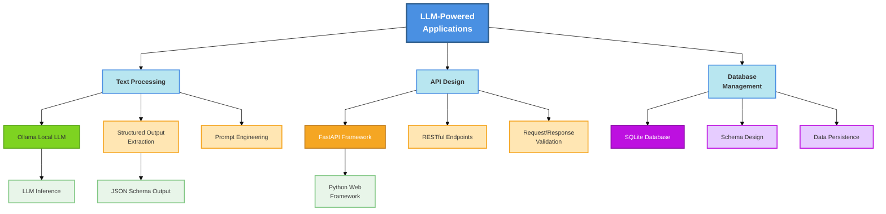

# Week 2: LLM-Powered Action Item Extraction

> **核心主题**: 如何使用 LLM + FastAPI + SQLite 构建智能笔记转换系统

---

## 1. 核心概念图谱 (5 min read)



**图表说明**：
- 蓝色（顶部）：核心应用概念
- 浅蓝色：三大主要模块
- 绿色：Ollama LLM 相关
- 橙色：FastAPI 相关
- 紫色：数据库相关
- 绿底：输出/集成相关

### 关键术语定义

1. **Ollama**: 一个轻量级的本地 LLM 运行时，支持多种开源模型（如 Llama2、Mistral），允许在本地计算机上运行 LLM，无需云服务。

2. **Structured Output (结构化输出)**: 通过 JSON Schema 或特定格式约束，使 LLM 生成符合预定义结构的输出，便于程序解析和集成。

3. **FastAPI**: 现代高性能的 Python Web 框架，支持自动 API 文档生成、请求验证、异步操作，是构建 AI 应用后端的理想选择。

4. **Action Item Extraction (任务项提取)**: 从非结构化文本（如会议笔记、电子邮件）中自动识别和提取可操作的任务项。

5. **Heuristic vs LLM-Based Approach (启发式 vs 基于 LLM 的方法)**: 
   - 启发式：基于规则的简单模式匹配（如搜索 "TODO"、"-" 符号）
   - 基于 LLM：使用神经网络理解上下文，提取语义相关的任务项

---

## 2. 为什么重要 (AI Engineer 视角)

### 解决的痛点

| 痛点 | 传统方案 | LLM-Powered 方案 |
|------|--------|-----------------|
| **理解上下文** | 基于关键词和符号的模式匹配失败率高 | LLM 理解自然语言的语义和隐含含义 |
| **处理多样化格式** | 每种格式需要新的正则表达式规则 | 一个模型适应多种输入格式 |
| **灵活性** | 增加新规则复杂且易出错 | 通过 prompt 工程快速调整 |
| **用户体验** | 提取结果不准确，用户需要大量手动修正 | 提取准确率高，用户只需轻微调整 |

### 真实应用场景

1. **会议记录管理系统**：自动从团队会议笔记中提取任务分配和截止日期
2. **项目管理工具集成**：将客户反馈自动转换为可追踪的 issue
3. **知识库助手**：从文档中提取关键决策和行动项，建立可搜索的索引
4. **销售 CRM 系统**：从客户沟通记录中提取跟进任务

---

## 3. 常见误区与陷阱

### ❌ 初学者常犯的错误

1. **假设 LLM 输出总是有效的 JSON**
   - ✅ 正确做法：使用 JSON Schema 约束和错误处理重试机制
   
2. **直接在生产环境使用大模型**
   - ✅ 正确做法：先用小模型测试（如 mistral 而非 llama2-70b），基准测试后再升级
   
3. **忽视 Prompt 工程的重要性**
   - ✅ 正确做法：花时间优化 prompt，包括示例、约束条件、输出格式说明
   
4. **没有设置超时和资源限制**
   - ✅ 正确做法：为 API 调用设置超时时间，监控 Ollama 内存使用

5. **一次性实现所有功能，没有渐进式构建**
   - ✅ 正确做法：先实现基础的启发式提取，再集成 LLM，分离关注点

### 💡 专家级最佳实践

1. **Dependency Injection & 配置管理**
   ```python
   # 注入 LLM 配置而非硬编码
   class Config:
       ollama_base_url: str = "http://localhost:11434"
       model_name: str = "mistral"
       timeout: int = 30
   ```

2. **Schema-Driven Design**
   - 使用 Pydantic 定义请求/响应模型
   - 利用 FastAPI 的自动验证能力
   - 为 LLM 输出定义明确的 JSON Schema

3. **Graceful Degradation**
   ```python
   # 当 LLM 失败时回退到启发式方法
   try:
       items = extract_action_items_llm(text)
   except LLMUnavailableError:
       items = extract_action_items_heuristic(text)
   ```

4. **测试分层**
   - 单元测试：Mock LLM 调用，测试业务逻辑
   - 集成测试：使用小模型验证端到端流程
   - 性能测试：基准测试不同模型的延迟

5. **可观测性（Observability）**
   - 记录 LLM 输入/输出用于调试
   - 追踪 API 延迟
   - 监控 LLM 成功率

---

## 4. 动手前的思考题 (苏格拉底式)

### 问题 1: 为什么我们需要 "Structured Output"？

**我的思考**:
- 如果 LLM 返回纯文本而不是 JSON，程序如何可靠地解析结果？
- 是否存在 LLM 生成无效 JSON 的情况？如何处理？

**你的答案**:
```
[请在此填写]
```

---

### 问题 2: 启发式方法 vs LLM 方法的权衡是什么？

**我的思考**:
- 启发式方法的优点（速度、可预测性、不需要 GPU）和缺点（准确率、灵活性）各是什么？
- 在什么情况下我会优先使用启发式方法而不是 LLM？

**你的答案**:
```
[请在此填写]
```

---

### 问题 3: 当 Ollama 服务不可用时会发生什么？

**我的思考**:
- 应用应该如何处理 LLM 服务故障？
- 用户体验会受到什么影响？
- 我们可以采取哪些措施来提高系统的韧性（resilience）？

**你的答案**:
```
[请在此填写]
```

---

## 5. 学习路径建议

### 第 1-2 小时：理论基础
- [ ] 理解 Ollama 的架构和本地部署
- [ ] 学习 JSON Schema 和结构化输出
- [ ] 复习 FastAPI 的基础概念（路由、模型验证、依赖注入）

### 第 3-4 小时：实践基础
- [ ] 安装并运行 Ollama 本地模型
- [ ] 编写简单的 LLM 调用脚本
- [ ] 测试不同 prompt 的效果

### 第 5-6 小时：集成与优化
- [ ] 将 LLM 集成到 FastAPI 应用
- [ ] 实现错误处理和 graceful degradation
- [ ] 编写测试并进行性能基准测试

### 第 7-8 小时：生产准备
- [ ] 重构代码以提高可维护性
- [ ] 添加文档和注释
- [ ] 完成 README 和 writeup

---

## 6. 关键资源链接

- [Ollama 结构化输出文档](https://ollama.com/blog/structured-outputs)
- [Ollama 模型库](https://ollama.com/library)
- [FastAPI 官方文档](https://fastapi.tiangolo.com/)
- [Pydantic JSON Schema](https://docs.pydantic.dev/latest/concepts/json_schema/)
- [Python JSON 模块](https://docs.python.org/3/library/json.html)

---

## 7. 与其他周次的关系

```
Week 1: Prompt Engineering Basics
    ↓
Week 2: LLM-Powered Application (LOCAL LLM with Ollama)
    ↓
Week 3: MCP Server & Advanced Integration
    ↓
Week 4+: Scaling & Production Deployment
```

**Week 2 在课程中的地位**：
- 从理论（Week 1）到实践的过渡
- 学习如何集成 LLM 到实际应用
- 为后续分布式系统和生产部署打基础
