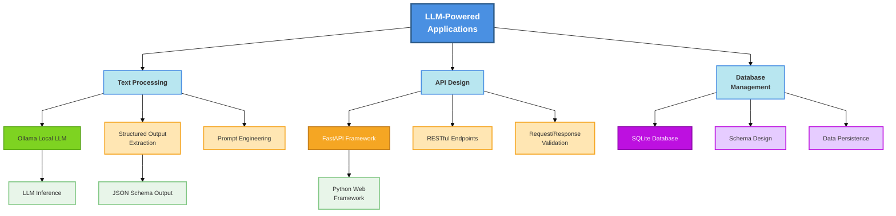

# Week 2 概念总览

> **核心主题**: LLM + FastAPI + SQLite 构建智能应用

---

## 🧠 核心概念图谱



**颜色说明**：
- 🔵 蓝色：核心应用概念
- 🟢 绿色：Ollama LLM 相关
- 🟠 橙色：FastAPI 相关
- 🟣 紫色：数据库相关

---

## 📚 关键术语

| 术语 | 定义 |
|------|------|
| **Ollama** | 轻量级本地 LLM 运行时，支持多种开源模型（llama3.1, mistral），无需云服务 |
| **Structured Output** | 通过 JSON Schema 约束，使 LLM 生成可解析的结构化输出 |
| **FastAPI** | 现代高性能 Python Web 框架，自动 API 文档、请求验证、异步操作 |
| **Action Item Extraction** | 从非结构化文本中自动提取可操作的任务项 |
| **Heuristic vs LLM** | 启发式基于规则匹配；LLM 基于语义理解 |

---

## 🛠️ 技术栈总览

### 核心组件

```
┌─────────────────────────────────────────────────────────┐
│                    FastAPI Application                  │
├─────────────────────────────────────────────────────────┤
│  Routers: /notes, /action-items                        │
│  Services: extract.py (LLM integration)                │
│  Models: Pydantic schemas for validation               │
│  Database: SQLite with SQLAlchemy                      │
└─────────────────────────────────────────────────────────┘
                            ↓
                    ┌───────────────┐
                    │  Ollama LLM    │
                    │  llama3.1:8b  │
                    │  localhost:   │
                    │  11434         │
                    └───────────────┘
```

### 依赖关系

| 组件 | 版本 | 用途 |
|------|------|------|
| **Python** | 3.10+ | 运行环境 |
| **FastAPI** | ≥0.111.0 | Web 框架 |
| **SQLAlchemy** | ≥2.0.0 | ORM |
| **Pydantic** | ≥2.0.0 | 数据验证 |
| **Ollama** | ^0.5.3 | 本地 LLM |
| **pytest** | ≥7.0.0 | 测试框架 |

---

## 🎯 为什么重要（AI Engineer 视角）

### 解决的痛点

| 痛点 | 传统方案 | LLM-Powered 方案 |
|------|--------|-----------------|
| 理解上下文 | 模式匹配失败率高 | LLM 理解语义 |
| 多样化格式 | 每种格式需新规则 | 一个模型适应 |
| 灵活性 | 规则复杂易错 | prompt 快速调整 |

### 真实应用场景

- 会议记录管理 → 自动提取任务分配
- 项目工具集成 → 客户反馈转 issue
- 知识库助手 → 提取关键决策和行动项
- 销售 CRM → 提取跟进任务

---

## ⚠️ 常见误区

### ❌ 初学者常犯错误

| 错误 | ✅ 正确做法 |
|------|-----------|
| 假设 LLM 输出总是有效 JSON | 使用 JSON Schema 约束 + 错误处理 |
| 直接在生产使用大模型 | 先用小模型测试，基准后再升级 |
| 忽视 prompt 工程 | 花时间优化 prompt（示例、约束、格式） |
| 没有超时和资源限制 | 设置超时时间，监控内存使用 |
| 一次性实现所有功能 | 渐进式构建：启发式 → LLM 集成 |

### 💡 专家级最佳实践

```python
# 1. 依赖注入 - 配置管理
class Config:
    ollama_base_url: str = "http://localhost:11434"
    model_name: str = "llama3.1:8b"
    timeout: int = 30

# 2. Schema-Driven Design
class ExtractRequest(BaseModel):
    text: str = Field(..., min_length=1, max_length=5000)

# 3. 优雅降级
try:
    items = extract_with_llm(text)
except LLMUnavailableError:
    items = extract_heuristic(text)

# 4. 测试分层
# - 单元测试：Mock LLM 调用
# - 集成测试：使用小模型验证
# - 性能测试：基准测试延迟

# 5. 可观测性
# - 记录 LLM 输入/输出
# - 追踪 API 延迟
# - 监控成功率
```

---

## 🗺️ 学习路径

### 系统认知（本模块）
- [ ] [00_overview.md](00_overview.md) ← 当前文件
- [ ] [01_architecture.md](01_architecture.md) - FastAPI + SQLite 架构
- [ ] [02_llm_basics.md](02_llm_basics.md) - LLM 集成基础
- [ ] [03_testing_concepts.md](03_testing_concepts.md) - 测试核心概念

### 实战指南
- [ ] [../practice/llm_integration.md](../practice/llm_integration.md) - LLM 集成实战
- [ ] [../practice/testing_patterns.md](../practice/testing_patterns.md) - 测试模式实战
- [ ] [../practice/refactoring_journey.md](../practice/refactoring_journey.md) - 重构案例

### 快速查阅
- [ ] [../reference/code_patterns.md](../reference/code_patterns.md) - 代码模式
- [ ] [../reference/command_reference.md](../reference/command_reference.md) - 命令速查
- [ ] [../reference/troubleshooting.md](../reference/troubleshooting.md) - 问题排查

---

## 🔗 相关资源

- [Ollama 结构化输出](https://ollama.com/blog/structured-outputs)
- [Ollama 模型库](https://ollama.com/library)
- [FastAPI 文档](https://fastapi.tiangolo.com/)
- [Pydantic JSON Schema](https://docs.pydantic.dev/latest/concepts/json_schema/)

---

## 📊 在课程中的位置

```
Week 1: Prompt Engineering Basics
    ↓
Week 2: LLM-Powered Application (LOCAL LLM with Ollama)
    ↓
Week 3: MCP Server & Advanced Integration
    ↓
Week 4+: Scaling & Production Deployment
```

**Week 2 的地位**：
- 从理论到实践的过渡
- 学习如何集成 LLM 到实际应用
- 为后续分布式系统和生产部署打基础
