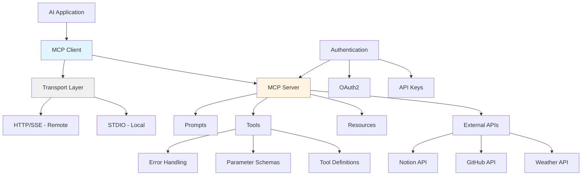

# Week 3: Model Context Protocol (MCP) Server - Pre-Learning

> 生成时间: 2025年12月8日
> 学习主题: Model Context Protocol (MCP) Server

---

## 1. 核心概念图谱 (5 min read)

### MCP 在 AI 系统中的位置



### 关键术语精确定义

1. **Model Context Protocol (MCP)**
   - 标准化协议，用于 AI 模型与外部数据源/工具之间的通信
   - 定义了统一的接口规范，使 LLM 能够安全、可靠地访问外部功能

2. **MCP Server**
   - 实现 MCP 协议的服务端程序
   - 负责暴露 tools、resources、prompts 给 MCP Client
   - 处理与外部 API 的集成和错误处理

3. **Transport Layer (传输层)**
   - **STDIO Transport**: 标准输入/输出，用于本地进程间通信
   - **HTTP/SSE Transport**: 基于 HTTP 的远程通信，支持 Server-Sent Events

4. **Tool (工具)**
   - MCP Server 暴露给 AI 模型的可执行函数
   - 包含类型化的参数定义和返回值规范
   - 示例：`search_weather`, `create_github_issue`

5. **Resource (资源)**
   - 可被 AI 模型读取的数据源
   - 通常以 URI 形式标识（如 `file:///path/to/doc`）

---

## 2. 为什么重要 (AI Engineer 视角)

### 解决的痛点

**痛点 1: AI 模型的"信息孤岛"问题**
- LLM 训练数据有截止日期，无法访问实时数据
- 无法直接调用外部服务（天气、数据库、API）
- MCP 提供标准化的"桥梁"，让模型安全地访问外部世界

**痛点 2: 集成复杂度高**
- 每个外部 API 都有不同的认证、错误处理、速率限制
- MCP Server 统一封装这些复杂性，对模型提供一致的接口

**痛点 3: 安全性和控制**
- 直接让模型访问 API 存在安全风险
- MCP 通过服务器端验证、日志记录、权限控制来保护敏感操作

### 真实 AI 系统中的应用场景

**场景 1: 企业内部 AI 助手**
```
用户: "帮我查一下北京明天的天气，然后在日历里创建一个户外活动"
MCP Server 1: Weather API
MCP Server 2: Calendar API
AI 调用两个 MCP 工具，完成跨系统操作
```

**场景 2: 代码助手集成**
```
开发者: "这个仓库最近有哪些 critical bug？"
MCP Server: GitHub Issues API
→ 实时拉取最新 issue，而不依赖训练数据
```

**场景 3: 多模态数据处理**
```
分析师: "对比最近三个月的销售报表趋势"
MCP Server: Database + File Storage
→ 动态查询数据库，返回结构化数据给模型分析
```

---

## 3. 常见误区与陷阱

### 初学者常犯的错误

**❌ 错误 1: 在 STDIO Transport 中使用 print()**
```python
# 错误示例
def handle_request(request):
    print("Processing request...")  # 会污染 STDIO 通道！
    return response
```
✅ **正确做法**: 使用 logging 模块，输出到 stderr
```python
import logging
logging.basicConfig(level=logging.INFO, stream=sys.stderr)
logger.info("Processing request...")
```

**❌ 错误 2: 忽略 API 速率限制**
```python
# 危险：可能导致 API 被封禁
for item in large_list:
    call_external_api(item)
```
✅ **正确做法**: 实现 backoff 或返回友好错误
```python
import time
try:
    response = call_api()
except RateLimitError:
    return {"error": "请稍后重试，API 速率限制"}
```

**❌ 错误 3: 返回原始 HTTP 错误给模型**
```python
# 不友好的错误
return {"error": "HTTPError 500: Internal Server Error"}
```
✅ **正确做法**: 转换为业务层错误
```python
return {
    "error": "无法获取天气数据，请检查城市名称或稍后重试",
    "debug_info": str(e)  # 可选：用于开发调试
}
```

### 专家级最佳实践

**✅ 实践 1: 强类型参数定义**
```python
from pydantic import BaseModel, Field

class SearchParams(BaseModel):
    query: str = Field(description="搜索关键词")
    limit: int = Field(default=10, ge=1, le=100)
```

**✅ 实践 2: 结构化日志**
```python
logger.info("Tool invoked", extra={
    "tool_name": "search_github",
    "user_id": user_id,
    "timestamp": time.time()
})
```

**✅ 实践 3: 优雅降级**
```python
try:
    result = await external_api.call()
except TimeoutError:
    # 返回缓存数据或降级方案
    result = get_cached_result()
```

---

## 4. 动手前的思考题 (苏格拉底式)

### 问题 1: 架构设计
**如果你要构建一个 MCP Server 来集成 GitHub API，你会选择 STDIO 还是 HTTP Transport？为什么？**

#### 结论先行

**单机、个人或开发阶段** → 选 **STDIO**
- 理由：零网络暴露（更安全）、超低延迟、部署最简单、日志好调试
- 额外优势：GitHub OAuth/Token 只在本机子进程里用，攻击面更小
- 应用场景：在本地 Claude Desktop 或 IDE 插件里给自己用

**团队共享、需要远程访问/横向扩展** → 选 **HTTP (Streamable)**
- 理由：
  - 天然支持多客户端与远程调用
  - 便于接入网关、审计、配额管理
  - 支持组织级 OAuth 应用
  - 能用 SSE 流式推送长任务进度（批量同步仓库、检查 PR、生成代码审查清单）

#### 深度对比

| 维度 | STDIO | HTTP |
|------|-------|------|
| **部署复杂度** | 极低（直接子进程） | 中等（需要网络配置） |
| **安全性** | 非常高（本机进程） | 需要 HTTPS + 认证 |
| **延迟** | 最低（IPC） | 网络延迟 |
| **客户端数量** | 1 个 | 多个 |
| **远程访问** | ❌ 不支持 | ✅ 支持 |
| **水平扩展** | ❌ 困难 | ✅ 容易 |
| **调试** | 日志清晰 | 需要网络工具 |
| **Token 管理** | 环境变量 | 环境变量 + API 认证 |

---

### 问题 2: 错误处理
**假设外部 API 返回了 429 (Too Many Requests) 错误，你有哪些应对策略？哪种对用户体验最友好？**

#### 应对策略详解

##### ✅ 策略 1: 使用 Retry-After 头进行退避重试

**原理**：大多数 API 会在响应头中返回 `Retry-After`（秒数或时间戳）

**实现**：
```python
import time
from typing import Optional

def get_retry_after(response) -> Optional[int]:
    """从响应头中提取重试等待时间"""
    retry_after = response.headers.get('Retry-After')
    if retry_after:
        try:
            return int(retry_after)
        except ValueError:
            # 可能是 HTTP-date 格式
            return None
    return None

async def call_github_api_with_retry(url, params, max_retries=3):
    for attempt in range(max_retries):
        response = await client.get(url, params=params)
        
        if response.status_code == 429:
            wait_seconds = get_retry_after(response) or (2 ** attempt)
            logger.warning(f"Rate limit hit, waiting {wait_seconds}s")
            await asyncio.sleep(wait_seconds)
            continue
        
        return response.json()
    
    raise RateLimitError("Max retries exceeded")
```

**优点**：遵守服务端指令，避免进一步触发限制
**用户体验**：在 UI 上显示"稍后重试，预计 X 秒"，体验最佳

---

##### ✅ 策略 2: 指数退避（Exponential Backoff）

**原理**：无 Retry-After 时，逐次增长等待时间

**实现**：
```python
async def exponential_backoff_retry(func, max_retries=5, base_delay=1):
    """指数退避重试机制"""
    for attempt in range(max_retries):
        try:
            return await func()
        except RateLimitError as e:
            if attempt == max_retries - 1:
                raise
            
            delay = base_delay * (2 ** attempt)
            max_delay = 60  # 上限 60 秒
            delay = min(delay, max_delay)
            
            logger.info(f"Attempt {attempt + 1} failed, waiting {delay}s")
            await asyncio.sleep(delay)
```

**优点**：减少对 API 的压力，避免雪崩
**用户体验**：后台执行时用户无感；前台操作需提示"正在重试"

---

##### ✅ 策略 3: 请求队列与批处理

**原理**：将请求放入队列，按 API 限额逐步发送

**实现**：
```python
from asyncio import Semaphore

class RateLimitedGitHubClient:
    def __init__(self, requests_per_second=2):
        self.semaphore = Semaphore(requests_per_second)
        self.request_queue = []
    
    async def call_with_limit(self, url, params):
        """限制并发请求数"""
        async with self.semaphore:
            response = await client.get(url, params=params)
            if response.status_code == 429:
                # 触发限制后，进一步降速
                await asyncio.sleep(5)
            return response.json()
```

**优点**：避免丢请求，适合高并发场景
**用户体验**：显示"任务已排队，预计完成时间 X 秒"

---

##### ✅ 策略 4: 缓存结果，减少重复请求

**原理**：对相同查询缓存结果，避免频繁调用

**实现**：
```python
from functools import lru_cache
from datetime import datetime, timedelta

class CachedGitHubClient:
    def __init__(self, cache_ttl=300):  # 5分钟缓存
        self.cache = {}
        self.cache_ttl = cache_ttl
    
    async def get_repo_info(self, owner, repo):
        cache_key = f"{owner}/{repo}"
        
        if cache_key in self.cache:
            cached_data, timestamp = self.cache[cache_key]
            if datetime.now() - timestamp < timedelta(seconds=self.cache_ttl):
                logger.info(f"Cache hit for {cache_key}")
                return cached_data
        
        # 缓存未命中，调用 API
        data = await client.get(f"/repos/{owner}/{repo}")
        self.cache[cache_key] = (data, datetime.now())
        return data
```

**优点**：降低 API 压力，提升性能
**用户体验**：用户看到即时响应

---

##### ✅ 策略 5: 降级策略

**原理**：API 不可用时，提供部分功能或本地数据

**实现**：
```python
async def get_github_issues_with_fallback(owner, repo):
    try:
        return await fetch_live_issues(owner, repo)
    except RateLimitError:
        logger.warning("GitHub API unavailable, using cached data")
        return get_cached_issues(owner, repo) or []
    except Exception as e:
        logger.error(f"Failed to fetch issues: {e}")
        return {
            "error": "目前无法获取 GitHub Issues，请稍后重试",
            "cached_data": get_cached_issues(owner, repo)
        }
```

**优点**：保证核心功能可用
**用户体验**：用户不会完全卡死

---

#### 🏆 综合最佳实践：分层应对

```
1. 立即提示用户
   ↓
   显示 "请求过多，正在等待 X 秒后重试"
   
2. 后台自动重试（选择策略）
   ↓
   Retry-After 优先（遵守服务端指令）
   次选指数退避（无 Retry-After 时）
   
3. 避免重复请求
   ↓
   实现缓存 + 请求队列
   限制并发数，降低触发限制的概率
   
4. 完全降级
   ↓
   API 完全不可用时，使用本地缓存或降级数据
```

**关键原则**：透明 + 自动处理，不要让用户手动刷新或猜测

---

#### 代码示例：完整的容错策略

```python
async def robust_github_call(url, params, operation_name):
    """完整的 GitHub API 调用容错方案"""
    
    # 步骤 1: 检查缓存
    cached_result = await cache.get(url)
    if cached_result:
        logger.info(f"{operation_name}: Cache hit")
        return cached_result
    
    # 步骤 2: 带重试调用 API
    for attempt in range(3):
        try:
            async with rate_limiter.semaphore:
                response = await client.get(url, params=params)
                
                if response.status_code == 200:
                    result = response.json()
                    await cache.set(url, result, ttl=300)
                    return result
                
                elif response.status_code == 429:
                    retry_after = int(response.headers.get('Retry-After', 2 ** attempt))
                    logger.warning(
                        f"{operation_name}: Rate limit, waiting {retry_after}s",
                        extra={"attempt": attempt, "retry_after": retry_after}
                    )
                    await asyncio.sleep(retry_after)
                    continue
        
        except TimeoutError:
            logger.error(f"{operation_name}: Timeout on attempt {attempt + 1}")
            if attempt < 2:
                await asyncio.sleep(5)
                continue
    
    # 步骤 3: 降级
    fallback = await cache.get_stale(url)
    if fallback:
        logger.warning(f"{operation_name}: Using stale cache")
        return fallback
    
    raise ServiceUnavailableError(f"Cannot {operation_name}, API unavailable")
```

---

### 问题 3: 安全性
**如果你的 MCP Server 需要访问用户的 Notion 数据，如何在不泄露 API Token 的情况下实现认证？**

#### ✅ 方案 1：OAuth 2.0 授权（推荐）

**原理**：标准的第三方应用授权方式，用户永不直接暴露 Token

**流程**：

```
┌─────────────────────────────────────────────────────────────┐
│  用户浏览器                    │  MCP Server        │ Notion  │
├─────────────────────────────────────────────────────────────┤
│                                                              │
│  1. 用户点击"连接 Notion"                                     │
│     ─────────────→ MCP Server                               │
│                                                              │
│  2. MCP Server 重定向到 Notion 授权页                         │
│     ─────────────→ Notion OAuth 页面                        │
│                     ↓ 用户登录+授权                           │
│                                                              │
│  3. Notion 返回授权码                                        │
│     ← ─────────── Notion (callback to MCP Server)          │
│                                                              │
│  4. MCP Server 后端使用授权码交换 Access Token              │
│     ──────────────→ Notion Token API                        │
│     ← ────────────── Access Token + Refresh Token           │
│                                                              │
│  5. MCP Server 存储 Token（加密）                            │
│     并返回成功给用户                                          │
│     ← ─────────── 成功响应                                  │
│                                                              │
└─────────────────────────────────────────────────────────────┘
```

**实现步骤**：

```python
# 1. 注册应用（在 Notion 开发者平台）
# - 获取 CLIENT_ID 和 CLIENT_SECRET
# - 配置 Redirect URI: https://mcp-server.com/auth/notion/callback

# 2. 步骤 1：生成授权链接
from urllib.parse import urlencode

def get_notion_auth_url():
    params = {
        "client_id": os.getenv("NOTION_CLIENT_ID"),
        "redirect_uri": "https://mcp-server.com/auth/notion/callback",
        "response_type": "code",
        "owner": "user"  # 或 "workspace"
    }
    return f"https://api.notion.com/v1/oauth/authorize?{urlencode(params)}"

# 3. 步骤 2：处理授权回调
import aiohttp
from cryptography.fernet import Fernet

async def handle_notion_callback(auth_code):
    """处理 Notion OAuth 回调"""
    
    # 使用授权码交换 Access Token
    async with aiohttp.ClientSession() as session:
        token_response = await session.post(
            "https://api.notion.com/v1/oauth/token",
            json={
                "grant_type": "authorization_code",
                "code": auth_code,
                "redirect_uri": "https://mcp-server.com/auth/notion/callback",
                "client_id": os.getenv("NOTION_CLIENT_ID"),
                "client_secret": os.getenv("NOTION_CLIENT_SECRET")
            }
        )
        
        token_data = await token_response.json()
        access_token = token_data["access_token"]
        workspace_id = token_data["workspace_name"]
        
        # 加密并存储 Token
        cipher = Fernet(os.getenv("TOKEN_ENCRYPTION_KEY"))
        encrypted_token = cipher.encrypt(access_token.encode())
        
        # 存储到数据库
        await db.store_user_token(
            user_id=current_user.id,
            encrypted_token=encrypted_token,
            workspace_id=workspace_id,
            expires_at=datetime.now() + timedelta(days=365)
        )
        
        return {"status": "success", "workspace": workspace_id}

# 4. 步骤 3：使用 Token 调用 Notion API
async def call_notion_api(user_id, endpoint, method="GET", data=None):
    """使用存储的 Token 调用 Notion API"""
    
    # 从数据库解密 Token
    encrypted_token = await db.get_user_token(user_id)
    cipher = Fernet(os.getenv("TOKEN_ENCRYPTION_KEY"))
    access_token = cipher.decrypt(encrypted_token).decode()
    
    headers = {
        "Authorization": f"Bearer {access_token}",
        "Notion-Version": "2022-06-28"
    }
    
    async with aiohttp.ClientSession() as session:
        async with session.request(
            method,
            f"https://api.notion.com/v1{endpoint}",
            headers=headers,
            json=data
        ) as response:
            return await response.json()

# 5. 步骤 4：定期刷新 Token（如果支持）
async def refresh_notion_token(user_id):
    """使用 Refresh Token 获取新的 Access Token"""
    
    refresh_token = await db.get_user_refresh_token(user_id)
    
    async with aiohttp.ClientSession() as session:
        response = await session.post(
            "https://api.notion.com/v1/oauth/token",
            json={
                "grant_type": "refresh_token",
                "refresh_token": refresh_token,
                "client_id": os.getenv("NOTION_CLIENT_ID"),
                "client_secret": os.getenv("NOTION_CLIENT_SECRET")
            }
        )
        
        new_token_data = await response.json()
        new_token = new_token_data["access_token"]
        
        # 更新数据库
        cipher = Fernet(os.getenv("TOKEN_ENCRYPTION_KEY"))
        encrypted_token = cipher.encrypt(new_token.encode())
        await db.update_user_token(user_id, encrypted_token)
```

**优点**：
- ✅ 用户无需手动提供 API Token
- ✅ Token 生命周期可控，权限范围可限制（支持细粒度权限）
- ✅ 符合行业标准，用户更信任
- ✅ 可轻松撤销权限（用户在 Notion 账户设置中撤销）

---

#### ✅ 方案 2：使用安全代理（如暂无 OAuth）

**原理**：Token 不直接暴露，在后端加密存储和使用

**实现**：

```python
from typing import Dict, Any
import secrets

class NotionTokenManager:
    """安全的 Notion Token 管理器"""
    
    async def store_user_token(self, user_id: str, token: str):
        """用户首次输入 Token（仅一次），后端加密存储"""
        
        # 1. 验证 Token 有效性
        try:
            await self._verify_token(token)
        except InvalidTokenError:
            raise ValueError("Invalid Notion API Token")
        
        # 2. 加密存储
        cipher = Fernet(os.getenv("TOKEN_ENCRYPTION_KEY"))
        encrypted_token = cipher.encrypt(token.encode())
        
        # 3. 存储到安全数据库（带版本控制）
        await db.store_token(
            user_id=user_id,
            encrypted_token=encrypted_token,
            created_at=datetime.now(),
            hash_token=hashlib.sha256(token.encode()).hexdigest()  # 用于验证
        )
        
        logger.info(f"Token stored for user {user_id}", extra={"user_id": user_id})
    
    async def call_notion_with_proxy(self, user_id: str, endpoint: str, params: Dict):
        """客户端通过代理调用 Notion API，Token 不暴露"""
        
        # 1. 验证用户身份（不是 Notion Token，是 MCP Server 的会话令牌）
        # JWT 或 Session ID
        await auth.verify_session(user_id)
        
        # 2. 从数据库解密 Token
        encrypted_token = await db.get_user_token(user_id)
        cipher = Fernet(os.getenv("TOKEN_ENCRYPTION_KEY"))
        notion_token = cipher.decrypt(encrypted_token).decode()
        
        # 3. 后端代理调用 Notion API
        headers = {
            "Authorization": f"Bearer {notion_token}",
            "Content-Type": "application/json"
        }
        
        async with aiohttp.ClientSession() as session:
            async with session.post(
                f"https://api.notion.com/v1{endpoint}",
                headers=headers,
                json=params
            ) as response:
                data = await response.json()
                
                # 4. 返回结果给客户端（不包含 Token）
                return data
```

**配置示例**：

```yaml
# .env
NOTION_ENCRYPTION_KEY=your-fernet-key-here  # 使用 Fernet.generate_key()

# config.yaml
token_storage:
  type: "encrypted_db"
  encryption_algorithm: "AES-256"
  cache_ttl: 3600  # 1小时缓存解密后的 Token（可选，增加性能但降低安全性）
```

**关键安全点**：
- Token 永远不出现在客户端
- Token 永远不在日志中记录（或只记录 hash）
- 使用 HTTPS 传输所有请求
- 验证客户端身份（JWT + 密钥）

---

#### ✅ 方案 3：零信任 + 临时访问令牌（最安全）

**原理**：MCP Server 为客户端生成短期临时令牌，而不是暴露 Notion Token

**流程**：

```
┌──────────────────────────────────────────────────────────┐
│  客户端                  │  MCP Server        │ Notion    │
├──────────────────────────────────────────────────────────┤
│                                                           │
│  初始化：设置 Notion Token 一次                            │
│  (MCP Server 存储加密版本)                                 │
│                                                           │
│  客户端请求：                                               │
│  POST /api/query {user_id, request_params}               │
│  ───────────→ MCP Server                                 │
│                                                           │
│  MCP Server：                                              │
│  1. 验证用户身份                                            │
│  2. 生成临时令牌（JWT，有效期 5 分钟）                     │
│  ← ─────────── {"temp_token": "jwt_...", "expires": 300}│
│                                                           │
│  客户端保存临时令牌，用于后续请求                            │
│  GET /api/notion/pages?temp_token=jwt_...                │
│  ───────────→ MCP Server                                 │
│                                                           │
│  MCP Server：                                              │
│  1. 验证 JWT 签名和有效期                                  │
│  2. 从 JWT 中解析 user_id                                 │
│  3. 使用存储的 Notion Token 调用 API                      │
│     (客户端不知道真实 Token)                               │
│  4. 返回结果                                               │
│  ← ─────────── {notion_data: {...}}                      │
│                                                           │
└──────────────────────────────────────────────────────────┘
```

**实现**：

```python
import jwt
from datetime import datetime, timedelta

class ZeroTrustNotionManager:
    """零信任的 Notion Token 管理"""
    
    def __init__(self, jwt_secret: str):
        self.jwt_secret = jwt_secret
        self.token_lifetime = 300  # 5 分钟
    
    def generate_temp_token(self, user_id: str) -> str:
        """生成临时访问令牌"""
        
        payload = {
            "user_id": user_id,
            "iat": datetime.utcnow(),
            "exp": datetime.utcnow() + timedelta(seconds=self.token_lifetime),
            "type": "notion_temp_access"
        }
        
        temp_token = jwt.encode(payload, self.jwt_secret, algorithm="HS256")
        logger.info(f"Generated temp token for user {user_id}", extra={"user_id": user_id})
        return temp_token
    
    async def verify_and_use_temp_token(self, temp_token: str, operation: str):
        """验证临时令牌并执行操作"""
        
        try:
            # 1. 验证 JWT 签名和有效期
            payload = jwt.decode(temp_token, self.jwt_secret, algorithms=["HS256"])
            user_id = payload["user_id"]
            
            # 2. 检查令牌类型
            if payload.get("type") != "notion_temp_access":
                raise InvalidTokenError("Wrong token type")
            
            # 3. 检查令牌是否过期
            if payload["exp"] < datetime.utcnow().timestamp():
                raise ExpiredTokenError("Token expired")
            
        except jwt.InvalidTokenError as e:
            logger.warning(f"Invalid temp token: {e}")
            raise UnauthorizedError("Invalid authorization")
        
        # 4. 从数据库获取真实 Token，执行操作
        encrypted_token = await db.get_user_token(user_id)
        cipher = Fernet(os.getenv("TOKEN_ENCRYPTION_KEY"))
        notion_token = cipher.decrypt(encrypted_token).decode()
        
        # 5. 执行操作（如查询页面）
        result = await self._call_notion_api(notion_token, operation)
        
        # 6. 日志记录（使用 user_id，不记录 Token）
        logger.info(
            f"Notion API call: {operation}",
            extra={"user_id": user_id, "operation": operation}
        )
        
        return result
    
    async def _call_notion_api(self, token: str, operation: str):
        """内部调用 Notion API（Token 不暴露给客户端）"""
        
        headers = {
            "Authorization": f"Bearer {token}",
            "Notion-Version": "2022-06-28"
        }
        
        async with aiohttp.ClientSession() as session:
            async with session.get(
                f"https://api.notion.com/v1/{operation}",
                headers=headers
            ) as response:
                return await response.json()

# API 端点
@app.post("/auth/notion/init")
async def init_notion_token(user_id: str, token: str):
    """用户初始化 Notion Token（一次性）"""
    
    manager = ZeroTrustNotionManager(os.getenv("JWT_SECRET"))
    await manager.store_user_token(user_id, token)
    return {"status": "success"}

@app.post("/auth/notion/temp-token")
async def get_temp_token(user_id: str):
    """客户端获取临时令牌"""
    
    manager = ZeroTrustNotionManager(os.getenv("JWT_SECRET"))
    temp_token = manager.generate_temp_token(user_id)
    return {
        "temp_token": temp_token,
        "expires_in": 300,
        "type": "Bearer"
    }

@app.get("/api/notion/pages")
async def get_notion_pages(temp_token: str, database_id: str):
    """使用临时令牌查询 Notion 页面"""
    
    manager = ZeroTrustNotionManager(os.getenv("JWT_SECRET"))
    result = await manager.verify_and_use_temp_token(
        temp_token,
        f"databases/{database_id}/query"
    )
    return result
```

**优点**：
- ✅ 真实 Notion Token 永不离开 MCP Server 内存
- ✅ 客户端只持有短期临时令牌（5 分钟有效期）
- ✅ 临时令牌泄露不会导致永久授权丢失
- ✅ 符合零信任安全原则

---

#### 🏆 三大方案对比

| 方案 | 安全性 | 易用性 | 维护成本 | 最适用场景 |
|------|--------|--------|---------|----------|
| **OAuth 2.0** | ⭐⭐⭐⭐⭐ | ⭐⭐⭐⭐ | 中等 | 商业应用、需要用户信任 |
| **安全代理** | ⭐⭐⭐⭐ | ⭐⭐⭐ | 低 | 快速原型、单个用户 |
| **零信任令牌** | ⭐⭐⭐⭐⭐ | ⭐⭐⭐⭐ | 高 | 企业级、多租户系统 |

**推荐选择**：
- 快速开发 → 安全代理
- 线上环境 → OAuth 2.0
- 企业级应用 → 零信任令牌

---

## 下一步

完成上述思考题后，你可以：
1. ✅ 开始实现第一个简单的 MCP Server（如 Weather API）
2. ✅ 阅读官方 Quickstart: https://modelcontextprotocol.io/quickstart/server
3. ✅ 使用 MCP Inspector 工具调试你的服务器
4. ✅ 参考学习笔记: `02_ai_agent_interaction_guide.md`（如何与 AI 协作编码）

---

## 参考资源

- [MCP 官方文档](https://modelcontextprotocol.io/)
- [MCP Authorization Spec](https://modelcontextprotocol.io/specification/2025-06-18/basic/authorization)
- [Cloudflare Agents Guide](https://developers.cloudflare.com/agents/guides/remote-mcp-server/)
- [Vercel MCP Deployment](https://vercel.com/docs/mcp/deploy-mcp-servers-to-vercel)
