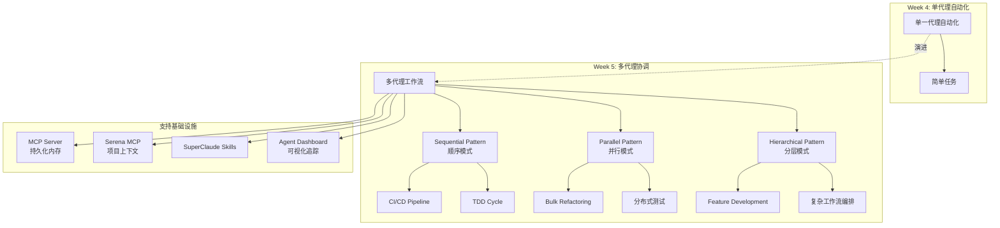

# Week 5: Multi-Agent Workflows with Claude Code - 概念深度理解

> **学习日期**: 2025-01-01
> **学习目标**: 掌握多代理协调模式，构建可复用的 Agent Orchestration System

---

## 1. 核心概念图谱

### 概念关系图



### 关键术语精确定义

| 术语 | 定义 |
|------|------|
| **Agent Orchestration** | 协调多个专业化代理按特定模式协作完成复杂任务的过程，包括代理调度、上下文传递和错误处理 |
| **Sequential Pattern** | 顺序模式，代理依次执行，每个代理的输出作为下一个代理的输入，形成代理链 |
| **Parallel Pattern** | 并行模式，多个代理同时独立处理不同任务，最后聚合结果 |
| **Hierarchical Pattern** | 分层模式，一个 Orchestrator Agent 负责任务分解和协调，多个 Specialist Agent 执行具体任务 |
| **Handoff Protocol** | 代理间传递控制的标准格式，包含上下文、状态、中间结果等信息 |
| **Agent State** | 代理执行期间的状态信息，包括输入参数、中间结果、执行状态等 |
| **Fault Tolerance** | 容错机制，当代理失败时能够重试、回滚或优雅降级 |

---

## 2. 为什么重要 (AI Engineer 视角)

### 解决的痛点

1. **复杂任务分解**: 单个代理难以处理需要多种专业知识的复杂任务
   - 例如: Feature Development 需要 TestAgent + CodeAgent + DocsAgent + ReviewAgent

2. **执行效率提升**: 并行模式可以显著缩短总执行时间
   - 例如: 3 个 RefactorAgent 同时处理 3 个文件，比顺序处理快 3 倍

3. **专业分工**: 每个代理专注于特定领域，提高质量
   - TestAgent 擅长测试策略，CodeAgent 擅长实现，ReviewAgent 擅长代码审查

4. **可维护性**: 工作流可复用、可组合、可调试
   - Workflow Template Engine 可以定义和重用常见模式

### 真实 AI 系统中的应用场景

| 场景 | 协调模式 | 代理组合 |
|------|----------|----------|
| **CI/CD Pipeline** | Sequential | TestAgent → BuildAgent → DeployAgent → MonitorAgent |
| **批量重构** | Parallel | 3+ RefactorAgent 同时工作 → TestAgent 验证 |
| **Feature Development** | Hierarchical | Orchestrator → TestAgent + CodeAgent + DocsAgent + ReviewAgent |
| **文档生成** | Sequential | DocsAgent → ReviewAgent → FormatAgent → SyncAgent |
| **分布式测试** | Parallel | 多个 TestAgent 同时测试不同模块 |

---

## 3. 常见误区与陷阱

### 初学者常犯的错误

| 误区 | 正确做法 |
|------|----------|
| **代理职责不清** - 让一个代理做太多事情 | 每个代理只负责一个专业领域 (Single Responsibility) |
| **缺乏容错机制** - 一个代理失败导致整个流程崩溃 | 实现 retry、rollback、circuit breaker |
| **上下文传递不足** - 代理间交接时丢失关键信息 | 使用标准化的 Handoff Protocol |
| **并行执行冲突** - 多个代理同时修改同一文件 | 确保代理工作在独立资源上，或使用锁机制 |
| **缺乏可观测性** - 无法追踪代理执行情况 | 实现 Execution Timeline 和 Metrics Dashboard |

### 专家级最佳实践

1. **Handoff Protocol 设计**
   ```markdown
   ## 标准交接格式
   - **From Agent**: TestAgent
   - **To Agent**: CodeAgent
   - **Context**: {项目信息, 相关文件, 现有模式}
   - **Requirements**: {从测试导出的实现需求}
   - **Constraints**: {不要修改测试, 遵循项目规范}
   - **Output Expected**: {实现文件列表, 测试结果}
   ```

2. **容错策略**
   - **Retry**: 失败后自动重试 (指数退避)
   - **Rollback**: 保存执行前状态，失败时回滚
   - **Circuit Breaker**: 连续 N 次失败后暂停代理
   - **Fallback**: 降级到简化流程

3. **状态持久化**
   - 使用 MCP (如 Notion) 存储代理执行历史
   - 便于调试、审计和恢复

4. **渐进式开发**
   - 先实现 Sequential (最简单)
   - 再实现 Parallel (需要处理并发)
   - 最后实现 Hierarchical (最复杂)

---

## 4. 动手前的思考题 (苏格拉底式)

### 问题 1: 代理职责边界

> **思考**: 在 TDD Cycle 中，TestAgent 负责写测试，CodeAgent 负责实现。如果 CodeAgent 发现测试有问题 (比如测试逻辑错误)，它应该:
>
> - A) 直接修改测试
> - B) 在 handoff 消息中反馈给 TestAgent
> - C) 报错并停止流程
>
> **你的答案**: ___________
>
> **提示**: 考虑代理职责分离和工作流稳定性

---

### 问题 2: 并行执行的数据一致性

> **思考**: 在 Bulk Refactor 场景中，3 个 RefactorAgent 同时修改不同文件，如果其中 1 个失败，应该如何处理?
>
> - A) 只回滚失败的代理修改
> - B) 回滚所有代理的修改
> - C) 提交成功的，记录失败的
>
> **你的答案**: ___________
>
> **提示**: 考虑代码库一致性和测试验证策略

---

### 问题 3: Hierarchical 模式的任务分解

> **思考**: OrchestratorAgent 如何决定将任务分配给哪个 Specialist Agent?
>
> - A) 基于任务关键词匹配
> - B) 分析任务类型和代理能力描述
> - C) 让所有代理都尝试，选最好的结果
>
> **你的答案**: ___________
>
> **提示**: 考虑 Agent Registry 中存储的能力元数据

---

## 5. 本周技术栈与现有基础设施

### 启动器应用结构

```
week5/
├── backend/               # FastAPI 应用
│   ├── app/
│   │   ├── routers/      # agents, workflows, executions 端点
│   │   ├── models.py     # Agent, Execution, WorkflowTemplate
│   │   └── services/     # 协调逻辑
│   └── tests/            # pytest 测试
├── frontend/             # 静态 UI (HTML/JS/CSS)
├── data/                 # SQLite + seed
└── docs/TASKS.md         # 任务列表
```

### 现有集成点

| 组件 | 集成方式 | 用途 |
|------|----------|------|
| **TDD Agents** | `.claude/subagents/tdd-*.md` | 复用 TestAgent/CodeAgent |
| **TDD Cycle** | `.claude/commands/tdd-cycle.md` | Sequential 模式示例 |
| **SuperClaude** | `sc:workflow`, `sc:pm`, `sc:implement` | 工作流生成和管理 |
| **Serena MCP** | 项目上下文加载 | 代理间通信持久化 |
| **Notion MCP** | 外部存储 | Agent Execution Logs |

### 新建文件位置

- **Slash Commands**: `.claude/commands/{name}.md`
- **Subagents**: `.claude/subagents/{name}.md`
- **Backend Models**: `week5/backend/app/models.py`
- **Backend Routers**: `week5/backend/app/routers/{name}.py`
- **Frontend**: `week5/frontend/{index.html,app.js,styles.css}`
- **Tests**: `week5/backend/tests/test_{name}.py`

---

## 6. 推荐学习路径

### Step 1: 理解模式 (30 分钟)
- 阅读 [Claude Code SubAgents 文档](https://docs.anthropic.com/en/docs/claude-code/sub-agents)
- 研究现有 `tdd-cycle.md` (Sequential 模式实现)

### Step 2: 实现第一个多代理自动化 (2-3 小时)
- 选择 Option A (Sequential) 或 Option B (Parallel)
- 实现并测试代理协调

### Step 3: 构建 Agent Dashboard (3-4 小时)
- 实现 Agent Registry
- 实现 Execution Timeline
- 添加 Metrics Dashboard

### Step 4: 高级特性 (可选)
- MCP Integration for Persistent Memory
- Agent Failure Recovery System
- Handoff Visualization

---

## 下一步

运行 `/explore-week week5` 深入了解当前代码库状态，然后开始实现你的第一个多代理协调模式!
