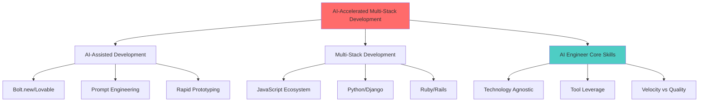

# Week 8 核心概念深度理解
## AI-Accelerated Multi-Stack Development

---

## 1. 核心概念图谱



### 关键术语精确定义

| 术语 | 定义 |
|------|------|
| **AI App Generator** | 通过自然语言描述自动生成全栈应用代码的平台（如 Bolt.new），使用 LLM 理解需求并输出可直接运行的项目代码 |
| **Technology Stack** | 构建完整 Web 应用所需的技术组合，通常包括：前端框架 + 后端框架 + 数据库 + 运行时环境 |
| **Prompt-First Development** | 先用清晰的自然语言描述应用需求（数据模型、路由、UI 流程），再让 AI 工具生成的开发范式 |
| **Polyglot Development** | 掌握多种编程语言/框架并能根据场景选择合适技术栈的能力 |
| **Scaffolding** | 自动生成项目骨架、基础文件结构和样板代码的过程 |

---

## 2. 为什么重要（AI Engineer 视角）

### 解决的痛点

| 传统开发痛点 | AI-Accelerated 解决方案 |
|-------------|------------------------|
| CRUD 样板代码耗时 | AI 几秒生成完整 CRUD 接口 |
| 技术栈切换成本高 | 快速尝试多种栈，找到最优解 |
| 原型到生产转化慢 | 从 idea 到 working demo 分钟级 |
| 单一技术视野局限 | 多栈对比，培养技术判断力 |

### 真实 AI 系统中的应用场景

1. **快速 PoC（Proof of Concept）**
   - 场景：需要验证一个 AI 功能 idea
   - 做法：用 Bolt 30 分钟生成可演示原型
   - 价值：快速失败，节省资源

2. **技术选型决策**
   - 场景：团队不确定用 Django 还是 Rails
   - 做法：用 AI 生成两个版本，对比开发体验
   - 价值：数据驱动的技术决策

3. **全栈 AI 应用开发**
   - 场景：需要 LLM 集成的全栈应用
   - 做法：用 AI 生成基础架构，人工专注 AI 逻辑
   - 价值：加速 AI 产品落地

4. **遗留系统迁移评估**
   - 场景：考虑从 Java 迁移到 Python
   - 做法：用 AI 生成目标栈版本，评估迁移成本
   - 价值：降低迁移风险

---

## 3. 常见误区与陷阱

### ❌ 误区 1：AI 生成的代码无需人工审核

**问题**：
- 可能包含安全漏洞（SQL 注入、XSS）
- 缺少错误处理和边界检查
- 数据库设计可能不合理（缺少索引）

**✅ 最佳实践**：
```yaml
流程:
  1. AI 生成代码
  2. 人工 review 数据模型
  3. 添加安全中间件
  4. 编写集成测试
  5. 部署到 staging 验证
```

### ❌ 误区 2：所有技术栈都适合用 AI 生成

**问题**：
- Bolt 擅长现代 JS 栈（Next.js、React）
- 对 Django/Rails 的 ORM 模式理解有限
- 传统框架的"约定优于配置"难以体现

**✅ 最佳实践**：
```yaml
技术栈选择指南:
  高适配: Next.js, React, Vue, Node.js
  中适配: Flask, Express, FastAPI
  低适配: Django, Rails (需手动调整)
```

### ❌ 误区 3：三个版本代码可以共享逻辑

**问题**：
- 不同栈的设计模式不同（如 Django 的 MTV vs Rails 的 MVC）
- 直接复制代码导致"反模式"
- 难以维护和扩展

**✅ 最佳实践**：
```yaml
隔离原则:
  - 每个版本独立文件夹
  - 共享 API 契约（OpenAPI spec）
  - 不共享源码文件
  - 数据库 schema 可以共享
```

### ❌ 误区 4：生成后立即部署

**问题**：
- 缺少测试覆盖
- 没有性能优化
- 配置硬编码（密钥、URL）

**✅ 最佳实践**：
```yaml
部署前检查清单:
  ✅ CRUD 功能测试通过
  ✅ 环境变量正确配置
  ✅ 数据库迁移脚本可执行
  ✅ 错误处理完善
  ✅ README 包含完整运行说明
```

---

## 4. 动手前的思考题

### 思考题 1：应用概念选择

**你的回答**：
```
创建新应用：RDE AI culture

理由：
1. 我工作中需要使用
2. 可以尝试迭代出来更好的版本
```

---

## 5. 技术栈深度分析（AI-Coding 考量）

### 候选技术栈对比

| 技术栈 | AI 工具适配度 | Claude Code 体验 | 学习曲线 | 适用场景 |
|--------|-------------|-----------------|---------|---------|
| **Next.js + shadcn/ui** | ⭐⭐⭐⭐⭐ | ⭐⭐⭐⭐⭐ | 中等 | 现代 Web 应用、SEO 友好 |
| **Django + React** | ⭐⭐⭐ | ⭐⭐⭐⭐ | 中高 | 快速 CRUD、传统 Web |
| **Rails 7** | ⭐⭐⭐ | ⭐⭐⭐⭐ | 中等 | 快速原型、约定优先 |
| **FastAPI + Vue** | ⭐⭐⭐⭐ | ⭐⭐⭐⭐⭐ | 中等 | API 优先、现代前端 |
| **MERN** | ⭐⭐⭐⭐⭐ | ⭐⭐⭐⭐ | 中等 | 全栈 JavaScript |

---

### 推荐组合 1：Next.js 全栈（Bolt 生成）

```yaml
技术组成:
  前端: Next.js 14 (App Router) + TypeScript
  UI: shadcn/ui + Tailwind CSS
  后端: Next.js API Routes
  数据库: SQLite (better-sqlite3) 或 PostgreSQL
  ORM: Prisma

AI Coding 优势:
  ✅ TypeScript 类型安全，Claude 理解更好
  ✅ 文件结构清晰，Read/Glob 效率高
  ✅ 组件化好，Edit/MultiEdit 精准
  ✅ shadcn/ui 复制粘贴即用，AI 熟悉
  ✅ Prisma Schema 即文档，Claude 能准确推断

Bolt.new 适配:
  ✅ 官方推荐栈，生成质量最高
  ✅ 支持现代 React 模式
  ✅ 内置 API 路由，无需单独后端

适合你的理由:
  - Claude Code 对 TypeScript 项目理解最深
  - 类型系统帮助 AI 减少错误
  - shadcn/ui 组件库 AI 熟悉度高

劣势:
  ❌ 全 JS，不符合"非-JS 语言"要求
  ❌ Next.js 学习曲线（App Router 概念）
```

---

### 推荐组合 2：FastAPI + Vue（手动 + AI 辅助）

```yaml
技术组成:
  前端: Vue 3 + TypeScript + Vite
  后端: FastAPI (Python 3.10+)
  数据库: SQLite + SQLAlchemy 2.0
  UI: Element Plus 或 Naive UI
  认证: FastAPI Security

AI Coding 优势:
  ✅ Python 代码简洁，Claude 生成准确
  ✅ FastAPI 依赖注入，AI 易于理解
  ✅ Pydantic Model 即文档，类型推断强
  ✅ 你已有 FastAPI 项目经验（week2-6）
  ✅ Vue 3 Composition API，TypeScript 友好

Bolt.new 适配:
  ⚠️ Bolt 可以生成，但不如 Next.js 顺畅
  ⚠️ 可能需要手动调整 FastAPI 部分

适合你的理由:
  ✅ 非-JS 语言（Python），满足要求
  ✅ 复用你现有的 FastAPI 知识
  ✅ TypeScript + Vue，AI 体验好

劣势:
  ❌ 需要维护前后端两个项目
  ❌ Vue 生态不如 React 熟悉
```

---

### 推荐组合 3：Django + HTMX（手动 + AI 辅助）

```yaml
技术组成:
  后端: Django 5.0
  前端: HTMX + Alpine.js (轻量)
  数据库: SQLite (默认)
  ORM: Django ORM
  UI: Bootstrap 或 Tailwind

AI Coding 优势:
  ✅ Django "batteries included"，代码结构固定
  ✅ ORM 代码直观，Claude 易于生成
  ✅ Admin 界面自动生成，节省时间
  ⚠️ MTV 模式，需要明确告知 AI
  ⚠️ 模板语法，AI 可能偶尔混淆

Bolt.new 适配:
  ❌ Bolt 不擅长 Django
  ✅ 可以用 Claude Code 手动生成

适合你的理由:
  ✅ 非-JS 语言（Python），满足要求
  ✅ Django Admin 自动化 CRUD
  ✅ HTMX 减少前端复杂度
  ✅ 学习 Rails 风格的"约定优先"

劣势:
  ❌ AI 对 Django 模板理解不如 JSX
  ❌ 配置相对复杂（settings.py, urls.py）
  ❌ HTMX 与 AI 生成配合一般
```

---

### 推荐组合 4：Rails 7 + Hotwire（手动 + AI 辅助）

```yaml
技术组成:
  全栈: Ruby on Rails 7
  前端: Hotwire (Turbo + Stimulus)
  数据库: SQLite (默认)
  ORM: Active Record
  UI: Tailwind CSS 或 Bootstrap

AI Coding 优势:
  ⚠️ Ruby 语法不如 Python/JS 普及，Claude 可能需要更多提示
  ✅ Rails "约定优于配置"，结构固定
  ✅ Scaffold 命令生成 CRUD，AI 可模拟
  ⚠️ 需要明确告知 AI Rails 惯例

Bolt.new 适配:
  ❌ Bolt 不支持 Rails
  ✅ 可以用 Claude Code 手动生成

适合你的理由:
  ✅ 非-JS 语言（Ruby），满足要求
  ✅ 学习经典全栈框架
  ✅ Rails 生态成熟，gem 丰富
  ✅ 快速开发（scaffold 一条命令）

劣势:
  ❌ AI 对 Ruby 支持不如 Python/JS
  ❌ 学习曲线（Ruby 语法、Rails 魔法）
  ❌ 你可能完全没有 Ruby 经验
```

---

## 🎯 最终推荐方案（针对你的情况）

```yaml
基于你的背景和 AI Coding 考量:

方案 A - 平衡型:
  Stack 1: Next.js + Prisma + shadcn/ui
    → 用 Bolt.new 生成，5 分钟搞定基础 CRUD
    → 最适合 AI 辅助开发

  Stack 2: FastAPI + Vue + SQLAlchemy
    → 用 Claude Code 辅助手动构建
    → 复用你现有的 FastAPI 知识
    → TypeScript 前端，AI 理解好

  Stack 3: Django + HTMX
    → 用 Claude Code 辅助手动构建
    → 学习 Django Admin 自动化
    → 满足非-JS 要求

优势:
  ✅ 满足所有要求（3 栈 + 1 Bolt + 1 非-JS）
  ✅ 两个 Python 栈，复用现有知识
  ✅ Next.js 体验现代 AI 工具
  ✅ AI Coding 体验整体优秀
```

---

## 6. 多版本一致性测试方案

### Postman 统一测试方案 ✅

**好消息**：Postman 完全支持你的需求！

```yaml
方案 1: Postman Collection + 环境变量
  原理:
    1. 创建一个 Collection 定义所有 API 测试
    2. 为每个版本创建 Environment
    3. 使用变量 {{base_url}} 动态切换目标

  步骤:
    1. 定义测试用例（CRUD 操作）
    2. 创建 3 个 Environment:
       - nextjs-app: http://localhost:3000
       - fastapi-app: http://localhost:8000
       - django-app: http://localhost:8080
    3. 一键运行 Collection，自动测试 3 个版本

  优势:
    ✅ 一份测试脚本，多个环境
    ✅ 自动化测试，一键运行
    ✅ 可视化报告，对比结果
```

### 具体实现

**Postman Collection 结构**：
```json
{
  "item": [
    {
      "name": "GET /culture-notes - List all",
      "request": {
        "method": "GET",
        "url": "{{base_url}}/api/culture-notes"
      },
      "event": [
        {
          "test": "Status code is 200",
          "script": "pm.response.to.have.status(200);"
        }
      ]
    },
    {
      "name": "POST /culture-notes - Create",
      "request": {
        "method": "POST",
        "url": "{{base_url}}/api/culture-notes",
        "body": {
          "mode": "raw",
          "raw": "{\"title\": \"Test Note\", \"content\": \"Test Content\"}"
        }
      }
    }
  ]
}
```

**Environment 配置**：
```json
// nextjs-app.json
{
  "name": "Next.js App",
  "values": [
    {"key": "base_url", "value": "http://localhost:3000"},
    {"key": "api_key", "value": "{{optional_auth}}"}
  ]
}

// fastapi-app.json
{
  "name": "FastAPI App",
  "values": [
    {"key": "base_url", "value": "http://localhost:8000"},
    {"key": "api_key", "value": "{{optional_auth}}"}
  ]
}
```

### 方案 2：Python 测试脚本（更灵活）

```python
# test_all_stacks.py
import requests
import sys

BASE_URLS = {
    "nextjs": "http://localhost:3000",
    "fastapi": "http://localhost:8000",
    "django": "http://localhost:8080",
}

def test_crud(base_url: str):
    """统一测试 CRUD 操作"""
    results = []

    # Create
    response = requests.post(f"{base_url}/api/culture-notes", json={
        "title": "Test",
        "content": "Test content"
    })
    results.append(("CREATE", response.status_code == 201))

    # Read
    response = requests.get(f"{base_url}/api/culture-notes")
    results.append(("READ", response.status_code == 200))

    # Update
    note_id = response.json()[0]["id"]
    response = requests.put(f"{base_url}/api/culture-notes/{note_id}", json={
        "title": "Updated"
    })
    results.append(("UPDATE", response.status_code == 200))

    # Delete
    response = requests.delete(f"{base_url}/api/culture-notes/{note_id}")
    results.append(("DELETE", response.status_code == 200))

    return results

if __name__ == "__main__":
    print("Testing all stacks...\n")
    for name, url in BASE_URLS.items():
        print(f"Testing {name.upper()} ({url})")
        results = test_crud(url)
        for op, passed in results:
            status = "✅ PASS" if passed else "❌ FAIL"
            print(f"  {op}: {status}")
        print()
```

---

## 下一步行动

1. **✅ 笔记已保存**：`learning_notes/week8/01_pre_learning_concepts.md`
2. **选择技术栈**：基于推荐方案，确定你的 3 个技术栈
3. **设计数据模型**：定义 "RDE AI culture" 应用的核心实体
4. **开始开发**：先用 Bolt 生成第一个版本

---

**你的决策**：
```
Stack 1 (Bolt): _______________________

Stack 2 (手动+AI): _______________________

Stack 3 (手动+AI): _______________________

非-JS 语言: _______________________
```

准备好开始了吗？我可以帮你：
1. 用 Bolt 生成第一个版本
2. 用 Claude Code 构建 FastAPI 版本
3. 创建 Postman Collection 测试脚本
