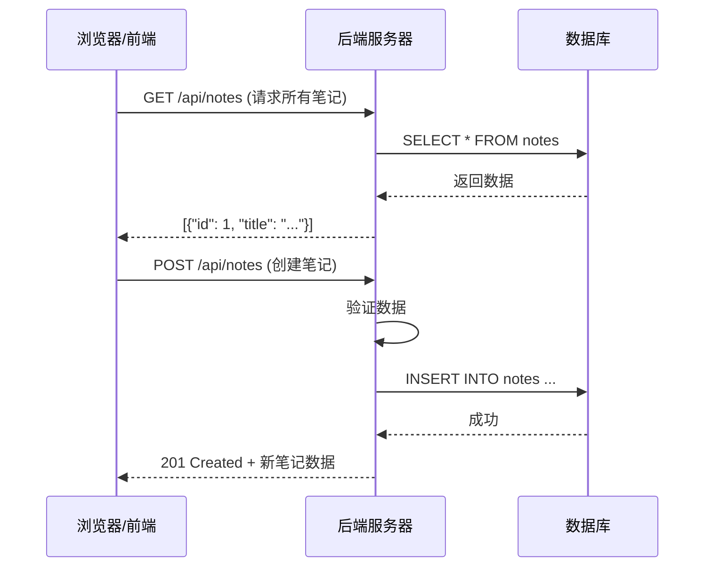
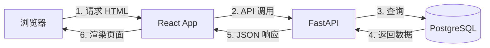
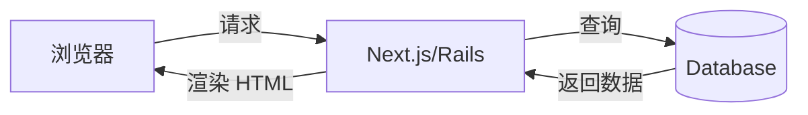
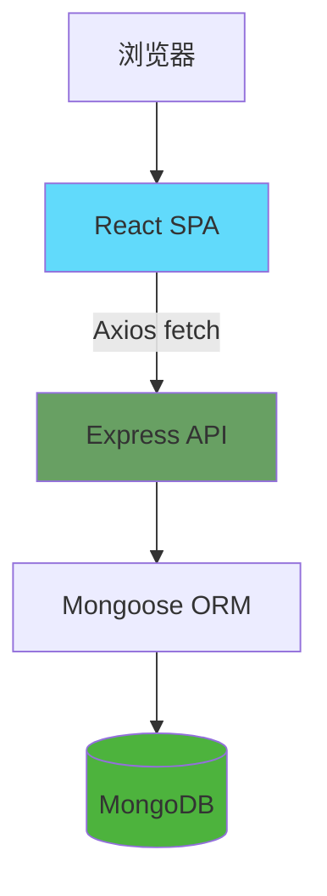
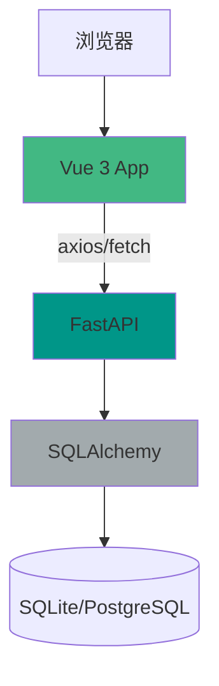
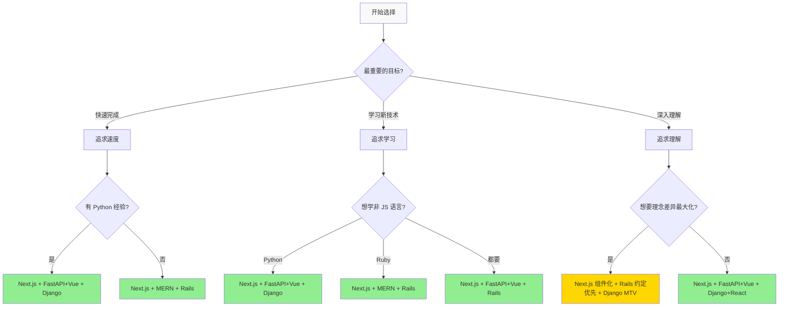

# Week 8 技术栈对比方法论
## 初学者友好的多栈开发决策指南

> **目标**: 帮助你理解不同技术栈的核心理念，做出适合 Week 8 作业的选择，并培养长期的技术判断力。

---

# 第一章：前置知识 - Web 开发 5 分钟速成

在深入技术栈之前，先快速了解 Web 开发的核心概念。

## 1.1 HTTP 请求/响应模型

Web 应用的本质：**客户端发送请求 → 服务器处理并返回响应**



## HTTP 动词（对应 CRUD 操作）

| 动词 | 操作 | 示例 | 幂等性 |
|------|------|------|--------|
| **GET** | 读取 | `GET /api/notes/1` | ✅ 多次执行结果相同 |
| **POST** | 创建 | `POST /api/notes` | ❌ 每次执行创建新资源 |
| **PUT/PATCH** | 更新 | `PUT /api/notes/1` | ✅ |
| **DELETE** | 删除 | `DELETE /api/notes/1` | ✅ |

**幂等性** = 多次执行产生相同结果（GET、PUT、DELETE 是幂等的，POST 不是）

---

## 1.2 前端 vs 后端 vs 数据库

| 层级 | 职责 | 技术 |
|------|------|------|
| **前端** | 用户界面、交互逻辑 | React, Vue, HTML/CSS |
| **后端** | 业务逻辑、数据处理 | FastAPI, Django, Rails, Express |
| **数据库** | 数据持久化 | PostgreSQL, MongoDB, SQLite |

### 两种架构模式

**模式 A：前后端分离**（如 React + FastAPI）


**模式 B：服务端渲染**（如 Next.js, Rails）


---

## 1.3 什么是"全栈"？

**全栈开发者** = 能处理整个请求链路的人：
- 前端：用户看到什么
- 后端：数据如何处理
- 数据库：数据如何存储

**Week 8 任务**：用 3 种不同的"全栈组合"构建同一个应用。

---

# 第二章：技术栈解剖图

每个技术栈都是一组工具的组合，但它们的**架构理念**不同。

## 2.1 架构模式对比

### MVC vs MTV vs 组件化

| 模式 | 全称 | 谁负责什么？ |
|------|------|-------------|
| **MVC** | Model-View-Controller | Model(数据) ↔ View(界面) ↔ Controller(逻辑) |
| **MTV** | Model-Template-View | Model(数据) ↔ Template(界面) ↔ View(逻辑) ← Django |
| **组件化** | Component-Based | 组件 = HTML + CSS + JS 逻辑 ← React/Vue |

**关键区别**：
- MVC/MTV：**框架**负责路由和渲染
- 组件化：**前端框架**负责渲染，后端只提供 API

---

## 2.2 6 个技术栈架构图

### Stack 1: Next.js 全栈（推荐用于 Bolt）

```mermaid
graph TB
    subgraph "Next.js App"
        A[pages/app.tsx] --> B[API Routes]
        B --> C[Prisma ORM]
        C --> D[(SQLite/PostgreSQL)]
        A --> E[React Components]
        E --> F[shadcn/ui]
    end
    G[浏览器] <--> A

    style A fill:#61dafb
    style B fill:#68a063
    style C fill:#0f3443
```



**特点**：
- 🔄 一个框架处理前后端
- 📦 内置 API Routes（无需单独后端）
- 🎨 React 组件化 + shadcn/ui

---

### Stack 2: MERN (MongoDB + Express + React + Node)



**特点**：
- 💚 全 JavaScript（前端 + 后端 + 数据库）
- 🔧 Express 是轻量级后端框架
- 📊 MongoDB 是 NoSQL（文档型数据库）

---

### Stack 3: FastAPI + Vue



**特点**：
- 🐍 Python 后端（你已有经验！）
- 🎨 Vue 3 前端（组件化，类似 React）
- ⚡ FastAPI 自动生成 API 文档

---

### Stack 4: Django + React

```mermaid
graph TB
    A[浏览器] --> B[React SPA]
    B -->|fetch| C[Django REST]
    C --> D[Django ORM]
    D --> E[(SQLite/PostgreSQL)]
    C --> F[Django Admin]

    style B fill:#61dafb
    style C fill:#092e20
    style F fill:#0C4B33
```



**特点**：
- 🎸 Django "Batteries Included"（内置功能多）
- 🛠️ 自动生成 Admin 界面
- 📐 MTV 架构（Model-Template-View）

---

### Stack 5: Rails 全栈

```mermaid
graph TB
    A[浏览器] --> B[Rails Views]
    B --> C[Rails Controller]
    C --> D[Active Record]
    D --> E[(SQLite/PostgreSQL)]
    C --> F[Rails Helpers]

    style B fill:#cc0000
    style C fill="#880000"
    style F fill="#b30000"
```

**特点**：
- 💎 "约定优于配置"（Convention over Configuration）
- 🚀 Scaffold 命令快速生成 CRUD
- 📦 Rails 7 + Hotwire（现代版不依赖 React）

---

### Stack 6: Flask + React

```mermaid
graph TB
    A[浏览器] --> B[React SPA]
    B -->|fetch| C[Flask API]
    C --> D[SQLAlchemy]
    D --> E[(SQLite/PostgreSQL)]

    style B fill:#61dafb
    style C fill:#333
    style D fill:#a2aaad
```



**特点**：
- 🧪 Flask 是"微框架"（Minimalist）
- 🔧 你需要自己选择组件
- 📚 灵活但需要更多配置

---

## 2.3 组件职责对比表

| 职责 | Next.js | MERN | FastAPI+Vue | Django+React | Rails | Flask+React |
|------|---------|------|-------------|--------------|-------|-------------|
| **路由** | Next Router | React Router | Vue Router | React Router | Rails Routes | Flask @route |
| **API 层** | API Routes | Express | FastAPI | DRF | Rails Controllers | Flask views |
| **ORM** | Prisma | Mongoose | SQLAlchemy | Django ORM | Active Record | SQLAlchemy |
| **前端渲染** | React (SSR) | React (CSR) | Vue (CSR) | React (CSR) | ERB (SSR) | React (CSR) |
| **UI 组件库** | shadcn/ui | Material-UI | Element Plus | Ant Design | Tailwind | Material-UI |

**SSR** = Server-Side Rendering (服务端渲染)
**CSR** = Client-Side Rendering (客户端渲染)

---

# 第三章：6 个候选技术栈深度解析

## 3.1 Next.js 全栈

### 📌 理念标签
> "React-first, with server-side capabilities"

### 🏗️ 架构模式
- **App Router** (Next.js 13+): 文件系统路由
- **Server Components**: 默认在服务端渲染
- **API Routes**: `/app/api/*` 自动成为 API 端点

### 📈 学习曲线
**15-20 小时**（如果熟悉 React）/ **30-40 小时**（全新）

### 🤖 AI 适配度
| 工具 | 评分 | 说明 |
|------|------|------|
| Bolt.new | ⭐⭐⭐⭐⭐ | 官方推荐，生成质量最高 |
| Claude Code | ⭐⭐⭐⭐⭐ | TypeScript 类型推断准确 |
| GitHub Copilot | ⭐⭐⭐⭐ | 对 Next.js 模式很熟悉 |

### ✅ 优点
- ✨ 一套技术栈处理前后端
- 🎨 shadcn/ui 复制粘贴即用
- 📚 文档完善，社区活跃
- 🚀 开发速度快（API Routes 无需配置）
- 🔍 SEO 友好（SSR）

### ❌ 缺点
- ❌ 全 JavaScript（不符合作业"非 JS 语言"要求）
- 📦 App Router 概念需要时间理解
- 🔧 配置相对复杂（tsconfig, next.config）

### 💻 代码示例：创建笔记 API

```typescript
// app/api/notes/route.ts
import { NextRequest, NextResponse } from 'next/server';
import { prisma } from '@/lib/prisma';

// GET /api/notes - 获取所有笔记
export async function GET() {
  const notes = await prisma.note.findMany();
  return NextResponse.json(notes);
}

// POST /api/notes - 创建笔记
export async function POST(request: NextRequest) {
  const data = await request.json();
  const note = await prisma.note.create({
    data: {
      title: data.title,
      content: data.content,
    },
  });
  return NextResponse.json(note, { status: 201 });
}
```

```typescript
// app/notes/page.tsx - 前端页面
async function getNotes() {
  const res = await fetch('/api/notes');
  return res.json();
}

export default async function NotesPage() {
  const notes = await getNotes();

  return (
    <div>
      <h1>Notes</h1>
      {notes.map(note => (
        <div key={note.id}>
          <h2>{note.title}</h2>
          <p>{note.content}</p>
        </div>
      ))}
    </div>
  );
}
```

---

## 3.2 MERN (MongoDB + Express + React + Node)

### 📌 理念标签
> "JavaScript everywhere"

### 🏗️ 架构模式
- **Express**: 轻量级 REST API 框架
- **Mongoose**: MongoDB 对象建模
- **React**: 前端 SPA（单页应用）

### 📈 学习曲线
**25-35 小时**（需要学 4 个独立技术）

### 🤖 AI 适配度
| 工具 | 评分 | 说明 |
|------|------|------|
| Bolt.new | ⭐⭐⭐⭐⭐ | 全 JS 栈，生成效果极佳 |
| Claude Code | ⭐⭐⭐⭐ | JavaScript 生态熟悉 |
| GitHub Copilot | ⭐⭐⭐⭐⭐ | JS 是 Copilot 最强语言 |

### ✅ 优点
- 💚 只用一门语言（JavaScript）
- 🌐 最大的生态系统（npm）
- 📊 MongoDB 灵活（无 Schema）
- 🔄 前后端可共享代码

### ❌ 缺点
- ❌ 全 JavaScript（不符合作业要求）
- 🔧 需要配置 4 个独立部分
- 🐌 MongoDB 不适合事务复杂的应用
- 📚 学习曲线陡（要学 4 个东西）

### 💻 代码示例：创建笔记 API

```javascript
// backend/server.js
const express = require('express');
const mongoose = require('mongoose');
const app = express();

// 连接 MongoDB
mongoose.connect('mongodb://localhost:27017/notes');

// 定义 Schema
const noteSchema = new mongoose.Schema({
  title: String,
  content: String,
});
const Note = mongoose.model('Note', noteSchema);

// 路由
app.get('/api/notes', async (req, res) => {
  const notes = await Note.find();
  res.json(notes);
});

app.post('/api/notes', async (req, res) => {
  const note = await Note.create(req.body);
  res.status(201).json(note);
});

app.listen(3000);
```

```jsx
// frontend/src/App.js
import { useState, useEffect } from 'react';

function App() {
  const [notes, setNotes] = useState([]);

  useEffect(() => {
    fetch('http://localhost:3000/api/notes')
      .then(res => res.json())
      .then(data => setNotes(data));
  }, []);

  return (
    <div>
      {notes.map(note => (
        <div key={note._id}>
          <h2>{note.title}</h2>
          <p>{note.content}</p>
        </div>
      ))}
    </div>
  );
}
```

---

## 3.3 FastAPI + Vue

### 📌 理念标签
> "Modern Python + Progressive JavaScript"

### 🏗️ 架构模式
- **FastAPI**: 异步 Python Web 框架
- **SQLAlchemy**: Python ORM
- **Vue 3**: 渐进式前端框架
- **Composition API**: Vue 3 的现代写法

### 📈 学习曲线
**20-30 小时**（如果你熟悉 Python）

### 🤖 AI 适配度
| 工具 | 评分 | 说明 |
|------|------|------|
| Bolt.new | ⭐⭐⭐ | 可以生成，但不如 Next.js 顺畅 |
| Claude Code | ⭐⭐⭐⭐⭐ | Python 代码简洁准确 |
| GitHub Copilot | ⭐⭐⭐⭐ | 对 FastAPI 装饰器理解好 |

### ✅ 优点
- ✅ 非 JS 语言（Python），满足作业要求
- 🐍 你已有 FastAPI 经验（Week 2-6）
- ⚡ FastAPI 自动生成 API 文档（`/docs`）
- 🎨 Vue 3 + TypeScript 组合优秀
- 📐 Pydantic 类型验证

### ❌ 缺点
- 🔧 需要维护前后端两个项目
- 📦 部署需要两个服务
- 🌐 Vue 生态比 React 小

### 💻 代码示例：创建笔记 API

```python
# backend/main.py
from fastapi import FastAPI
from sqlalchemy.orm import Session
from pydantic import BaseModel

app = FastAPI()

class NoteCreate(BaseModel):
    title: str
    content: str

@app.get("/api/notes")
def get_notes(db: Session = Depends(get_db)):
    return db.query(Note).all()

@app.post("/api/notes")
def create_note(note: NoteCreate, db: Session = Depends(get_db)):
    db_note = Note(**note.dict())
    db.add(db_note)
    db.commit()
    db.refresh(db_note)
    return db_note
```

```vue
<!-- frontend/src/components/NoteList.vue -->
<script setup>
import { ref, onMounted } from 'vue';

const notes = ref([]);

onMounted(async () => {
  const res = await fetch('http://localhost:8000/api/notes');
  notes.value = await res.json();
});
</script>

<template>
  <div>
    <div v-for="note in notes" :key="note.id">
      <h2>{{ note.title }}</h2>
      <p>{{ note.content }}</p>
    </div>
  </div>
</template>
```

---

## 3.4 Django + React

### 📌 理念标签
> "Batteries Included + Component-Based UI"

### 🏗️ 架构模式
- **MTV**: Model-Template-View（Django 特色）
- **Django REST Framework**: API 工具包
- **Django ORM**: Python 对象关系映射

### 📈 学习曲线
**30-40 小时**（Django 概念多）

### 🤖 AI 适配度
| 工具 | 评分 | 说明 |
|------|------|------|
| Bolt.new | ⭐⭐ | 不擅长 Django |
| Claude Code | ⭐⭐⭐⭐ | 对 Django ORM 理解好 |
| GitHub Copilot | ⭐⭐⭐ | 需要明确告知 Django 惯例 |

### ✅ 优点
- ✅ 非 JS 语言（Python）
- 🛠️ Django Admin 自动生成管理界面
- 📦 内置认证、表单、中间件
- 🔒 安全性高（自动防 SQL 注入、XSS）
- 📚 文档完善

### ❌ 缺点
- 🐌 相对重量级
- 📐 MTV 概念需要理解
- 🔧 配置较多（settings.py, urls.py）
- ⚠️ AI 对 Django 模板理解不如 JSX

### 💻 代码示例：创建笔记 API

```python
# backend/models.py
from django.db import models

class Note(models.Model):
    title = models.CharField(max_length=200)
    content = models.TextField()
    created_at = models.DateTimeField(auto_now_add=True)

# backend/views.py
from rest_framework import generics
from .models import Note
from .serializers import NoteSerializer

class NoteListCreate(generics.ListCreateAPIView):
    queryset = Note.objects.all()
    serializer_class = NoteSerializer

# backend/urls.py
from django.urls import path
from .views import NoteListCreate

urlpatterns = [
    path('api/notes/', NoteListCreate.as_view()),
]
```

```jsx
// frontend/src/App.js
// 与 MERN 的 React 代码类似
// 但 API 地址是 Django 的
const API_URL = 'http://localhost:8000/api/notes/';
```

---

## 3.5 Rails 全栈

### 📌 理念标签
> "Convention over Configuration"

### 🏗️ 架构模式
- **MVC**: Model-View-Controller
- **Active Record**: ORM 模式
- **ERB**: 嵌入式 Ruby 模板

### 📈 学习曲线
**35-50 小时**（Ruby 语法 + Rails 魔法）

### 🤖 AI 适配度
| 工具 | 评分 | 说明 |
|------|------|------|
| Bolt.new | ⭐ | 不支持 Ruby |
| Claude Code | ⭐⭐⭐ | Ruby 语法不如 JS/Python 普及 |
| GitHub Copilot | ⭐⭐⭐ | 需要明确告知 Rails 惯例 |

### ✅ 优点
- ✅ 非 JS 语言（Ruby）
- 🚀 Scaffold 命令快速生成 CRUD
- 💎 "Rails 之道"（最佳实践内置）
- 📦 gem 生态系统成熟
- 🎨 Rails 7 + Hotwire（无需 React）

### ❌ 缺点
- 💎 你可能完全没有 Ruby 经验
- 📖 Ruby 语法独特（需要时间适应）
- 🎩 "魔法"多（初学者可能困惑）
- 📚 AI 对 Ruby 支持不如 Python/JS

### 💻 代码示例：创建笔记 API

```ruby
# app/models/note.rb
class Note < ApplicationRecord
  # 自动继承 ActiveRecord::Base
  # 自动映射到 notes 表
end

# config/routes.rb
Rails.application.routes.draw do
  resources :notes  # 一行生成 7 个 RESTful 路由
end

# app/controllers/notes_controller.rb
class NotesController < ApplicationController
  def index
    @notes = Note.all
    render json: @notes
  end

  def create
    @note = Note.new(note_params)
    if @note.save
      render json: @note, status: :created
    else
      render json: @note.errors, status: :unprocessable_entity
    end
  end

  private
  def note_params
    params.require(:note).permit(:title, :content)
  end
end
```

```erb
<!-- app/views/notes/index.html.erb -->
<div id="notes">
  <% @notes.each do |note| %>
    <div>
      <h2><%= note.title %></h2>
      <p><%= note.content %></p>
    </div>
  <% end %>
</div>
```

---

## 3.6 Flask + React

### 📌 理念标签
> "Microframework + Component Library"

### 🏗️ 架构模式
- **Flask**: "微框架"（最小核心）
- **SQLAlchemy**: ORM（与 FastAPI 共享）
- **React**: 前端 SPA

### 📈 学习曲线
**25-35 小时**（需要自己组装组件）

### 🤖 AI 适配度
| 工具 | 评分 | 说明 |
|------|------|------|
| Bolt.new | ⭐⭐ | 可以生成，但需要手动调整 |
| Claude Code | ⭐⭐⭐⭐ | Python + React 都支持好 |
| GitHub Copilot | ⭐⭐⭐⭐ | 对常见模式理解好 |

### ✅ 优点
- ✅ 非 JS 语言（Python）
- 🧪 Flask 灵活（你选择需要的组件）
- 📚 入门简单（最小核心）
- 🔧 与 FastAPI 共享 SQLAlchemy 知识

### ❌ 缺点
- 🔧 需要自己选择和配置组件
- 📦 没有内置的认证、Admin 等
- ⚠️ 灵活也意味着更多决策
- 🌐 社区比 Django 小

### 💻 代码示例：创建笔记 API

```python
# backend/app.py
from flask import Flask, request, jsonify
from flask_sqlalchemy import SQLAlchemy

app = Flask(__name__)
app.config['SQLALCHEMY_DATABASE_URI'] = 'sqlite:///notes.db'
db = SQLAlchemy(app)

class Note(db.Model):
    id = db.Column(db.Integer, primary_key=True)
    title = db.Column(db.String(100))
    content = db.Column(db.Text)

@app.route('/api/notes', methods=['GET'])
def get_notes():
    notes = Note.query.all()
    return jsonify([{'id': n.id, 'title': n.title} for n in notes])

@app.route('/api/notes', methods=['POST'])
def create_note():
    data = request.json
    note = Note(title=data['title'], content=data['content'])
    db.session.add(note)
    db.session.commit()
    return jsonify({'id': note.id}), 201
```

```jsx
// frontend/src/App.js
// 与 MERN/Django+React 的代码类似
// React 部分基本相同
```

---

# 第四章：10 维度评分对比表

## 4.1 评分标准

| 分数 | 含义 |
|------|------|
| ⭐ (1分) | 很弱 / 很难 / 不推荐 |
| ⭐⭐ (2分) | 较弱 / 较难 |
| ⭐⭐⭐ (3分) | 中等 |
| ⭐⭐⭐⭐ (4分) | 较强 / 较容易 |
| ⭐⭐⭐⭐⭐ (5分) | 很强 / 很容易 / 强烈推荐 |

---

## 4.2 对比矩阵

| 维度 | Next.js | MERN | FastAPI+Vue | Django+React | Rails | Flask+React |
|------|---------|------|-------------|--------------|-------|-------------|
| **开发速度** | ⭐⭐⭐⭐⭐ | ⭐⭐⭐ | ⭐⭐⭐⭐ | ⭐⭐⭐ | ⭐⭐⭐⭐⭐ | ⭐⭐⭐ |
| **学习曲线** | ⭐⭐⭐ | ⭐⭐ | ⭐⭐⭐⭐ | ⭐⭐⭐ | ⭐⭐ | ⭐⭐⭐ |
| **Bolt 适配** | ⭐⭐⭐⭐⭐ | ⭐⭐⭐⭐⭐ | ⭐⭐⭐ | ⭐⭐ | ⭐ | ⭐⭐ |
| **Claude Code** | ⭐⭐⭐⭐⭐ | ⭐⭐⭐⭐ | ⭐⭐⭐⭐⭐ | ⭐⭐⭐⭐ | ⭐⭐⭐ | ⭐⭐⭐⭐ |
| **生态成熟度** | ⭐⭐⭐⭐⭐ | ⭐⭐⭐⭐⭐ | ⭐⭐⭐⭐ | ⭐⭐⭐⭐⭐ | ⭐⭐⭐⭐⭐ | ⭐⭐⭐⭐ |
| **类型安全** | ⭐⭐⭐⭐⭐ | ⭐⭐ | ⭐⭐⭐⭐ | ⭐⭐⭐ | ⭐⭐ | ⭐⭐⭐ |
| **就业需求** | ⭐⭐⭐⭐⭐ | ⭐⭐⭐⭐⭐ | ⭐⭐⭐⭐ | ⭐⭐⭐⭐ | ⭐⭐⭐ | ⭐⭐⭐ |
| **部署难度** | ⭐⭐⭐⭐ | ⭐⭐⭐ | ⭐⭐⭐ | ⭐⭐⭐⭐ | ⭐⭐⭐⭐ | ⭐⭐⭐ |
| **适用场景** | ⭐⭐⭐⭐⭐ | ⭐⭐⭐⭐ | ⭐⭐⭐⭐ | ⭐⭐⭐⭐⭐ | ⭐⭐⭐⭐⭐ | ⭐⭐⭐⭐ |
| **你的关联度** | ⭐⭐ | ⭐⭐ | ⭐⭐⭐⭐⭐ | ⭐⭐⭐⭐ | ⭐⭐ | ⭐⭐⭐⭐ |

### 维度说明

1. **开发速度**: 从零到可用 CRUD 需要多久
2. **学习曲线**: 对初学者的友好度
3. **Bolt 适配**: Bolt.new 能否直接生成
4. **Claude Code**: AI 辅助开发的效率
5. **生态成熟度**: 库、工具、教程的丰富度
6. **类型安全**: TypeScript/Pydantic 等类型检查
7. **就业需求**: 市场需求量
8. **部署难度**: 上线生产环境的复杂度
9. **适用场景**: 通用性（能做多少类型的应用）
10. **你的关联度**: 与你现有知识（FastAPI, Python）的重叠度

---

## 4.3 总分排名

| 排名 | 技术栈 | 总分 | 最适合... |
|------|--------|------|-----------|
| 🥇 | Next.js 全栈 | 43/50 | Bolt 生成 + 现代 Web 应用 |
| 🥈 | FastAPI + Vue | 41/50 | **你的情况**（Python 经验 + AI 辅助） |
| 🥉 | Django + React | 40/50 | 快速开发 + Admin 界面 |
| 4 | MERN | 37/50 | 全 JS 开发 |
| 5 | Rails | 36/50 | 约定优先 + CRUD 应用 |
| 6 | Flask + React | 35/50 | 灵活组装 |

---

## 4.4 权重建议

根据 Week 8 的特殊要求，调整权重：

### 方案 A：快速完成（权重 = 时间效率）
```yaml
开发速度: 30%
Bolt 适配: 25%
学习曲线: 20%
Claude Code: 15%
其他: 10%
```

**推荐**: Next.js (Bolt) + FastAPI+Vue + Django+React

### 方案 B：深入理解（权重 = 学习价值）
```yaml
理念差异: 30%
学习曲线: 25%
生态成熟度: 20%
你的关联度: 15%
其他: 10%
```

**推荐**: Next.js (组件化) + Rails (约定优先) + Django (MTV)

### 方案 C：就业导向（权重 = 市场需求）
```yaml
就业需求: 35%
生态成熟度: 25%
类型安全: 20%
适用场景: 20%
```

**推荐**: Next.js + MERN + FastAPI+Vue

---

# 第五章：决策流程图

## 5.1 交互式决策树

回答以下问题，找到最适合你的组合：



---

## 5.2 约束检查清单

在最终决定前，确保满足以下约束：

```yaml
✅ 作业约束检查:

1. 3 个不同技术栈?
   [ ] Stack 1: ___________
   [ ] Stack 2: ___________
   [ ] Stack 3: ___________
   检查: 3 个栈的组件组合是否明显不同?

2. 至少 1 个用 Bolt.new?
   [ ] 哪个: ___________
   检查: Bolt 是否支持这个栈?

3. 至少 1 个非 JS 语言?
   [ ] 哪个: ___________ (Python/Ruby)
   检查: 前端或后端是否用非 JS 语言?

4. 满足最小功能范围?
   [ ] CRUD 操作
   [ ] 持久化存储
   [ ] 基础验证
   [ ] 功能 UI
   [ ] 运行说明
```

---

## 5.3 推荐方案（3 种）

### 方案 A：平衡型（推荐给你）

```
Stack 1: Next.js 全栈
  - 用 Bolt.new 生成（5 分钟搞定基础）
  - 体验现代 AI 开发

Stack 2: FastAPI + Vue
  - 复用你现有的 Python 经验
  - TypeScript 前端，AI 理解好
  - 非 JS 语言（满足要求）

Stack 3: Django + React
  - 学习 Django Admin 自动化
  - 体验 MTV 架构
  - 非 JS 语言

特点:
  ✅ 2 个 Python 栈（学习效率高）
  ✅ 1 个 Bolt 生成（节省时间）
  ✅ 理念差异明显（组件化 vs API-first vs MTV）
  ✅ AI 辅助体验优秀
```

---

### 方案 B：激进型（追求理念差异）

```
Stack 1: Next.js 全栈
  - 理念: 组件化 + SSR

Stack 2: Rails 全栈
  - 理念: 约定优于配置
  - Scaffold 快速生成

Stack 3: Django + React
  - 理念: MTV + Batteries Included

特点:
  ✅ 3 种完全不同的架构理念
  ✅ 非 JS 语言 (Ruby + Python)
  ⚠️ 学习曲线陡（需要学 Ruby）
  ⚠️ AI 辅助效果一般
```

---

### 方案 C：保守型（最快完成）

```
Stack 1: Next.js 全栈 (Bolt 生成)

Stack 2: FastAPI + Vue
  - 复用现有知识

Stack 3: Flask + React
  - 与 FastAPI 共享 SQLAlchemy

特点:
  ✅ 最快完成（2 个 Python 栈）
  ✅ 复用最大化
  ⚠️ Flask vs FastAPI 理念差异较小
```

---

# 第六章：AI-Coding 实战指南

## 6.1 Claude Code 配合度排名

| 排名 | 技术栈 | 配合度 | 为什么 |
|------|--------|--------|--------|
| 1 | Next.js 全栈 | ⭐⭐⭐⭐⭐ | TypeScript 类型系统，AI 推断准确 |
| 2 | FastAPI + Vue | ⭐⭐⭐⭐⭐ | Python 简洁，Pydantic 类型明确 |
| 3 | MERN | ⭐⭐⭐⭐ | JavaScript 生态成熟，但类型弱 |
| 4 | Django + React | ⭐⭐⭐⭐ | Django ORM 直观，但模板语法偶尔混淆 |
| 5 | Flask + React | ⭐⭐⭐⭐ | Python + React，都不错 |
| 6 | Rails | ⭐⭐⭐ | Ruby 语法不如 JS/Python 普及 |

---

## 6.2 Prompt 模板库

### Template 1: 让 AI 生成 CRUD 接口

```markdown
角色: 你是 {技术栈} 专家

任务: 为我的应用创建 {资源} 的 CRUD 接口

数据模型:
- {字段1}: {类型}
- {字段2}: {类型}
- {字段3}: {类型}

要求:
1. 创建数据模型/Schema
2. 实现 GET /api/{资源} - 获取所有
3. 实现 POST /api/{资源} - 创建
4. 实现 PUT /api/{资源}/:id - 更新
5. 实现 DELETE /api/{资源}/:id - 删除
6. 添加基本验证
7. 使用 {ORM/数据库}

请生成完整的代码，包括文件结构。
```

### Template 2: 让 AI 调试错误

```markdown
上下文:
- 技术栈: {技术栈}
- 我在做什么: {操作描述}

错误信息:
{粘贴完整的错误堆栈}

相关代码:
{粘贴相关代码}

请帮我:
1. 分析错误原因
2. 提供修复方案
3. 解释为什么会出现这个错误
4. 如何避免类似问题
```

### Template 3: 让 AI 解释概念

```markdown
请用初学者能理解的方式解释:

概念: {如 Next.js App Router}

要求:
1. 用生活化比喻
2. 对比传统方式
3. 给出代码示例
4. 说明适用场景
```

---

## 6.3 AI 能做什么 vs 不能做什么

### ✅ AI 擅长

| 任务 | 例子 | 效率提升 |
|------|------|----------|
| 生成样板代码 | CRUD 接口、数据模型 | 10x |
| 解释错误 | 调试错误信息 | 5x |
| 代码重构 | 提取函数、重命名变量 | 3x |
| 编写测试 | 单元测试、集成测试 | 5x |
| 文档生成 | README、API 文档 | 10x |

### ❌ AI 不擅长

| 任务 | 为什么 | 建议 |
|------|--------|------|
| 复杂业务逻辑 | 需要理解领域知识 | 人工设计，AI 实现 |
| 架构决策 | 需要权衡长期影响 | 先人工决策，再问 AI |
| 性能优化 | 需要性能分析 | AI 提供建议，人工验证 |
| 安全审查 | AI 可能遗漏漏洞 | 人工 + 安全工具 |
| 调试异步问题 | 上下文复杂 | 逐步缩小范围 |

---

## 6.4 常见陷阱

### 陷阱 1：直接复制粘贴，不理解代码

**问题**: AI 生成的代码可能有 bug 或不适合你的场景。

**解决方案**:
```yaml
流程:
  1. 让 AI 解释代码
  2. 逐行审查关键部分
  3. 运行并测试
  4. 问 AI: "这段代码有什么潜在问题?"
```

### 陷阱 2：一次性生成整个应用

**问题**: AI 生成大量代码，但你无法维护。

**解决方案**:
```yaml
增量生成:
  1. 先生成数据模型
  2. 再生成一个 CRUD 端点
  3. 理解并测试
  4. 继续下一个功能
```

### 陷阱 3：不指定框架版本

**问题**: AI 可能使用过时的语法。

**解决方案**:
```markdown
明确版本:
- "使用 Next.js 14 App Router"
- "使用 Django 5.0"
- "使用 Vue 3 Composition API"
```

---

# 第七章：实施路线图

## 7.1 每个栈的最小知识集

### Next.js 全栈（Bolt 生成）

**需要学**:
- [ ] React 基础（组件、Props、State）
- [ ] Next.js App Router（文件系统路由）
- [ ] Prisma Schema 基础
- [ ] shadcn/ui 使用方法

**时间**: 4-6 小时

---

### FastAPI + Vue

**需要学**:
- [ ] Vue 3 Composition API（`<script setup>`）
- [ ] Vue Router（如果需要多页面）
- [ ] Element Plus 或 Naive UI 组件库

**你已经知道**（FastAPI）:
- [ ] Pydantic Models
- [ ] SQLAlchemy ORM
- [ ] 依赖注入

**时间**: 6-8 小时（主要学 Vue）

---

### Django + React

**需要学**:
- [ ] Django Models（ORM）
- [ ] Django Admin（自动生成界面）
- [ ] Django REST Framework（可选，如果用 API）
- [ ] Django URLs 配置

**React 部分**（与 FastAPI+Vue 类似）:
- [ ] React Hooks
- [ ] React Router

**时间**: 8-10 小时

---

### Rails 全栈

**需要学**:
- [ ] Ruby 基础语法（块、元编程）
- [ ] Rails MVC 结构
- [ ] Active Record（ORM）
- [ ] Rails Console（调试）
- [ ] ERB 模板（或 Hotwire）

**时间**: 12-15 小时（包括 Ruby）

---

## 7.2 推荐学习顺序

### 方案 A：并行学习（适合有经验）

```
Week 1-2: Day 1-3  Day 4-5   Day 6-7
          学习    生成      测试
Next.js    →    Bolt生成   →  调试
FastAPI    →    手动构建    →  测试
Django     →    手动构建    →  测试
```

### 方案 B：顺序学习（适合初学者）

```
阶段 1: Next.js (Bolt)
  - 学习: 4h
  - 生成: 1h
  - 调试: 2h
  总计: 7h

阶段 2: FastAPI + Vue
  - 学习 Vue: 6h
  - 构建: 4h
  - 测试: 2h
  总计: 12h

阶段 3: Django + React
  - 学习 Django: 8h
  - 构建: 4h
  - 测试: 2h
  总计: 14h

总计: 33 小时
```

---

## 7.3 时间规划（按天分解）

### 3 天冲刺计划

**Day 1: 技术准备**
- 上午（4h）：学习 Next.js + Prisma 基础
- 下午（4h）：用 Bolt 生成第一个版本
- 晚上（2h）：测试并理解生成的代码

**Day 2: 第二个版本**
- 上午（4h）：学习 Vue 3（如果选 FastAPI+Vue）
- 下午（4h）：构建后端 API + 前端页面
- 晚上（2h）：测试和调试

**Day 3: 第三个版本 + 总结**
- 上午（4h）：学习 Django/Rails
- 下午（4h）：构建第三个版本
- 晚上（2h）：写 writeup，对比三个版本

---

### 7 天从容计划

| Day | 任务 | 时间 |
|-----|------|------|
| 1 | 学习 Next.js 基础 | 4h |
| 2 | 用 Bolt 生成版本 1 | 4h |
| 3 | 学习 Vue/React 基础 | 4h |
| 4 | 构建版本 2（FastAPI+Vue） | 4h |
| 5 | 学习 Django 基础 | 4h |
| 6 | 构建版本 3（Django+React） | 4h |
| 7 | 测试 + 写 writeup | 4h |

---

## 7.4 验证清单

每个版本完成后，检查：

```yaml
✅ 功能检查:
  [ ] 创建资源
  [ ] 读取资源列表
  [ ] 更新资源
  [ ] 删除资源
  [ ] 基本验证（如必填字段）
  [ ] 错误处理

✅ 文档检查:
  [ ] README.md 存在
  [ ] 前置条件（Node 版本、Python 版本）
  [ ] 安装步骤
  [ ] 运行命令
  [ ] 环境变量说明

✅ 代码检查:
  [ ] 无硬编码密钥
  [ ] 数据库连接使用环境变量
  [ ] 有 .gitignore（忽略 node_modules 等）
```

---

## 7.5 写作 writeup.md

基于第三章的评分体系，每个版本写：

```markdown
## Version #1 Description

APP DETAILS:
===============
Folder name: version1-nextjs
Tech Stack: Next.js 14 + Prisma + shadcn/ui
Persistence: SQLite (better-sqlite3)
Frameworks: React, Next.js, Prisma

REFLECTIONS:
===============
a. Issues encountered:
   - Bolt 生成的 TypeScript 类型有问题
   - 解决：手动调整 Prisma Schema

b. Prompting:
   - 有效：明确指定 "Next.js 14 App Router"
   - 无效：只说 "React app"（生成了 CRA 而非 Next.js）

c. Time metrics:
   - Time-to-first-run: 15 分钟（Bolt 生成）
   - Time-to-feature: 2 小时（添加搜索功能）
```

---

# 附录

## A. 快速参考卡片

### 技术栈速查

| 命令 | Next.js | MERN | FastAPI | Django | Rails | Flask |
|------|---------|------|---------|--------|-------|-------|
| 创建项目 | `npx create-next-app` | `npm create vite` | `fastapi create` | `django-startproject` | `rails new` | `flask init` |
| 运行开发服务器 | `npm run dev` | `npm run dev` | `uvicorn main:app` | `python manage.py runserver` | `rails server` | `flask run` |
| 安装依赖 | `npm install` | `npm install` | `poetry install` | `pip install -r requirements.txt` | `bundle install` | `pip install -r requirements.txt` |
| 运行测试 | `npm test` | `npm test` | `pytest` | `python manage.py test` | `rails test` | `pytest` |

---

## B. 故障排除

### 常见问题

**问题 1**: `Module not found`
```bash
# 解决：安装依赖
npm install  # Node.js
pip install -r requirements.txt  # Python
```

**问题 2**: `Port already in use`
```bash
# 解决：更换端口或杀死占用进程
# macOS/Linux
lsof -ti:8000 | xargs kill

# Windows
netstat -ano | findstr :8000
taskkill /PID {PID} /F
```

**问题 3**: `Database connection error`
```bash
# 解决：检查数据库文件是否存在
# 创建数据库
python manage.py migrate  # Django
rails db:migrate  # Rails
npx prisma migrate dev  # Prisma
```

---

## C. 推荐资源

### Next.js
- [Next.js Learn](https://nextjs.org/learn)
- [Prisma Docs](https://www.prisma.io/docs)
- [shadcn/ui](https://ui.shadcn.com)

### FastAPI
- [FastAPI Official Tutorial](https://fastapi.tiangolo.com/tutorial/)
- [SQLAlchemy Docs](https://docs.sqlalchemy.org)

### Vue
- [Vue 3 Guide](https://vuejs.org/guide/introduction.html)
- [Vue Mastery](https://www.vuemastery.com)

### Django
- [Django Tutorial](https://docs.djangoproject.com/en/5.0/intro/tutorial01/)
- [Django Girls Tutorial](https://tutorial.djangogirls.org)

### Rails
- [Rails Guides](https://guides.rubyonrails.org)
- [Rails API](https://api.rubyonrails.org)

---

## D. 下一步

1. **选择你的 3 个技术栈**（参考第五章决策流程）
2. **创建项目文件夹**:
   ```bash
   mkdir week8/version1-nextjs
   mkdir week8/version2-fastapi-vue
   mkdir week8/version3-django-react
   ```
3. **开始第一个版本**（推荐：Next.js + Bolt）
4. **记录学习过程**（用于 writeup.md）

---

**祝你好运！🚀**

记住：目标是深入理解，不只是完成作业。每个技术栈都代表一种不同的思维方式。
