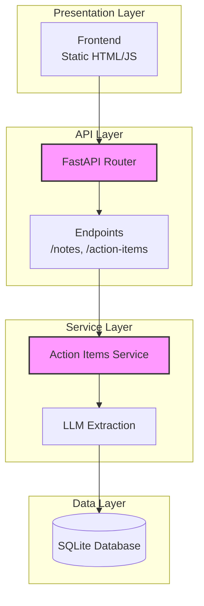
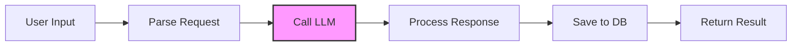
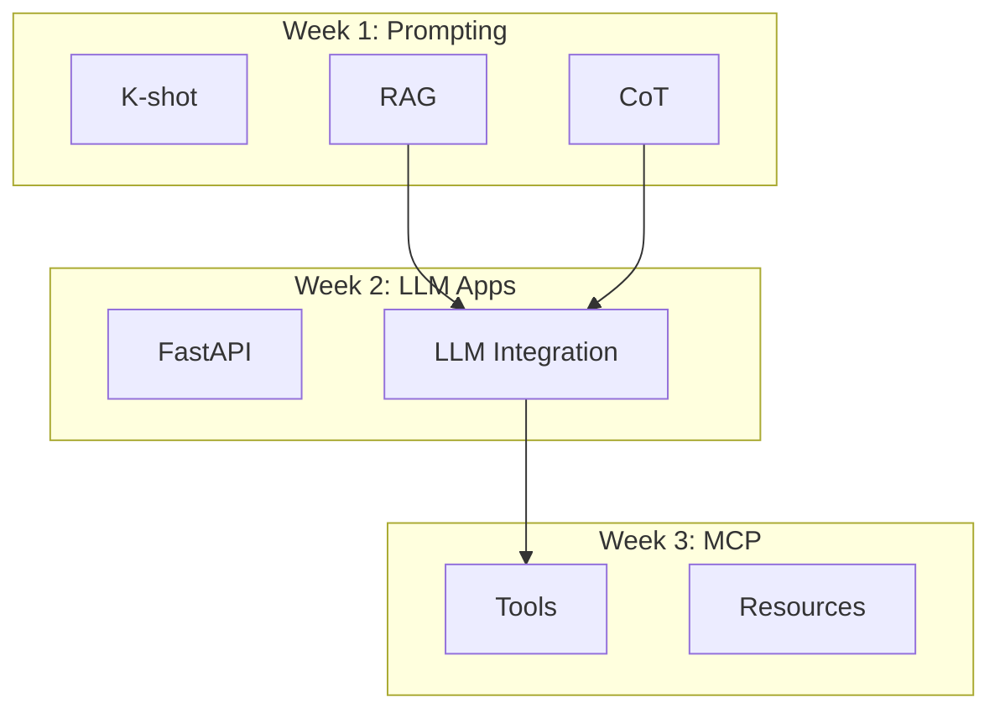
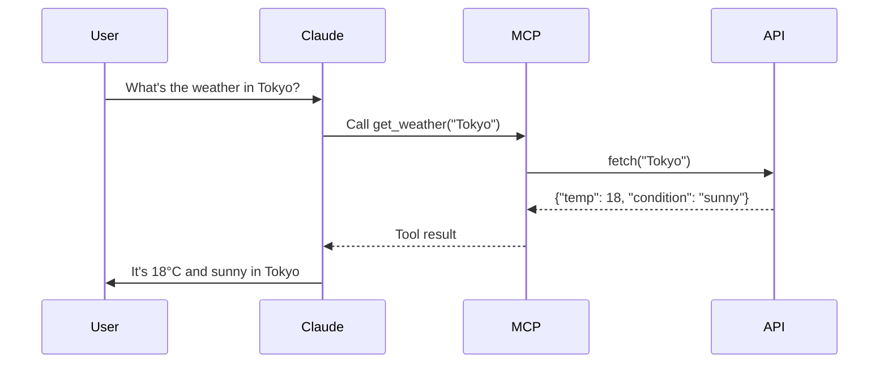
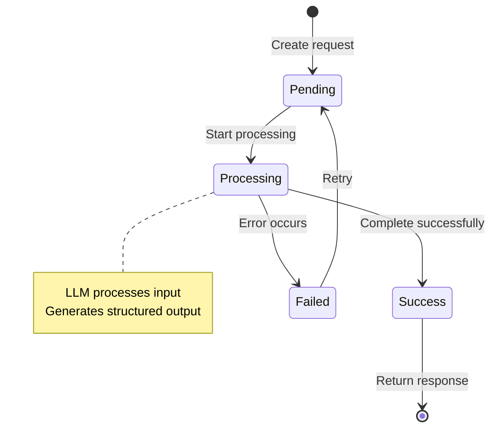
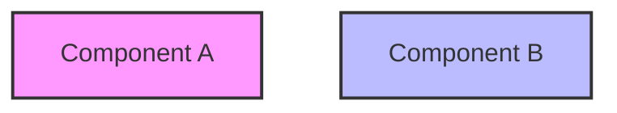
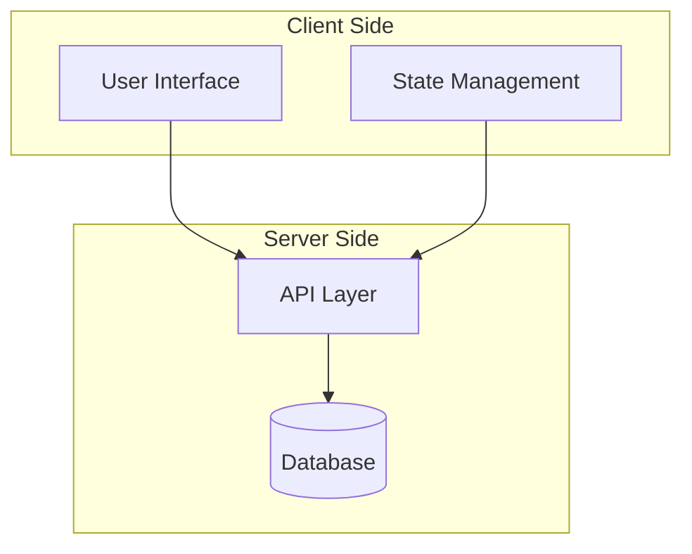
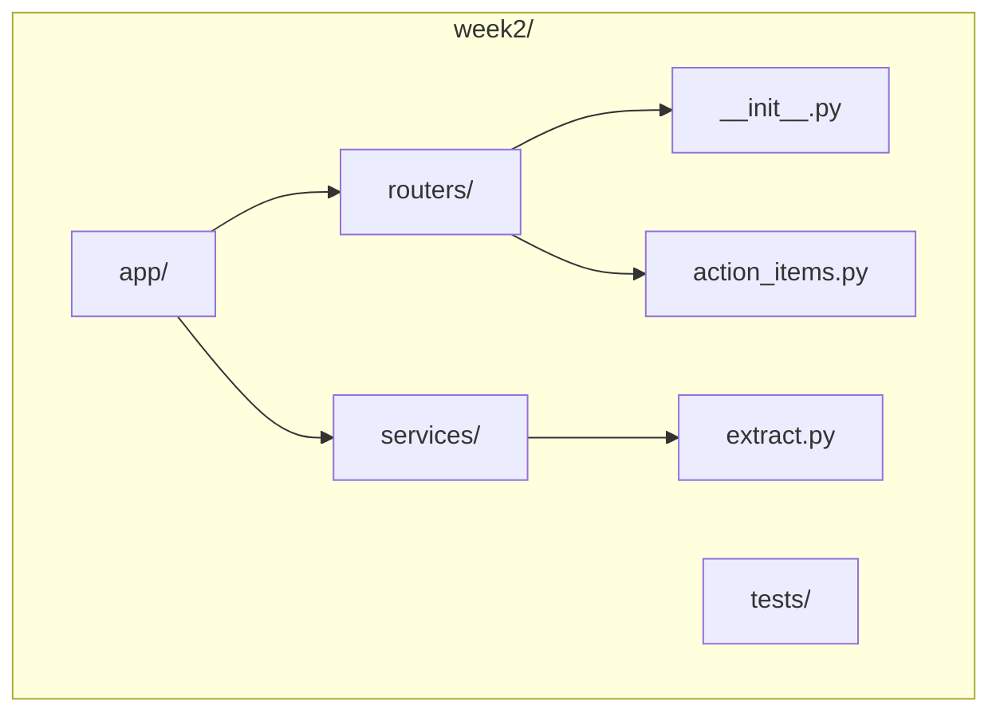
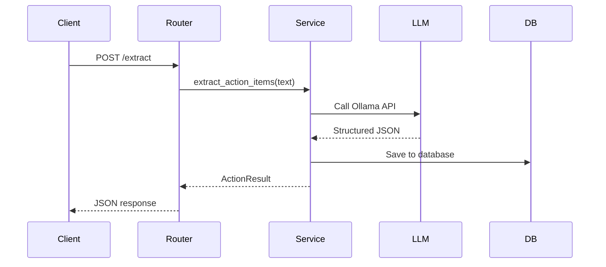
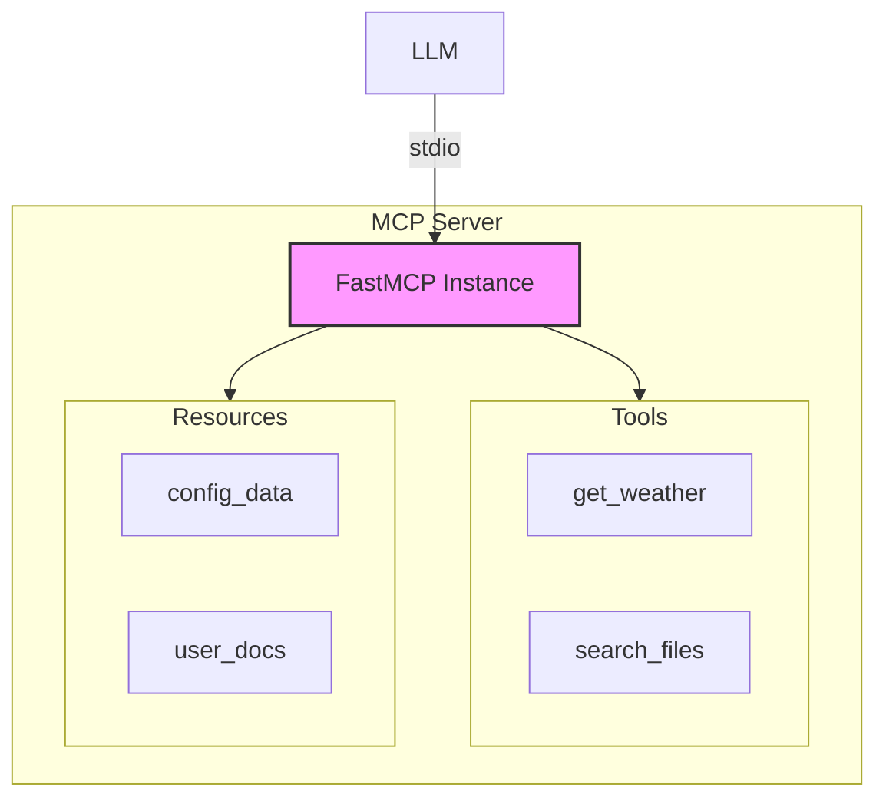

# Mermaid Diagram Patterns for Learning Mode

This file contains Mermaid diagram patterns and decision logic for visualizing technical concepts.

**IMPORTANT**: Mermaid diagrams do NOT render in Claude Code conversations. They only work in:
- VSCode (with Mermaid preview extension)
- GitHub/GitLab markdown rendering
- Other Mermaid-compatible markdown editors

**For Claude Code conversations**: Use ASCII art instead. See SKILL.md for ASCII art templates.

## When to Generate Diagrams

**Generate diagrams when these complexity indicators are present**:

| Indicator | Threshold | Example |
|-----------|-----------|---------|
| Number of components | > 3 | FastAPI: Router, Service, LLM, DB |
| Number of relationships | > 4 | MCP: Server → Tools, Resources, Transport |
| Transformation steps | > 2 | Request → Parse → LLM → Format → Response |
| Conditional branches | > 3 | Error handling with multiple paths |
| Hierarchical levels | > 2 | Multi-layer architecture |

**Skip diagrams when**:
- Single component or concept
- Simple linear process (< 3 steps)
- Code snippet is clearer than diagram
- User indicates they understand

## Diagram Type Selection

| Scenario | Diagram Type | Syntax | When to Use |
|----------|-------------|--------|-------------|
| Architecture/Layers | `graph TB` | Top-to-bottom | Showing system layers, module hierarchy |
| Data Flow | `graph LR` | Left-to-right | Request → Process → Response flows |
| Hierarchy | `graph TD` with subgraphs | Top-down with groups | Course structure (Week 1-8), package organization |
| Sequence/Time | `sequenceDiagram` | Participants over time | API calls, multi-step interactions |
| State Machine | `stateDiagram-v2` | States and transitions | Request lifecycle, user authentication flow |
| Class/Structure | `classDiagram` | Classes with methods | Database models, class relationships |

## Pattern Examples

### Pattern 1: Architecture Overview (graph TB)



**Use when**: Explaining system architecture with clear layers

### Pattern 2: Data Flow (graph LR)



**Use when**: Showing linear flow of data through system

### Pattern 3: Component Hierarchy (graph TD with subgraphs)



**Use when**: Showing relationships between weeks, modules, or packages

### Pattern 4: Sequence of Operations (sequenceDiagram)



**Use when**: Showing time-ordered interactions between components

### Pattern 5: State Lifecycle (stateDiagram-v2)



**Use when**: Showing state transitions in lifecycle or workflow

## Diagram Design Best Practices

### 1. Keep It Simple

- **Limit nodes**: 5-7 nodes maximum per diagram
- **Clear labels**: Use short, descriptive labels (not abbreviations)
- **Logical flow**: Left-to-right or top-to-bottom, avoid cross-overs

### 2. Use Styling Sparingly



**Only highlight**:
- Key components being discussed
- Entry/exit points
- Error paths

### 3. Add Annotations for Complex Logic

```mermaid
graph TB
    A[Start] --> B{Condition?}
    B -->|Yes| C[Action A]
    B -->|No| D[Action B]

    note right of B
        Check if user is
        authenticated
    end note
```

### 4. Group Related Components



## Common Diagram Patterns for Codebase Exploration

### Pattern: File Structure



### Pattern: Request Flow in FastAPI



### Pattern: MCP Server Architecture



## Decision Tree: Which Diagram to Use?

```
START: Need to visualize concept
│
├─ Is it showing layers/tiers?
│  └─ YES → graph TB (top-to-bottom)
│
├─ Is it showing data flow?
│  └─ YES → graph LR (left-to-right)
│
├─ Is it showing time sequence?
│  └─ YES → sequenceDiagram
│
├─ Is it showing state changes?
│  └─ YES → stateDiagram-v2
│
├─ Is it showing hierarchy with groups?
│  └─ YES → graph TD with subgraphs
│
└─ Is it showing class structure?
   └─ YES → classDiagram
```

## Troubleshooting

### Diagram Too Complex

**Symptoms**: > 10 nodes, crossing lines, hard to read

**Solutions**:
1. Split into multiple diagrams
2. Use subgraphs to group related components
3. Create a high-level overview + detailed diagrams
4. Remove less important nodes

### Diagram Not Rendering

**Common causes**:
- Syntax errors (check brackets, quotes)
- Invalid diagram type for content
- Missing required fields

**Debug steps**:
1. Validate syntax at [Mermaid Live Editor](https://mermaid.live)
2. Check for reserved words conflict
3. Ensure proper indentation
